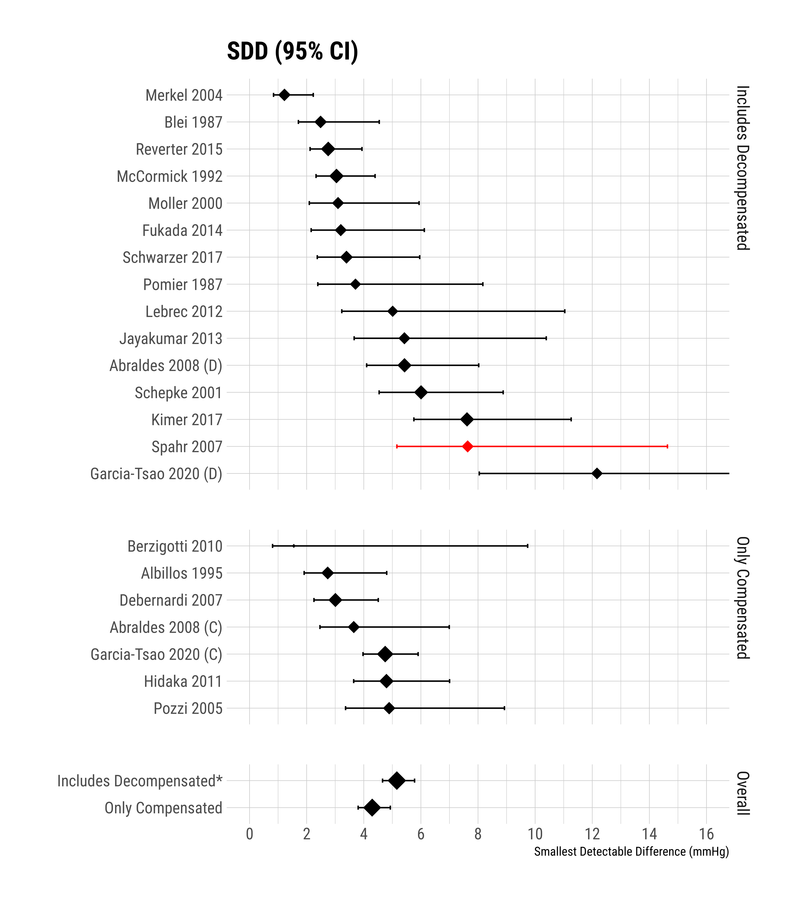
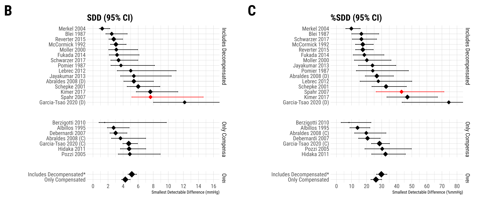
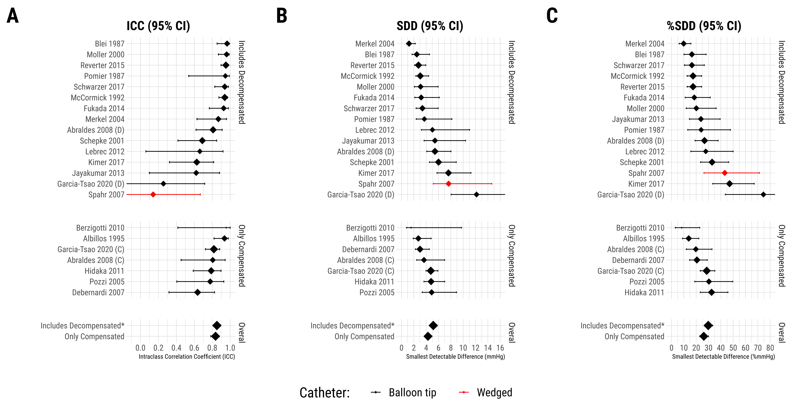
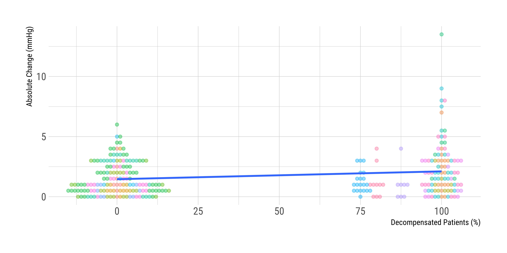

# Aims

Here, I will analyse the HVPG dataset, evaluate aspects of its test-retest reliability, and perform a power analysis for comparing treatments.

# Libraries


```r
library(tidyverse)
library(relfeas)
library(readxl)
library(hrbrthemes)
library(extrafont)
library(lme4)
library(lmerTest)
library(effsize)
library(broom)
library(RColorBrewer)
library(knitr)
library(cowplot)
library(progress)
library(kableExtra)
library(perm)
library(ggbeeswarm)
library(psych)
library(permuco)

extrafont::loadfonts(quiet = T)

theme_set(theme_ipsum_rc())
nsims <- 1e4
overwrite <- FALSE

knitr::opts_chunk$set(fig.path = "figures/", dev="png", dpi=600,
                      warning=FALSE, message=FALSE)

set.seed(42)
```


# Data


```r
trt_tidy <- read_excel("../RawData/TEST_RETEST_FINA_DATABASE_TIDY.xlsx") %>% 
  mutate(author = str_match(Description, "(^\\w*)")[,2]) %>% 
  select(-contains("≦"))

trt_wide <- read_excel("../RawData/TEST_RETEST_FINA_DATABASE.xlsx") %>% 
  select(New_Description, `Serial number`) %>% 
  select(-contains("≦"))

trt_studydemog <- read_excel("../RawData/FINAL_AGGREGATED_ICCs-2.xlsx") %>% 
  select(Study, Perc_Alc, Perc_Decomp, Days=TIMEDAYS, 
         Centre = CENTER,
         n_Patients = NUMBEROFPATIENTs) %>% 
  mutate(Centre = ifelse(Centre == 1, yes = "Multi-centre", "Single-centre"))
```

Now let's add the new new description to the trt_tidy sheet


```r
trt_tidy <- trt_tidy %>% 
  left_join(trt_wide)
```


# Study Names


```r
studynames <- trt_tidy %>% 
  select(Study = New_Description, 
         Technique = `Technique - Balloon/ catheter`) %>% 
  unique() %>% 
  mutate(Technique = ifelse(Technique=="Wedged Catheter",
                            yes = "Wedged Catheter",
                            no = "Balloon-tipped Catheter")) %>% 
  mutate(Technique = ifelse(is.na(Technique),
                            yes = "Balloon-tipped Catheter",
                            no = Technique)) %>% 
  mutate(Catheter = ifelse(Technique=="Wedged Catheter",
                           yes="Wedged", no="Balloon tip"))
```


# Test-Retest Analysis


## As if one study

Now, we look at the data as if it were all one study, however we also divide by whether the study contains decompensated patients.


```r
trt_all <- trt_tidy %>% 
  filter(Description != "Spahr. Octreotide") %>%
  select(-Study) %>%
  rename(Study= New_Description) %>% 
  left_join(trt_studydemog) %>% 
  mutate(decomp = ifelse(Perc_Decomp >0 , 
                           yes="Includes Decompensated",
                           no = "Only Compensated")) %>%
  group_by(decomp) %>% 
  nest() %>% 
  mutate(trt = map(data, ~relfeas::trt(data = .x, 
                                       values='PP', 
                                       cases = "Serial number", 
                                       rater = 'MEASUREMENT' )$tidy)) %>% 
  select(-data) %>% 
  unnest(trt)
  

trt_all
```

<div data-pagedtable="false">
  <script data-pagedtable-source type="application/json">
{"columns":[{"label":["decomp"],"name":[1],"type":["chr"],"align":["left"]},{"label":["mean"],"name":[2],"type":["dbl"],"align":["right"]},{"label":["sd"],"name":[3],"type":["dbl"],"align":["right"]},{"label":["cv"],"name":[4],"type":["dbl"],"align":["right"]},{"label":["skew"],"name":[5],"type":["dbl"],"align":["right"]},{"label":["kurtosis"],"name":[6],"type":["dbl"],"align":["right"]},{"label":["icc"],"name":[7],"type":["dbl"],"align":["right"]},{"label":["icc_l"],"name":[8],"type":["dbl"],"align":["right"]},{"label":["icc_u"],"name":[9],"type":["dbl"],"align":["right"]},{"label":["wscv"],"name":[10],"type":["dbl"],"align":["right"]},{"label":["sdd"],"name":[11],"type":["dbl"],"align":["right"]},{"label":["absvar"],"name":[12],"type":["dbl"],"align":["right"]},{"label":["signvar"],"name":[13],"type":["dbl"],"align":["right"]},{"label":["signvar_sd"],"name":[14],"type":["dbl"],"align":["right"]}],"data":[{"1":"Includes Decompensated","2":"17.79008","3":"4.856742","4":"0.2730029","5":"0.0455884","6":"-0.4937445","7":"0.8225684","8":"0.7699635","9":"0.8640907","10":"0.11517756","11":"5.679483","12":"0.12032447","13":"-0.0034327398","14":"0.1634746"},{"1":"Only Compensated","2":"16.19833","3":"3.953936","4":"0.2440952","5":"0.3764225","6":"-0.5408748","7":"0.8721779","8":"0.8358338","9":"0.9009234","10":"0.08739701","11":"3.924009","12":"0.09579193","13":"0.0002057825","14":"0.1240119"}],"options":{"columns":{"min":{},"max":[10]},"rows":{"min":[10],"max":[10]},"pages":{}}}
  </script>
</div>

```r
kable(trt_all, digits=2)
```

<table>
 <thead>
  <tr>
   <th style="text-align:left;"> decomp </th>
   <th style="text-align:right;"> mean </th>
   <th style="text-align:right;"> sd </th>
   <th style="text-align:right;"> cv </th>
   <th style="text-align:right;"> skew </th>
   <th style="text-align:right;"> kurtosis </th>
   <th style="text-align:right;"> icc </th>
   <th style="text-align:right;"> icc_l </th>
   <th style="text-align:right;"> icc_u </th>
   <th style="text-align:right;"> wscv </th>
   <th style="text-align:right;"> sdd </th>
   <th style="text-align:right;"> absvar </th>
   <th style="text-align:right;"> signvar </th>
   <th style="text-align:right;"> signvar_sd </th>
  </tr>
 </thead>
<tbody>
  <tr>
   <td style="text-align:left;"> Includes Decompensated </td>
   <td style="text-align:right;"> 17.79 </td>
   <td style="text-align:right;"> 4.86 </td>
   <td style="text-align:right;"> 0.27 </td>
   <td style="text-align:right;"> 0.05 </td>
   <td style="text-align:right;"> -0.49 </td>
   <td style="text-align:right;"> 0.82 </td>
   <td style="text-align:right;"> 0.77 </td>
   <td style="text-align:right;"> 0.86 </td>
   <td style="text-align:right;"> 0.12 </td>
   <td style="text-align:right;"> 5.68 </td>
   <td style="text-align:right;"> 0.12 </td>
   <td style="text-align:right;"> 0 </td>
   <td style="text-align:right;"> 0.16 </td>
  </tr>
  <tr>
   <td style="text-align:left;"> Only Compensated </td>
   <td style="text-align:right;"> 16.20 </td>
   <td style="text-align:right;"> 3.95 </td>
   <td style="text-align:right;"> 0.24 </td>
   <td style="text-align:right;"> 0.38 </td>
   <td style="text-align:right;"> -0.54 </td>
   <td style="text-align:right;"> 0.87 </td>
   <td style="text-align:right;"> 0.84 </td>
   <td style="text-align:right;"> 0.90 </td>
   <td style="text-align:right;"> 0.09 </td>
   <td style="text-align:right;"> 3.92 </td>
   <td style="text-align:right;"> 0.10 </td>
   <td style="text-align:right;"> 0 </td>
   <td style="text-align:right;"> 0.12 </td>
  </tr>
</tbody>
</table>

So, overall, we estimate that our smallest detectable difference in an individual is 3.9mmHg for only compensated patients, and 5.7mmHg for studies including decompensated patients


```r
trt_all_detailed <- trt_tidy %>% 
  filter(Description != "Spahr. Octreotide") %>%
  select(-Study) %>%
  rename(Study= New_Description) %>% 
  left_join(trt_studydemog) %>% 
  mutate(decomp = ifelse(Perc_Decomp >0 , 
                           yes="Includes Decompensated",
                           no = "Only Compensated")) %>%
  filter(Description != "Spahr. Octreotide") %>% 
  group_by(decomp) %>% 
  nest() %>% 
  mutate(trt = map(data, ~relfeas::trt(data = .x, 
                                       values='PP', 
                                       cases = "Serial number", 
                                       rater = 'MEASUREMENT' )))

trt_all_detailed$decomp[1]
```

```
## [1] "Includes Decompensated"
```

```r
trt_all_detailed$trt[[1]]$sdd
```

```
## $value
## [1] 5.679483
## 
## $lbound
## [1] 5.067141
## 
## $ubound
## [1] 6.461497
```

```r
trt_all$sdd_l <- trt_all_detailed$trt[[1]]$sdd$lbound
trt_all$sdd_u <- trt_all_detailed$trt[[1]]$sdd$ubound

trt_all_detailed$decomp[2]
```

```
## [1] "Only Compensated"
```

```r
trt_all_detailed$trt[[2]]$sdd
```

```
## $value
## [1] 3.924009
## 
## $lbound
## [1] 3.525756
## 
## $ubound
## [1] 4.424489
```

```r
trt_all$sdd_l[2] <- trt_all_detailed$trt[[2]]$sdd$lbound
trt_all$sdd_u[2] <- trt_all_detailed$trt[[2]]$sdd$ubound

trt_all_detailed$decomp[1]
```

```
## [1] "Includes Decompensated"
```

```r
trt_all_detailed$trt[[1]]$sddm
```

```
## $value
## [1] 0.3192501
## 
## $lbound
## [1] 0.2808643
## 
## $ubound
## [1] 0.3636064
```

```r
trt_all$sddm   <- trt_all_detailed$trt[[1]]$sddm$value*100
trt_all$sddm_l <- trt_all_detailed$trt[[1]]$sddm$lbound*100
trt_all$sddm_u <- trt_all_detailed$trt[[1]]$sddm$ubound*100

trt_all_detailed$decomp[2]
```

```
## [1] "Only Compensated"
```

```r
trt_all_detailed$trt[[2]]$sddm
```

```
## $value
## [1] 0.2422477
## 
## $lbound
## [1] 0.2151506
## 
## $ubound
## [1] 0.2731478
```

```r
trt_all$sddm[2]   <- trt_all_detailed$trt[[2]]$sddm$value*100
trt_all$sddm_l[2] <- trt_all_detailed$trt[[2]]$sddm$lbound*100
trt_all$sddm_u[2] <- trt_all_detailed$trt[[2]]$sddm$ubound*100
```


Now, let's prepare this as a table for below the forest plot


```r
overall_n <- map_dbl(trt_all_detailed$data, nrow)

overall <- trt_all %>% 
  ungroup() %>% 
  rename(Study = decomp) %>% 
  mutate(decomp = "Overall",
         Catheter = "Balloon tip",
         n = overall_n) %>% 
  arrange(desc(Study)) %>% 
  mutate(Study = ifelse(Study=="Includes Decompensated",
                        "Includes Decompensated*",
                        Study))

overall
```

<div data-pagedtable="false">
  <script data-pagedtable-source type="application/json">
{"columns":[{"label":["Study"],"name":[1],"type":["chr"],"align":["left"]},{"label":["mean"],"name":[2],"type":["dbl"],"align":["right"]},{"label":["sd"],"name":[3],"type":["dbl"],"align":["right"]},{"label":["cv"],"name":[4],"type":["dbl"],"align":["right"]},{"label":["skew"],"name":[5],"type":["dbl"],"align":["right"]},{"label":["kurtosis"],"name":[6],"type":["dbl"],"align":["right"]},{"label":["icc"],"name":[7],"type":["dbl"],"align":["right"]},{"label":["icc_l"],"name":[8],"type":["dbl"],"align":["right"]},{"label":["icc_u"],"name":[9],"type":["dbl"],"align":["right"]},{"label":["wscv"],"name":[10],"type":["dbl"],"align":["right"]},{"label":["sdd"],"name":[11],"type":["dbl"],"align":["right"]},{"label":["absvar"],"name":[12],"type":["dbl"],"align":["right"]},{"label":["signvar"],"name":[13],"type":["dbl"],"align":["right"]},{"label":["signvar_sd"],"name":[14],"type":["dbl"],"align":["right"]},{"label":["sdd_l"],"name":[15],"type":["dbl"],"align":["right"]},{"label":["sdd_u"],"name":[16],"type":["dbl"],"align":["right"]},{"label":["sddm"],"name":[17],"type":["dbl"],"align":["right"]},{"label":["sddm_l"],"name":[18],"type":["dbl"],"align":["right"]},{"label":["sddm_u"],"name":[19],"type":["dbl"],"align":["right"]},{"label":["decomp"],"name":[20],"type":["chr"],"align":["left"]},{"label":["Catheter"],"name":[21],"type":["chr"],"align":["left"]},{"label":["n"],"name":[22],"type":["dbl"],"align":["right"]}],"data":[{"1":"Only Compensated","2":"16.19833","3":"3.953936","4":"0.2440952","5":"0.3764225","6":"-0.5408748","7":"0.8721779","8":"0.8358338","9":"0.9009234","10":"0.08739701","11":"3.924009","12":"0.09579193","13":"0.0002057825","14":"0.1240119","15":"3.525756","16":"4.424489","17":"24.22477","18":"21.51506","19":"27.31478","20":"Overall","21":"Balloon tip","22":"300"},{"1":"Includes Decompensated*","2":"17.79008","3":"4.856742","4":"0.2730029","5":"0.0455884","6":"-0.4937445","7":"0.8225684","8":"0.7699635","9":"0.8640907","10":"0.11517756","11":"5.679483","12":"0.12032447","13":"-0.0034327398","14":"0.1634746","15":"5.067141","16":"6.461497","17":"31.92501","18":"28.08643","19":"36.36064","20":"Overall","21":"Balloon tip","22":"262"}],"options":{"columns":{"min":{},"max":[10]},"rows":{"min":[10],"max":[10]},"pages":{}}}
  </script>
</div>


## Grouped by study


```r
trt_study <- trt_tidy %>% 
  group_by(New_Description) %>% 
  nest() %>% 
  mutate(outcomes = map(data, ~ trt( data=.x, values='PP', 
                                     cases = "Serial number", rater = 'MEASUREMENT' )))

trt_study <- trt_study %>% 
  mutate(n = map_dbl(data, nrow))
  

tidytrt <- map_df(trt_study$outcomes, 'tidy') %>% 
  mutate(n = trt_study$n) %>% 
  mutate(Study = trt_study$New_Description) %>% 
  select(Study, everything()) %>% 
  left_join(studynames) %>% 
  left_join(trt_studydemog) %>% 
  mutate(decomp = ifelse(Perc_Decomp >0 , 
                           yes="Includes Decompensated",
                           no = "Only Compensated")) %>% 
  mutate(decomp = fct_inorder(decomp)) %>% 
  select(-n_Patients)


knitr::kable(tidytrt, digits = 2)
```

<table>
 <thead>
  <tr>
   <th style="text-align:left;"> Study </th>
   <th style="text-align:right;"> mean </th>
   <th style="text-align:right;"> sd </th>
   <th style="text-align:right;"> cv </th>
   <th style="text-align:right;"> skew </th>
   <th style="text-align:right;"> kurtosis </th>
   <th style="text-align:right;"> icc </th>
   <th style="text-align:right;"> icc_l </th>
   <th style="text-align:right;"> icc_u </th>
   <th style="text-align:right;"> wscv </th>
   <th style="text-align:right;"> sdd </th>
   <th style="text-align:right;"> absvar </th>
   <th style="text-align:right;"> signvar </th>
   <th style="text-align:right;"> signvar_sd </th>
   <th style="text-align:right;"> n </th>
   <th style="text-align:left;"> Technique </th>
   <th style="text-align:left;"> Catheter </th>
   <th style="text-align:right;"> Perc_Alc </th>
   <th style="text-align:right;"> Perc_Decomp </th>
   <th style="text-align:right;"> Days </th>
   <th style="text-align:left;"> Centre </th>
   <th style="text-align:left;"> decomp </th>
  </tr>
 </thead>
<tbody>
  <tr>
   <td style="text-align:left;"> Abraldes 2008 (D) </td>
   <td style="text-align:right;"> 20.28 </td>
   <td style="text-align:right;"> 4.43 </td>
   <td style="text-align:right;"> 0.22 </td>
   <td style="text-align:right;"> 0.12 </td>
   <td style="text-align:right;"> -1.00 </td>
   <td style="text-align:right;"> 0.81 </td>
   <td style="text-align:right;"> 0.62 </td>
   <td style="text-align:right;"> 0.91 </td>
   <td style="text-align:right;"> 0.10 </td>
   <td style="text-align:right;"> 5.43 </td>
   <td style="text-align:right;"> 0.11 </td>
   <td style="text-align:right;"> -0.03 </td>
   <td style="text-align:right;"> 0.14 </td>
   <td style="text-align:right;"> 36 </td>
   <td style="text-align:left;"> Balloon-tipped Catheter </td>
   <td style="text-align:left;"> Balloon tip </td>
   <td style="text-align:right;"> 44.0 </td>
   <td style="text-align:right;"> 100.0 </td>
   <td style="text-align:right;"> 30.00 </td>
   <td style="text-align:left;"> Multi-centre </td>
   <td style="text-align:left;"> Includes Decompensated </td>
  </tr>
  <tr>
   <td style="text-align:left;"> Abraldes 2008 (C) </td>
   <td style="text-align:right;"> 18.47 </td>
   <td style="text-align:right;"> 2.91 </td>
   <td style="text-align:right;"> 0.16 </td>
   <td style="text-align:right;"> 0.28 </td>
   <td style="text-align:right;"> -1.47 </td>
   <td style="text-align:right;"> 0.81 </td>
   <td style="text-align:right;"> 0.45 </td>
   <td style="text-align:right;"> 0.94 </td>
   <td style="text-align:right;"> 0.07 </td>
   <td style="text-align:right;"> 3.65 </td>
   <td style="text-align:right;"> 0.08 </td>
   <td style="text-align:right;"> 0.02 </td>
   <td style="text-align:right;"> 0.10 </td>
   <td style="text-align:right;"> 16 </td>
   <td style="text-align:left;"> Balloon-tipped Catheter </td>
   <td style="text-align:left;"> Balloon tip </td>
   <td style="text-align:right;"> 44.0 </td>
   <td style="text-align:right;"> 0.0 </td>
   <td style="text-align:right;"> 30.00 </td>
   <td style="text-align:left;"> Multi-centre </td>
   <td style="text-align:left;"> Only Compensated </td>
  </tr>
  <tr>
   <td style="text-align:left;"> Albillos 1995 </td>
   <td style="text-align:right;"> 19.60 </td>
   <td style="text-align:right;"> 3.82 </td>
   <td style="text-align:right;"> 0.20 </td>
   <td style="text-align:right;"> 0.14 </td>
   <td style="text-align:right;"> -1.69 </td>
   <td style="text-align:right;"> 0.94 </td>
   <td style="text-align:right;"> 0.82 </td>
   <td style="text-align:right;"> 0.98 </td>
   <td style="text-align:right;"> 0.05 </td>
   <td style="text-align:right;"> 2.74 </td>
   <td style="text-align:right;"> 0.05 </td>
   <td style="text-align:right;"> 0.01 </td>
   <td style="text-align:right;"> 0.07 </td>
   <td style="text-align:right;"> 20 </td>
   <td style="text-align:left;"> Balloon-tipped Catheter </td>
   <td style="text-align:left;"> Balloon tip </td>
   <td style="text-align:right;"> 60.0 </td>
   <td style="text-align:right;"> 0.0 </td>
   <td style="text-align:right;"> 90.00 </td>
   <td style="text-align:left;"> Single-centre </td>
   <td style="text-align:left;"> Only Compensated </td>
  </tr>
  <tr>
   <td style="text-align:left;"> Berzigotti 2010 </td>
   <td style="text-align:right;"> 18.62 </td>
   <td style="text-align:right;"> 2.21 </td>
   <td style="text-align:right;"> 0.12 </td>
   <td style="text-align:right;"> 0.05 </td>
   <td style="text-align:right;"> -2.35 </td>
   <td style="text-align:right;"> 0.96 </td>
   <td style="text-align:right;"> 0.42 </td>
   <td style="text-align:right;"> 1.00 </td>
   <td style="text-align:right;"> 0.03 </td>
   <td style="text-align:right;"> 1.55 </td>
   <td style="text-align:right;"> 0.04 </td>
   <td style="text-align:right;"> 0.01 </td>
   <td style="text-align:right;"> 0.06 </td>
   <td style="text-align:right;"> 4 </td>
   <td style="text-align:left;"> Balloon-tipped Catheter </td>
   <td style="text-align:left;"> Balloon tip </td>
   <td style="text-align:right;"> 50.0 </td>
   <td style="text-align:right;"> 0.0 </td>
   <td style="text-align:right;"> 16.00 </td>
   <td style="text-align:left;"> Single-centre </td>
   <td style="text-align:left;"> Only Compensated </td>
  </tr>
  <tr>
   <td style="text-align:left;"> Blei 1987 </td>
   <td style="text-align:right;"> 15.06 </td>
   <td style="text-align:right;"> 4.67 </td>
   <td style="text-align:right;"> 0.31 </td>
   <td style="text-align:right;"> 0.14 </td>
   <td style="text-align:right;"> -1.53 </td>
   <td style="text-align:right;"> 0.97 </td>
   <td style="text-align:right;"> 0.85 </td>
   <td style="text-align:right;"> 0.99 </td>
   <td style="text-align:right;"> 0.06 </td>
   <td style="text-align:right;"> 2.49 </td>
   <td style="text-align:right;"> 0.06 </td>
   <td style="text-align:right;"> 0.05 </td>
   <td style="text-align:right;"> 0.07 </td>
   <td style="text-align:right;"> 18 </td>
   <td style="text-align:left;"> Balloon-tipped Catheter </td>
   <td style="text-align:left;"> Balloon tip </td>
   <td style="text-align:right;"> 100.0 </td>
   <td style="text-align:right;"> 100.0 </td>
   <td style="text-align:right;"> 0.04 </td>
   <td style="text-align:left;"> Single-centre </td>
   <td style="text-align:left;"> Includes Decompensated </td>
  </tr>
  <tr>
   <td style="text-align:left;"> Debernardi 2007 </td>
   <td style="text-align:right;"> 14.59 </td>
   <td style="text-align:right;"> 1.76 </td>
   <td style="text-align:right;"> 0.12 </td>
   <td style="text-align:right;"> 0.49 </td>
   <td style="text-align:right;"> -0.56 </td>
   <td style="text-align:right;"> 0.64 </td>
   <td style="text-align:right;"> 0.32 </td>
   <td style="text-align:right;"> 0.83 </td>
   <td style="text-align:right;"> 0.07 </td>
   <td style="text-align:right;"> 3.01 </td>
   <td style="text-align:right;"> 0.08 </td>
   <td style="text-align:right;"> 0.05 </td>
   <td style="text-align:right;"> 0.10 </td>
   <td style="text-align:right;"> 34 </td>
   <td style="text-align:left;"> Balloon-tipped Catheter </td>
   <td style="text-align:left;"> Balloon tip </td>
   <td style="text-align:right;"> 21.7 </td>
   <td style="text-align:right;"> 0.0 </td>
   <td style="text-align:right;"> 365.00 </td>
   <td style="text-align:left;"> Single-centre </td>
   <td style="text-align:left;"> Only Compensated </td>
  </tr>
  <tr>
   <td style="text-align:left;"> Jayakumar 2013 </td>
   <td style="text-align:right;"> 22.72 </td>
   <td style="text-align:right;"> 3.11 </td>
   <td style="text-align:right;"> 0.14 </td>
   <td style="text-align:right;"> 0.18 </td>
   <td style="text-align:right;"> -0.90 </td>
   <td style="text-align:right;"> 0.62 </td>
   <td style="text-align:right;"> 0.10 </td>
   <td style="text-align:right;"> 0.88 </td>
   <td style="text-align:right;"> 0.09 </td>
   <td style="text-align:right;"> 5.42 </td>
   <td style="text-align:right;"> 0.11 </td>
   <td style="text-align:right;"> 0.00 </td>
   <td style="text-align:right;"> 0.13 </td>
   <td style="text-align:right;"> 16 </td>
   <td style="text-align:left;"> Balloon-tipped Catheter </td>
   <td style="text-align:left;"> Balloon tip </td>
   <td style="text-align:right;"> 75.0 </td>
   <td style="text-align:right;"> 100.0 </td>
   <td style="text-align:right;"> 56.00 </td>
   <td style="text-align:left;"> Multi-centre </td>
   <td style="text-align:left;"> Includes Decompensated </td>
  </tr>
  <tr>
   <td style="text-align:left;"> Kimer 2017 </td>
   <td style="text-align:right;"> 16.18 </td>
   <td style="text-align:right;"> 4.46 </td>
   <td style="text-align:right;"> 0.28 </td>
   <td style="text-align:right;"> 0.69 </td>
   <td style="text-align:right;"> 0.10 </td>
   <td style="text-align:right;"> 0.63 </td>
   <td style="text-align:right;"> 0.32 </td>
   <td style="text-align:right;"> 0.82 </td>
   <td style="text-align:right;"> 0.17 </td>
   <td style="text-align:right;"> 7.62 </td>
   <td style="text-align:right;"> 0.19 </td>
   <td style="text-align:right;"> -0.02 </td>
   <td style="text-align:right;"> 0.25 </td>
   <td style="text-align:right;"> 36 </td>
   <td style="text-align:left;"> Balloon-tipped Catheter </td>
   <td style="text-align:left;"> Balloon tip </td>
   <td style="text-align:right;"> 72.2 </td>
   <td style="text-align:right;"> 100.0 </td>
   <td style="text-align:right;"> 28.00 </td>
   <td style="text-align:left;"> Single-centre </td>
   <td style="text-align:left;"> Includes Decompensated </td>
  </tr>
  <tr>
   <td style="text-align:left;"> Lebrec 2012 </td>
   <td style="text-align:right;"> 18.04 </td>
   <td style="text-align:right;"> 3.01 </td>
   <td style="text-align:right;"> 0.17 </td>
   <td style="text-align:right;"> -1.10 </td>
   <td style="text-align:right;"> -0.06 </td>
   <td style="text-align:right;"> 0.66 </td>
   <td style="text-align:right;"> 0.06 </td>
   <td style="text-align:right;"> 0.92 </td>
   <td style="text-align:right;"> 0.10 </td>
   <td style="text-align:right;"> 5.01 </td>
   <td style="text-align:right;"> 0.13 </td>
   <td style="text-align:right;"> -0.06 </td>
   <td style="text-align:right;"> 0.14 </td>
   <td style="text-align:right;"> 12 </td>
   <td style="text-align:left;"> Balloon-tipped Catheter </td>
   <td style="text-align:left;"> Balloon tip </td>
   <td style="text-align:right;"> 50.0 </td>
   <td style="text-align:right;"> 0.0 </td>
   <td style="text-align:right;"> 0.04 </td>
   <td style="text-align:left;"> Multi-centre </td>
   <td style="text-align:left;"> Only Compensated </td>
  </tr>
  <tr>
   <td style="text-align:left;"> Merkel 2004 </td>
   <td style="text-align:right;"> 12.39 </td>
   <td style="text-align:right;"> 1.18 </td>
   <td style="text-align:right;"> 0.10 </td>
   <td style="text-align:right;"> 0.12 </td>
   <td style="text-align:right;"> -0.26 </td>
   <td style="text-align:right;"> 0.87 </td>
   <td style="text-align:right;"> 0.63 </td>
   <td style="text-align:right;"> 0.96 </td>
   <td style="text-align:right;"> 0.04 </td>
   <td style="text-align:right;"> 1.22 </td>
   <td style="text-align:right;"> 0.04 </td>
   <td style="text-align:right;"> 0.02 </td>
   <td style="text-align:right;"> 0.05 </td>
   <td style="text-align:right;"> 18 </td>
   <td style="text-align:left;"> Balloon-tipped Catheter </td>
   <td style="text-align:left;"> Balloon tip </td>
   <td style="text-align:right;"> 57.7 </td>
   <td style="text-align:right;"> 0.0 </td>
   <td style="text-align:right;"> 730.00 </td>
   <td style="text-align:left;"> Multi-centre </td>
   <td style="text-align:left;"> Only Compensated </td>
  </tr>
  <tr>
   <td style="text-align:left;"> Moller 2000 </td>
   <td style="text-align:right;"> 15.38 </td>
   <td style="text-align:right;"> 5.45 </td>
   <td style="text-align:right;"> 0.35 </td>
   <td style="text-align:right;"> -0.41 </td>
   <td style="text-align:right;"> -1.51 </td>
   <td style="text-align:right;"> 0.96 </td>
   <td style="text-align:right;"> 0.87 </td>
   <td style="text-align:right;"> 0.99 </td>
   <td style="text-align:right;"> 0.07 </td>
   <td style="text-align:right;"> 3.10 </td>
   <td style="text-align:right;"> 0.07 </td>
   <td style="text-align:right;"> 0.02 </td>
   <td style="text-align:right;"> 0.11 </td>
   <td style="text-align:right;"> 16 </td>
   <td style="text-align:left;"> Balloon-tipped Catheter </td>
   <td style="text-align:left;"> Balloon tip </td>
   <td style="text-align:right;"> 100.0 </td>
   <td style="text-align:right;"> 87.5 </td>
   <td style="text-align:right;"> 0.02 </td>
   <td style="text-align:left;"> Single-centre </td>
   <td style="text-align:left;"> Includes Decompensated </td>
  </tr>
  <tr>
   <td style="text-align:left;"> Reverter 2015 </td>
   <td style="text-align:right;"> 15.76 </td>
   <td style="text-align:right;"> 4.48 </td>
   <td style="text-align:right;"> 0.28 </td>
   <td style="text-align:right;"> 0.39 </td>
   <td style="text-align:right;"> -1.06 </td>
   <td style="text-align:right;"> 0.95 </td>
   <td style="text-align:right;"> 0.90 </td>
   <td style="text-align:right;"> 0.98 </td>
   <td style="text-align:right;"> 0.06 </td>
   <td style="text-align:right;"> 2.76 </td>
   <td style="text-align:right;"> 0.07 </td>
   <td style="text-align:right;"> -0.03 </td>
   <td style="text-align:right;"> 0.08 </td>
   <td style="text-align:right;"> 42 </td>
   <td style="text-align:left;"> Balloon-tipped Catheter </td>
   <td style="text-align:left;"> Balloon tip </td>
   <td style="text-align:right;"> 47.6 </td>
   <td style="text-align:right;"> 0.0 </td>
   <td style="text-align:right;"> 15.00 </td>
   <td style="text-align:left;"> Multi-centre </td>
   <td style="text-align:left;"> Only Compensated </td>
  </tr>
  <tr>
   <td style="text-align:left;"> Schepke 2001 </td>
   <td style="text-align:right;"> 18.25 </td>
   <td style="text-align:right;"> 3.85 </td>
   <td style="text-align:right;"> 0.21 </td>
   <td style="text-align:right;"> 0.06 </td>
   <td style="text-align:right;"> -1.18 </td>
   <td style="text-align:right;"> 0.69 </td>
   <td style="text-align:right;"> 0.42 </td>
   <td style="text-align:right;"> 0.85 </td>
   <td style="text-align:right;"> 0.12 </td>
   <td style="text-align:right;"> 6.01 </td>
   <td style="text-align:right;"> 0.12 </td>
   <td style="text-align:right;"> 0.00 </td>
   <td style="text-align:right;"> 0.17 </td>
   <td style="text-align:right;"> 36 </td>
   <td style="text-align:left;"> Balloon-tipped Catheter </td>
   <td style="text-align:left;"> Balloon tip </td>
   <td style="text-align:right;"> 72.5 </td>
   <td style="text-align:right;"> 100.0 </td>
   <td style="text-align:right;"> 7.00 </td>
   <td style="text-align:left;"> Single-centre </td>
   <td style="text-align:left;"> Includes Decompensated </td>
  </tr>
  <tr>
   <td style="text-align:left;"> Spahr 2007 </td>
   <td style="text-align:right;"> 17.69 </td>
   <td style="text-align:right;"> 2.96 </td>
   <td style="text-align:right;"> 0.17 </td>
   <td style="text-align:right;"> -0.07 </td>
   <td style="text-align:right;"> -1.32 </td>
   <td style="text-align:right;"> 0.14 </td>
   <td style="text-align:right;"> -0.47 </td>
   <td style="text-align:right;"> 0.67 </td>
   <td style="text-align:right;"> 0.16 </td>
   <td style="text-align:right;"> 7.64 </td>
   <td style="text-align:right;"> 0.21 </td>
   <td style="text-align:right;"> -0.07 </td>
   <td style="text-align:right;"> 0.22 </td>
   <td style="text-align:right;"> 16 </td>
   <td style="text-align:left;"> Wedged Catheter </td>
   <td style="text-align:left;"> Wedged </td>
   <td style="text-align:right;"> 62.5 </td>
   <td style="text-align:right;"> 75.0 </td>
   <td style="text-align:right;"> 90.00 </td>
   <td style="text-align:left;"> Single-centre </td>
   <td style="text-align:left;"> Includes Decompensated </td>
  </tr>
  <tr>
   <td style="text-align:left;"> Schwarzer 2017 </td>
   <td style="text-align:right;"> 20.50 </td>
   <td style="text-align:right;"> 4.86 </td>
   <td style="text-align:right;"> 0.24 </td>
   <td style="text-align:right;"> -0.06 </td>
   <td style="text-align:right;"> -1.50 </td>
   <td style="text-align:right;"> 0.94 </td>
   <td style="text-align:right;"> 0.83 </td>
   <td style="text-align:right;"> 0.98 </td>
   <td style="text-align:right;"> 0.06 </td>
   <td style="text-align:right;"> 3.39 </td>
   <td style="text-align:right;"> 0.06 </td>
   <td style="text-align:right;"> 0.02 </td>
   <td style="text-align:right;"> 0.09 </td>
   <td style="text-align:right;"> 20 </td>
   <td style="text-align:left;"> Balloon-tipped Catheter </td>
   <td style="text-align:left;"> Balloon tip </td>
   <td style="text-align:right;"> 80.0 </td>
   <td style="text-align:right;"> 80.0 </td>
   <td style="text-align:right;"> 28.00 </td>
   <td style="text-align:left;"> Single-centre </td>
   <td style="text-align:left;"> Includes Decompensated </td>
  </tr>
  <tr>
   <td style="text-align:left;"> Pomier 1987 </td>
   <td style="text-align:right;"> 15.42 </td>
   <td style="text-align:right;"> 5.50 </td>
   <td style="text-align:right;"> 0.36 </td>
   <td style="text-align:right;"> 1.45 </td>
   <td style="text-align:right;"> 0.52 </td>
   <td style="text-align:right;"> 0.95 </td>
   <td style="text-align:right;"> 0.54 </td>
   <td style="text-align:right;"> 0.99 </td>
   <td style="text-align:right;"> 0.09 </td>
   <td style="text-align:right;"> 3.71 </td>
   <td style="text-align:right;"> 0.09 </td>
   <td style="text-align:right;"> 0.10 </td>
   <td style="text-align:right;"> 0.08 </td>
   <td style="text-align:right;"> 12 </td>
   <td style="text-align:left;"> Balloon-tipped Catheter </td>
   <td style="text-align:left;"> Balloon tip </td>
   <td style="text-align:right;"> 62.5 </td>
   <td style="text-align:right;"> 100.0 </td>
   <td style="text-align:right;"> 172.50 </td>
   <td style="text-align:left;"> Single-centre </td>
   <td style="text-align:left;"> Includes Decompensated </td>
  </tr>
  <tr>
   <td style="text-align:left;"> Hidaka 2011 </td>
   <td style="text-align:right;"> 14.75 </td>
   <td style="text-align:right;"> 3.71 </td>
   <td style="text-align:right;"> 0.25 </td>
   <td style="text-align:right;"> 0.27 </td>
   <td style="text-align:right;"> -0.87 </td>
   <td style="text-align:right;"> 0.79 </td>
   <td style="text-align:right;"> 0.59 </td>
   <td style="text-align:right;"> 0.90 </td>
   <td style="text-align:right;"> 0.12 </td>
   <td style="text-align:right;"> 4.80 </td>
   <td style="text-align:right;"> 0.13 </td>
   <td style="text-align:right;"> -0.06 </td>
   <td style="text-align:right;"> 0.16 </td>
   <td style="text-align:right;"> 38 </td>
   <td style="text-align:left;"> Balloon-tipped Catheter </td>
   <td style="text-align:left;"> Balloon tip </td>
   <td style="text-align:right;"> 16.7 </td>
   <td style="text-align:right;"> 0.0 </td>
   <td style="text-align:right;"> 0.01 </td>
   <td style="text-align:left;"> Multi-centre </td>
   <td style="text-align:left;"> Only Compensated </td>
  </tr>
  <tr>
   <td style="text-align:left;"> McCormick 1992 </td>
   <td style="text-align:right;"> 17.44 </td>
   <td style="text-align:right;"> 4.40 </td>
   <td style="text-align:right;"> 0.25 </td>
   <td style="text-align:right;"> -0.18 </td>
   <td style="text-align:right;"> -0.32 </td>
   <td style="text-align:right;"> 0.94 </td>
   <td style="text-align:right;"> 0.87 </td>
   <td style="text-align:right;"> 0.97 </td>
   <td style="text-align:right;"> 0.06 </td>
   <td style="text-align:right;"> 3.04 </td>
   <td style="text-align:right;"> 0.08 </td>
   <td style="text-align:right;"> 0.02 </td>
   <td style="text-align:right;"> 0.09 </td>
   <td style="text-align:right;"> 40 </td>
   <td style="text-align:left;"> Balloon-tipped Catheter </td>
   <td style="text-align:left;"> Balloon tip </td>
   <td style="text-align:right;"> 75.0 </td>
   <td style="text-align:right;"> 75.0 </td>
   <td style="text-align:right;"> 0.01 </td>
   <td style="text-align:left;"> Single-centre </td>
   <td style="text-align:left;"> Includes Decompensated </td>
  </tr>
  <tr>
   <td style="text-align:left;"> Pozzi 2005 </td>
   <td style="text-align:right;"> 16.11 </td>
   <td style="text-align:right;"> 3.61 </td>
   <td style="text-align:right;"> 0.22 </td>
   <td style="text-align:right;"> 0.10 </td>
   <td style="text-align:right;"> -1.14 </td>
   <td style="text-align:right;"> 0.78 </td>
   <td style="text-align:right;"> 0.41 </td>
   <td style="text-align:right;"> 0.93 </td>
   <td style="text-align:right;"> 0.11 </td>
   <td style="text-align:right;"> 4.89 </td>
   <td style="text-align:right;"> 0.14 </td>
   <td style="text-align:right;"> 0.08 </td>
   <td style="text-align:right;"> 0.14 </td>
   <td style="text-align:right;"> 18 </td>
   <td style="text-align:left;"> Balloon-tipped Catheter </td>
   <td style="text-align:left;"> Balloon tip </td>
   <td style="text-align:right;"> 0.0 </td>
   <td style="text-align:right;"> 100.0 </td>
   <td style="text-align:right;"> 182.50 </td>
   <td style="text-align:left;"> Single-centre </td>
   <td style="text-align:left;"> Includes Decompensated </td>
  </tr>
  <tr>
   <td style="text-align:left;"> Garcia-Tsao 2020 (C) </td>
   <td style="text-align:right;"> 16.63 </td>
   <td style="text-align:right;"> 4.00 </td>
   <td style="text-align:right;"> 0.24 </td>
   <td style="text-align:right;"> 0.24 </td>
   <td style="text-align:right;"> -0.50 </td>
   <td style="text-align:right;"> 0.82 </td>
   <td style="text-align:right;"> 0.72 </td>
   <td style="text-align:right;"> 0.88 </td>
   <td style="text-align:right;"> 0.10 </td>
   <td style="text-align:right;"> 4.75 </td>
   <td style="text-align:right;"> 0.13 </td>
   <td style="text-align:right;"> 0.01 </td>
   <td style="text-align:right;"> 0.15 </td>
   <td style="text-align:right;"> 100 </td>
   <td style="text-align:left;"> Balloon-tipped Catheter </td>
   <td style="text-align:left;"> Balloon tip </td>
   <td style="text-align:right;"> 0.0 </td>
   <td style="text-align:right;"> 0.0 </td>
   <td style="text-align:right;"> 168.00 </td>
   <td style="text-align:left;"> Multi-centre </td>
   <td style="text-align:left;"> Only Compensated </td>
  </tr>
  <tr>
   <td style="text-align:left;"> Garcia-Tsao 2020 (D) </td>
   <td style="text-align:right;"> 16.32 </td>
   <td style="text-align:right;"> 4.73 </td>
   <td style="text-align:right;"> 0.29 </td>
   <td style="text-align:right;"> -0.76 </td>
   <td style="text-align:right;"> -0.15 </td>
   <td style="text-align:right;"> 0.26 </td>
   <td style="text-align:right;"> -0.19 </td>
   <td style="text-align:right;"> 0.72 </td>
   <td style="text-align:right;"> 0.27 </td>
   <td style="text-align:right;"> 12.17 </td>
   <td style="text-align:right;"> 0.35 </td>
   <td style="text-align:right;"> -0.25 </td>
   <td style="text-align:right;"> 0.31 </td>
   <td style="text-align:right;"> 14 </td>
   <td style="text-align:left;"> Balloon-tipped Catheter </td>
   <td style="text-align:left;"> Balloon tip </td>
   <td style="text-align:right;"> 0.0 </td>
   <td style="text-align:right;"> 100.0 </td>
   <td style="text-align:right;"> 168.00 </td>
   <td style="text-align:left;"> Multi-centre </td>
   <td style="text-align:left;"> Includes Decompensated </td>
  </tr>
  <tr>
   <td style="text-align:left;"> Fukada 2014 </td>
   <td style="text-align:right;"> 17.28 </td>
   <td style="text-align:right;"> 4.15 </td>
   <td style="text-align:right;"> 0.24 </td>
   <td style="text-align:right;"> 0.32 </td>
   <td style="text-align:right;"> -0.83 </td>
   <td style="text-align:right;"> 0.93 </td>
   <td style="text-align:right;"> 0.77 </td>
   <td style="text-align:right;"> 0.98 </td>
   <td style="text-align:right;"> 0.07 </td>
   <td style="text-align:right;"> 3.19 </td>
   <td style="text-align:right;"> 0.07 </td>
   <td style="text-align:right;"> 0.02 </td>
   <td style="text-align:right;"> 0.10 </td>
   <td style="text-align:right;"> 16 </td>
   <td style="text-align:left;"> Balloon-tipped Catheter </td>
   <td style="text-align:left;"> Balloon tip </td>
   <td style="text-align:right;"> 25.0 </td>
   <td style="text-align:right;"> 0.0 </td>
   <td style="text-align:right;"> 0.04 </td>
   <td style="text-align:left;"> Single-centre </td>
   <td style="text-align:left;"> Only Compensated </td>
  </tr>
</tbody>
</table>


Now let's make a table for the paper with the relevant things.


```r
tidytrt_table <- tidytrt %>% 
  mutate(signvar_sd = signvar_sd * mean) %>% 
  select(decomp, 
         Study,
         n,
         "Decompensated (%)" = Perc_Decomp,
         "Alcoholic (%)" = Perc_Alc,
         "Mean Days Elapsed" = Days,
         Mean = mean, CV = cv, 
         WSCV = wscv, ICC = icc,
         SDD = sdd,
         "Change SD" = signvar_sd) %>% 
  arrange(desc(decomp), Study)

decomp_change <- head(
  which(
    tidytrt_table$decomp == tail(tidytrt_table$decomp, 1)), 1 )

tidytrt_kable <- knitr::kable(tidytrt_table[,-1], digits=2) %>% 
  kable_styling("striped", full_width = F) %>%
  pack_rows(head(tidytrt_table$decomp, 1), 1, decomp_change-1) %>%
  pack_rows(tail(tidytrt_table$decomp, 1), decomp_change, nrow(tidytrt_table))

tidytrt_kable
```

<table class="table table-striped" style="width: auto !important; margin-left: auto; margin-right: auto;">
 <thead>
  <tr>
   <th style="text-align:left;"> Study </th>
   <th style="text-align:right;"> n </th>
   <th style="text-align:right;"> Decompensated (%) </th>
   <th style="text-align:right;"> Alcoholic (%) </th>
   <th style="text-align:right;"> Mean Days Elapsed </th>
   <th style="text-align:right;"> Mean </th>
   <th style="text-align:right;"> CV </th>
   <th style="text-align:right;"> WSCV </th>
   <th style="text-align:right;"> ICC </th>
   <th style="text-align:right;"> SDD </th>
   <th style="text-align:right;"> Change SD </th>
  </tr>
 </thead>
<tbody>
  <tr grouplength="10"><td colspan="11" style="border-bottom: 1px solid;"><strong>Only Compensated</strong></td></tr>
<tr>
   <td style="text-align:left; padding-left:  2em;" indentlevel="1"> Abraldes 2008 (C) </td>
   <td style="text-align:right;"> 16 </td>
   <td style="text-align:right;"> 0.0 </td>
   <td style="text-align:right;"> 44.0 </td>
   <td style="text-align:right;"> 30.00 </td>
   <td style="text-align:right;"> 18.47 </td>
   <td style="text-align:right;"> 0.16 </td>
   <td style="text-align:right;"> 0.07 </td>
   <td style="text-align:right;"> 0.81 </td>
   <td style="text-align:right;"> 3.65 </td>
   <td style="text-align:right;"> 1.94 </td>
  </tr>
  <tr>
   <td style="text-align:left; padding-left:  2em;" indentlevel="1"> Albillos 1995 </td>
   <td style="text-align:right;"> 20 </td>
   <td style="text-align:right;"> 0.0 </td>
   <td style="text-align:right;"> 60.0 </td>
   <td style="text-align:right;"> 90.00 </td>
   <td style="text-align:right;"> 19.60 </td>
   <td style="text-align:right;"> 0.20 </td>
   <td style="text-align:right;"> 0.05 </td>
   <td style="text-align:right;"> 0.94 </td>
   <td style="text-align:right;"> 2.74 </td>
   <td style="text-align:right;"> 1.46 </td>
  </tr>
  <tr>
   <td style="text-align:left; padding-left:  2em;" indentlevel="1"> Berzigotti 2010 </td>
   <td style="text-align:right;"> 4 </td>
   <td style="text-align:right;"> 0.0 </td>
   <td style="text-align:right;"> 50.0 </td>
   <td style="text-align:right;"> 16.00 </td>
   <td style="text-align:right;"> 18.62 </td>
   <td style="text-align:right;"> 0.12 </td>
   <td style="text-align:right;"> 0.03 </td>
   <td style="text-align:right;"> 0.96 </td>
   <td style="text-align:right;"> 1.55 </td>
   <td style="text-align:right;"> 1.06 </td>
  </tr>
  <tr>
   <td style="text-align:left; padding-left:  2em;" indentlevel="1"> Debernardi 2007 </td>
   <td style="text-align:right;"> 34 </td>
   <td style="text-align:right;"> 0.0 </td>
   <td style="text-align:right;"> 21.7 </td>
   <td style="text-align:right;"> 365.00 </td>
   <td style="text-align:right;"> 14.59 </td>
   <td style="text-align:right;"> 0.12 </td>
   <td style="text-align:right;"> 0.07 </td>
   <td style="text-align:right;"> 0.64 </td>
   <td style="text-align:right;"> 3.01 </td>
   <td style="text-align:right;"> 1.40 </td>
  </tr>
  <tr>
   <td style="text-align:left; padding-left:  2em;" indentlevel="1"> Fukada 2014 </td>
   <td style="text-align:right;"> 16 </td>
   <td style="text-align:right;"> 0.0 </td>
   <td style="text-align:right;"> 25.0 </td>
   <td style="text-align:right;"> 0.04 </td>
   <td style="text-align:right;"> 17.28 </td>
   <td style="text-align:right;"> 0.24 </td>
   <td style="text-align:right;"> 0.07 </td>
   <td style="text-align:right;"> 0.93 </td>
   <td style="text-align:right;"> 3.19 </td>
   <td style="text-align:right;"> 1.71 </td>
  </tr>
  <tr>
   <td style="text-align:left; padding-left:  2em;" indentlevel="1"> Garcia-Tsao 2020 (C) </td>
   <td style="text-align:right;"> 100 </td>
   <td style="text-align:right;"> 0.0 </td>
   <td style="text-align:right;"> 0.0 </td>
   <td style="text-align:right;"> 168.00 </td>
   <td style="text-align:right;"> 16.63 </td>
   <td style="text-align:right;"> 0.24 </td>
   <td style="text-align:right;"> 0.10 </td>
   <td style="text-align:right;"> 0.82 </td>
   <td style="text-align:right;"> 4.75 </td>
   <td style="text-align:right;"> 2.44 </td>
  </tr>
  <tr>
   <td style="text-align:left; padding-left:  2em;" indentlevel="1"> Hidaka 2011 </td>
   <td style="text-align:right;"> 38 </td>
   <td style="text-align:right;"> 0.0 </td>
   <td style="text-align:right;"> 16.7 </td>
   <td style="text-align:right;"> 0.01 </td>
   <td style="text-align:right;"> 14.75 </td>
   <td style="text-align:right;"> 0.25 </td>
   <td style="text-align:right;"> 0.12 </td>
   <td style="text-align:right;"> 0.79 </td>
   <td style="text-align:right;"> 4.80 </td>
   <td style="text-align:right;"> 2.37 </td>
  </tr>
  <tr>
   <td style="text-align:left; padding-left:  2em;" indentlevel="1"> Lebrec 2012 </td>
   <td style="text-align:right;"> 12 </td>
   <td style="text-align:right;"> 0.0 </td>
   <td style="text-align:right;"> 50.0 </td>
   <td style="text-align:right;"> 0.04 </td>
   <td style="text-align:right;"> 18.04 </td>
   <td style="text-align:right;"> 0.17 </td>
   <td style="text-align:right;"> 0.10 </td>
   <td style="text-align:right;"> 0.66 </td>
   <td style="text-align:right;"> 5.01 </td>
   <td style="text-align:right;"> 2.54 </td>
  </tr>
  <tr>
   <td style="text-align:left; padding-left:  2em;" indentlevel="1"> Merkel 2004 </td>
   <td style="text-align:right;"> 18 </td>
   <td style="text-align:right;"> 0.0 </td>
   <td style="text-align:right;"> 57.7 </td>
   <td style="text-align:right;"> 730.00 </td>
   <td style="text-align:right;"> 12.39 </td>
   <td style="text-align:right;"> 0.10 </td>
   <td style="text-align:right;"> 0.04 </td>
   <td style="text-align:right;"> 0.87 </td>
   <td style="text-align:right;"> 1.22 </td>
   <td style="text-align:right;"> 0.62 </td>
  </tr>
  <tr>
   <td style="text-align:left; padding-left:  2em;" indentlevel="1"> Reverter 2015 </td>
   <td style="text-align:right;"> 42 </td>
   <td style="text-align:right;"> 0.0 </td>
   <td style="text-align:right;"> 47.6 </td>
   <td style="text-align:right;"> 15.00 </td>
   <td style="text-align:right;"> 15.76 </td>
   <td style="text-align:right;"> 0.28 </td>
   <td style="text-align:right;"> 0.06 </td>
   <td style="text-align:right;"> 0.95 </td>
   <td style="text-align:right;"> 2.76 </td>
   <td style="text-align:right;"> 1.34 </td>
  </tr>
  <tr grouplength="12"><td colspan="11" style="border-bottom: 1px solid;"><strong>Includes Decompensated</strong></td></tr>
<tr>
   <td style="text-align:left; padding-left:  2em;" indentlevel="1"> Abraldes 2008 (D) </td>
   <td style="text-align:right;"> 36 </td>
   <td style="text-align:right;"> 100.0 </td>
   <td style="text-align:right;"> 44.0 </td>
   <td style="text-align:right;"> 30.00 </td>
   <td style="text-align:right;"> 20.28 </td>
   <td style="text-align:right;"> 0.22 </td>
   <td style="text-align:right;"> 0.10 </td>
   <td style="text-align:right;"> 0.81 </td>
   <td style="text-align:right;"> 5.43 </td>
   <td style="text-align:right;"> 2.77 </td>
  </tr>
  <tr>
   <td style="text-align:left; padding-left:  2em;" indentlevel="1"> Blei 1987 </td>
   <td style="text-align:right;"> 18 </td>
   <td style="text-align:right;"> 100.0 </td>
   <td style="text-align:right;"> 100.0 </td>
   <td style="text-align:right;"> 0.04 </td>
   <td style="text-align:right;"> 15.06 </td>
   <td style="text-align:right;"> 0.31 </td>
   <td style="text-align:right;"> 0.06 </td>
   <td style="text-align:right;"> 0.97 </td>
   <td style="text-align:right;"> 2.49 </td>
   <td style="text-align:right;"> 1.06 </td>
  </tr>
  <tr>
   <td style="text-align:left; padding-left:  2em;" indentlevel="1"> Garcia-Tsao 2020 (D) </td>
   <td style="text-align:right;"> 14 </td>
   <td style="text-align:right;"> 100.0 </td>
   <td style="text-align:right;"> 0.0 </td>
   <td style="text-align:right;"> 168.00 </td>
   <td style="text-align:right;"> 16.32 </td>
   <td style="text-align:right;"> 0.29 </td>
   <td style="text-align:right;"> 0.27 </td>
   <td style="text-align:right;"> 0.26 </td>
   <td style="text-align:right;"> 12.17 </td>
   <td style="text-align:right;"> 5.06 </td>
  </tr>
  <tr>
   <td style="text-align:left; padding-left:  2em;" indentlevel="1"> Jayakumar 2013 </td>
   <td style="text-align:right;"> 16 </td>
   <td style="text-align:right;"> 100.0 </td>
   <td style="text-align:right;"> 75.0 </td>
   <td style="text-align:right;"> 56.00 </td>
   <td style="text-align:right;"> 22.72 </td>
   <td style="text-align:right;"> 0.14 </td>
   <td style="text-align:right;"> 0.09 </td>
   <td style="text-align:right;"> 0.62 </td>
   <td style="text-align:right;"> 5.42 </td>
   <td style="text-align:right;"> 2.96 </td>
  </tr>
  <tr>
   <td style="text-align:left; padding-left:  2em;" indentlevel="1"> Kimer 2017 </td>
   <td style="text-align:right;"> 36 </td>
   <td style="text-align:right;"> 100.0 </td>
   <td style="text-align:right;"> 72.2 </td>
   <td style="text-align:right;"> 28.00 </td>
   <td style="text-align:right;"> 16.18 </td>
   <td style="text-align:right;"> 0.28 </td>
   <td style="text-align:right;"> 0.17 </td>
   <td style="text-align:right;"> 0.63 </td>
   <td style="text-align:right;"> 7.62 </td>
   <td style="text-align:right;"> 3.98 </td>
  </tr>
  <tr>
   <td style="text-align:left; padding-left:  2em;" indentlevel="1"> McCormick 1992 </td>
   <td style="text-align:right;"> 40 </td>
   <td style="text-align:right;"> 75.0 </td>
   <td style="text-align:right;"> 75.0 </td>
   <td style="text-align:right;"> 0.01 </td>
   <td style="text-align:right;"> 17.44 </td>
   <td style="text-align:right;"> 0.25 </td>
   <td style="text-align:right;"> 0.06 </td>
   <td style="text-align:right;"> 0.94 </td>
   <td style="text-align:right;"> 3.04 </td>
   <td style="text-align:right;"> 1.56 </td>
  </tr>
  <tr>
   <td style="text-align:left; padding-left:  2em;" indentlevel="1"> Moller 2000 </td>
   <td style="text-align:right;"> 16 </td>
   <td style="text-align:right;"> 87.5 </td>
   <td style="text-align:right;"> 100.0 </td>
   <td style="text-align:right;"> 0.02 </td>
   <td style="text-align:right;"> 15.38 </td>
   <td style="text-align:right;"> 0.35 </td>
   <td style="text-align:right;"> 0.07 </td>
   <td style="text-align:right;"> 0.96 </td>
   <td style="text-align:right;"> 3.10 </td>
   <td style="text-align:right;"> 1.67 </td>
  </tr>
  <tr>
   <td style="text-align:left; padding-left:  2em;" indentlevel="1"> Pomier 1987 </td>
   <td style="text-align:right;"> 12 </td>
   <td style="text-align:right;"> 100.0 </td>
   <td style="text-align:right;"> 62.5 </td>
   <td style="text-align:right;"> 172.50 </td>
   <td style="text-align:right;"> 15.42 </td>
   <td style="text-align:right;"> 0.36 </td>
   <td style="text-align:right;"> 0.09 </td>
   <td style="text-align:right;"> 0.95 </td>
   <td style="text-align:right;"> 3.71 </td>
   <td style="text-align:right;"> 1.26 </td>
  </tr>
  <tr>
   <td style="text-align:left; padding-left:  2em;" indentlevel="1"> Pozzi 2005 </td>
   <td style="text-align:right;"> 18 </td>
   <td style="text-align:right;"> 100.0 </td>
   <td style="text-align:right;"> 0.0 </td>
   <td style="text-align:right;"> 182.50 </td>
   <td style="text-align:right;"> 16.11 </td>
   <td style="text-align:right;"> 0.22 </td>
   <td style="text-align:right;"> 0.11 </td>
   <td style="text-align:right;"> 0.78 </td>
   <td style="text-align:right;"> 4.89 </td>
   <td style="text-align:right;"> 2.24 </td>
  </tr>
  <tr>
   <td style="text-align:left; padding-left:  2em;" indentlevel="1"> Schepke 2001 </td>
   <td style="text-align:right;"> 36 </td>
   <td style="text-align:right;"> 100.0 </td>
   <td style="text-align:right;"> 72.5 </td>
   <td style="text-align:right;"> 7.00 </td>
   <td style="text-align:right;"> 18.25 </td>
   <td style="text-align:right;"> 0.21 </td>
   <td style="text-align:right;"> 0.12 </td>
   <td style="text-align:right;"> 0.69 </td>
   <td style="text-align:right;"> 6.01 </td>
   <td style="text-align:right;"> 3.15 </td>
  </tr>
  <tr>
   <td style="text-align:left; padding-left:  2em;" indentlevel="1"> Schwarzer 2017 </td>
   <td style="text-align:right;"> 20 </td>
   <td style="text-align:right;"> 80.0 </td>
   <td style="text-align:right;"> 80.0 </td>
   <td style="text-align:right;"> 28.00 </td>
   <td style="text-align:right;"> 20.50 </td>
   <td style="text-align:right;"> 0.24 </td>
   <td style="text-align:right;"> 0.06 </td>
   <td style="text-align:right;"> 0.94 </td>
   <td style="text-align:right;"> 3.39 </td>
   <td style="text-align:right;"> 1.78 </td>
  </tr>
  <tr>
   <td style="text-align:left; padding-left:  2em;" indentlevel="1"> Spahr 2007 </td>
   <td style="text-align:right;"> 16 </td>
   <td style="text-align:right;"> 75.0 </td>
   <td style="text-align:right;"> 62.5 </td>
   <td style="text-align:right;"> 90.00 </td>
   <td style="text-align:right;"> 17.69 </td>
   <td style="text-align:right;"> 0.17 </td>
   <td style="text-align:right;"> 0.16 </td>
   <td style="text-align:right;"> 0.14 </td>
   <td style="text-align:right;"> 7.64 </td>
   <td style="text-align:right;"> 3.95 </td>
  </tr>
</tbody>
</table>

```r
save_kable(tidytrt_kable, file = "figures/tidytrt_kable.jpg")
```


### ICC 

Let's have a look at the ICC as a measure of between-subject differentiability (i.e. reliability).


```r
icc_out <- select(tidytrt, Study, icc, icc_l, icc_u, decomp, n) %>% 
  left_join(studynames) %>% 
  mutate(decomp = factor(decomp, levels=c(
    "Includes Decompensated", "Only Compensated"))) %>% 
  arrange(decomp, icc) %>% 
  bind_rows(overall) %>% 
  mutate(Study = fct_inorder(Study))

ICCs <- ggplot(icc_out,aes(x=icc,y=Study, 
                           colour=Catheter)) +
  #geom_rect(aes(xmin=0.8, xmax=1, ymin=-Inf, ymax=Inf),
  #          alpha = .1, fill="grey", colour="grey") +
  facet_grid(decomp~., scales="free", space="free") +
  geom_point(aes(size=log(n)), shape=18) + 
  scale_x_continuous(breaks = seq(0, 1, by=0.2))+
  geom_errorbarh(aes(xmax = icc_u, xmin = icc_l), height = 0.2) +
  #geom_vline(xintercept = 1, linetype = "longdash") +
  labs(y="", x="Intraclass Correlation Coefficient (ICC)") +
  theme(text = element_text(size=20)) +
  ggtitle("ICC (95% CI)") +
  scale_colour_manual(values = c("black", "red")) +
  coord_cartesian(xlim = c(-0.1, 1)) +
                  #ylim = c(0,12)) +
  guides(size = FALSE) +
  NULL

ICCs + theme(legend.position = "none")
```

<!-- -->


### SDD

#### Absolute

Let's have a look at the study-by-study SDD, but in raw units


```r
sdd_out <- map_df(trt_study$outcomes, "sdd") %>% 
  mutate(Study = trt_study$New_Description) %>% 
  rename(sdd=value, sdd_l = lbound, sdd_u = ubound) %>% 
  left_join(studynames) %>% 
  left_join(select(tidytrt, Study, decomp, n)) %>% 
  left_join(trt_studydemog) %>% 
  mutate(decomp = ifelse(Perc_Decomp >0 , 
                           yes="Includes Decompensated",
                           no = "Only Compensated")) %>% 
  mutate(decomp = factor(decomp, levels=c(
    "Includes Decompensated", "Only Compensated"))) %>% 
  arrange(decomp, desc(sdd)) %>% 
  bind_rows(overall) %>% 
  mutate(Study = fct_inorder(Study))

SDDs <- ggplot(sdd_out,aes(x=sdd,y=Study, 
                           colour=Catheter)) +
  facet_grid(decomp~., scales="free", space="free") +
  geom_point(aes(size=log(n)), shape=18) + 
  scale_x_continuous(breaks = seq(0, 20, by=2))+
  geom_errorbarh(aes(xmax = sdd_u, xmin = sdd_l), height = 0.15) +
  #geom_vline(xintercept = 1, linetype = "longdash") +
  labs(y="", x="Smallest Detectable Difference (mmHg)") +
  theme(text = element_text(size=20)) +
  ggtitle("SDD (95% CI)") +
  scale_colour_manual(values = c("black", "red")) +
  guides(colour=FALSE, shape=FALSE) +
  #scale_shape_manual(values = c(18, 19)) +
  coord_cartesian(xlim=c(0,16)) +
  guides(size = FALSE) +
  NULL

SDDs  #+ annotate("rect", xmin = 0.75, xmax = 1, ymin="Spahr 2007", ymax="Blei 1987", alpha = .2, fill="grey")
```

<!-- -->


#### Percentage

Now the study-by-study SDD, but in percentages


```r
sddm_out <- map_df(trt_study$outcomes, "sddm") %>% 
  mutate(Study = trt_study$New_Description) %>% 
  rename(sddm=value, sddm_l = lbound, sddm_u = ubound) %>% 
  mutate(sddm=100*sddm, sddm_l = 100*sddm_l, sddm_u = 100*sddm_u) %>% 
  left_join(studynames) %>% 
  left_join(select(tidytrt, Study, decomp, n)) %>% 
  left_join(trt_studydemog) %>% 
  mutate(decomp = ifelse(Perc_Decomp >0 , 
                           yes="Includes Decompensated",
                           no = "Only Compensated")) %>% 
  mutate(decomp = factor(decomp, levels=c(
    "Includes Decompensated", "Only Compensated"))) %>% 
  arrange(decomp, desc(sddm)) %>% 
  bind_rows(overall) %>% 
  mutate(Study = fct_inorder(Study))

SDDms <- ggplot(sddm_out,aes(x=sddm,y=Study, 
                           colour=Catheter)) +
  facet_grid(decomp~., scales="free", space="free") +
  geom_point(aes(size=log(n)), shape=18) + 
  scale_x_continuous(breaks = seq(0, 80, by=10))+
  geom_errorbarh(aes(xmax = sddm_u, xmin = sddm_l), height = 0.15) +
  #geom_vline(xintercept = 1, linetype = "longdash") +
  labs(y="", x="Smallest Detectable Difference (%mmHg)") +
  theme(text = element_text(size=20)) +
  ggtitle("%SDD (95% CI)") +
  scale_colour_manual(values = c("black", "red")) +
  guides(colour=FALSE, shape=FALSE) +
  #scale_shape_manual(values = c(18, 19)) +
  coord_cartesian(xlim=c(0,80)) +
  guides(size = FALSE) +
  NULL

SDDms  #+ annotate("rect", xmin = 0.75, xmax = 1, ymin="Spahr 2007", ymax="Blei 1987", alpha = .2, fill="grey")
```

<!-- -->


### Figures together


```r
SDD_together <- cowplot::plot_grid(SDDs, SDDms, ncol = 2,
                                   labels = c("B", "C"),
                                   label_size = 30)

SDD_together
```

<!-- -->

<!-- ### Even more together -->

<!-- ```{r all_forest, fig.height=12, fig.width=14} -->
<!-- ICCs_2 <- ICCs + coord_cartesian(xlim=c(0,1)) + -->
<!--   scale_shape_discrete("Patients") -->

<!-- plot_grid(ICCs_2, SDD_together,  -->
<!--           ncol=1, labels=c("A", ""),  -->
<!--           label_size=30, rel_heights = c(3,2)) -->
<!-- ``` -->

Alternatively, all in a row


```r
ICCs_row <- ICCs + guides(colour=FALSE, shape=FALSE)

forest_legend <- get_legend(ICCs + 
                              theme(legend.position="bottom") +
                              scale_shape_discrete("Patients:") +
                              scale_colour_manual("Catheter:",
                                values=c("black", "red")))

forest_row_legendless <- plot_grid(ICCs_row, SDDs, SDDms,
          nrow=1, labels=c("A", "B", "C"), 
          label_size=30)

forest_row <- plot_grid(forest_row_legendless, forest_legend,
                        nrow=2, rel_heights = c(15,1))

forest_row
```

<!-- -->

```r
ggsave(forest_row, filename = "figures/forest_three_row.png", width = 16, height = 8)
```

### Just ICC and SDD


```r
forest_row2_legendless <- plot_grid(ICCs_row, SDDs,
          nrow=1, labels=c("A", "B"), 
          label_size=30)

forest_row2 <- plot_grid(forest_row2_legendless, forest_legend,
                        nrow=2, rel_heights = c(15,1))

forest_row2
```

<!-- -->


## Are they different

To test the difference between the groups, we'll bootstrap the difference.  That means we take 1000 random samples from each group of the same size with replacement, and calculate the difference to get the null distribution. Then we compare the difference we see to the bootstrap distribution.


```r
trt_compare <- trt_tidy %>% 
  filter(Description != "Spahr. Octreotide") %>%
  select(-Study) %>%
  rename(Study= New_Description) %>% 
  left_join(trt_studydemog) %>% 
  mutate(decomp = ifelse(Perc_Decomp >0 , 
                           yes="Includes Decompensated",
                           no = "Only Compensated")) %>%
  group_by(decomp) %>% 
  nest()
```

### ICC


```r
bootstrap_icc_single <- function(data) {
  
  sample_ids <- unique(data$`Serial number`)
  ids <- sample(sample_ids, length(sample_ids), replace=TRUE)
  
  data_nested <- data %>% 
    select(`Serial number`, MEASUREMENT, PP) %>% 
    nest_by(`Serial number`)
  
  boot_sample <- tibble(
    `Serial number` = ids
  ) %>% 
    left_join(data_nested, by="Serial number") %>% 
    select(-`Serial number`) %>% 
    mutate(boot_serial = 1:n()) %>% 
    unnest(data) %>% 
    relfeas::trt_widify("PP", "boot_serial", "MEASUREMENT")

  boot_icc <- suppressMessages(
    suppressWarnings(
      psych::ICC(boot_sample[,c(2,3)])$results$ICC[2] ) )
  return(boot_icc)
}

bootstrap_icc <- function(n, data, colname=NULL) {
  
  out <- tibble(
    n = 1:n
  ) %>% 
    mutate(boot_icc = map_dbl(n, ~bootstrap_icc_single(data)))
  
  if(!is.null(colname)) {
    colnames(out)[2] <- colname
  }
  
  return(out)
}
```


That seems to work. Now let's test it!


```r
trt_compare_iccvals <- trt_compare %>% 
  mutate(boot = map2(data, decomp, ~bootstrap_icc(1000, .x))) %>% 
  select(-data) %>% 
  unnest(boot)
```


```r
trt_compare_icc <- trt_compare_iccvals %>% 
  spread(decomp, boot_icc) %>% 
  mutate(dif = `Only Compensated` - `Includes Decompensated`)

quantile(trt_compare_icc$dif, c(0.025, 0.975)) # 95% CI
```

```
##        2.5%       97.5% 
## -0.02794468  0.14634069
```

```r
1-sum(trt_compare_icc$dif > 0)/1000 # one-sided p value
```

```
## [1] 0.115
```

Not significant

### SDD


```r
bootstrap_sdd_single <- function(data) {
  
  sample_ids <- unique(data$`Serial number`)
  ids <- sample(sample_ids, length(sample_ids), replace=TRUE)
  
  data_nested <- data %>% 
    select(`Serial number`, MEASUREMENT, PP) %>% 
    nest_by(`Serial number`)
  
  boot_sample <- tibble(
    `Serial number` = ids
  ) %>% 
    left_join(data_nested, by="Serial number") %>% 
    select(-`Serial number`) %>% 
    mutate(boot_serial = 1:n()) %>% 
    unnest(data) %>% 
    relfeas::trt_widify("PP", "boot_serial", "MEASUREMENT")

  boot_sdd <- suppressMessages(
    suppressWarnings(
      agRee::agree.sdd(as.matrix(boot_sample[,c(2,3)]))$value ) )
  return(boot_sdd)
}

bootstrap_sdd <- function(n, data, colname=NULL) {
  
  out <- tibble(
    n = 1:n
  ) %>% 
    mutate(boot_sdd = map_dbl(n, ~bootstrap_sdd_single(data)))
  
  if(!is.null(colname)) {
    colnames(out)[2] <- colname
  }
  
  return(out)
}

bootstrap_sdd_single(trt_compare$data[[1]])
```

```
## [1] 4.638595
```

```r
bootstrap_sdd(100, trt_compare$data[[1]], "test")
```

<div data-pagedtable="false">
  <script data-pagedtable-source type="application/json">
{"columns":[{"label":["n"],"name":[1],"type":["int"],"align":["right"]},{"label":["test"],"name":[2],"type":["dbl"],"align":["right"]}],"data":[{"1":"1","2":"6.304086"},{"1":"2","2":"5.787527"},{"1":"3","2":"5.970214"},{"1":"4","2":"5.279448"},{"1":"5","2":"6.057375"},{"1":"6","2":"5.985544"},{"1":"7","2":"4.848018"},{"1":"8","2":"5.396188"},{"1":"9","2":"5.213072"},{"1":"10","2":"5.716793"},{"1":"11","2":"5.273195"},{"1":"12","2":"4.793271"},{"1":"13","2":"6.024610"},{"1":"14","2":"5.976964"},{"1":"15","2":"5.186991"},{"1":"16","2":"5.530375"},{"1":"17","2":"4.862362"},{"1":"18","2":"6.252709"},{"1":"19","2":"5.690444"},{"1":"20","2":"5.564734"},{"1":"21","2":"4.822242"},{"1":"22","2":"5.914699"},{"1":"23","2":"5.621749"},{"1":"24","2":"5.663972"},{"1":"25","2":"6.537576"},{"1":"26","2":"5.819108"},{"1":"27","2":"4.425062"},{"1":"28","2":"4.943850"},{"1":"29","2":"6.158794"},{"1":"30","2":"5.670440"},{"1":"31","2":"5.551544"},{"1":"32","2":"5.230621"},{"1":"33","2":"5.866786"},{"1":"34","2":"5.737913"},{"1":"35","2":"4.206792"},{"1":"36","2":"5.402298"},{"1":"37","2":"6.645458"},{"1":"38","2":"6.252709"},{"1":"39","2":"5.405689"},{"1":"40","2":"6.535893"},{"1":"41","2":"5.576578"},{"1":"42","2":"6.213898"},{"1":"43","2":"6.099588"},{"1":"44","2":"5.682709"},{"1":"45","2":"5.864286"},{"1":"46","2":"6.212128"},{"1":"47","2":"6.302923"},{"1":"48","2":"4.657522"},{"1":"49","2":"5.542293"},{"1":"50","2":"7.230322"},{"1":"51","2":"5.937585"},{"1":"52","2":"5.364167"},{"1":"53","2":"4.731697"},{"1":"54","2":"6.124775"},{"1":"55","2":"6.359084"},{"1":"56","2":"5.575263"},{"1":"57","2":"4.802438"},{"1":"58","2":"5.135858"},{"1":"59","2":"5.592986"},{"1":"60","2":"5.807759"},{"1":"61","2":"5.885500"},{"1":"62","2":"6.232158"},{"1":"63","2":"7.058966"},{"1":"64","2":"5.687867"},{"1":"65","2":"5.170712"},{"1":"66","2":"5.579207"},{"1":"67","2":"6.064028"},{"1":"68","2":"5.347056"},{"1":"69","2":"5.226415"},{"1":"70","2":"4.344813"},{"1":"71","2":"4.054154"},{"1":"72","2":"5.966529"},{"1":"73","2":"6.333671"},{"1":"74","2":"4.832872"},{"1":"75","2":"5.679483"},{"1":"76","2":"5.295393"},{"1":"77","2":"5.598227"},{"1":"78","2":"6.567225"},{"1":"79","2":"5.072663"},{"1":"80","2":"5.864286"},{"1":"81","2":"6.033122"},{"1":"82","2":"4.444898"},{"1":"83","2":"5.184163"},{"1":"84","2":"4.791741"},{"1":"85","2":"4.813112"},{"1":"86","2":"5.182042"},{"1":"87","2":"5.430721"},{"1":"88","2":"5.685288"},{"1":"89","2":"5.111534"},{"1":"90","2":"5.353907"},{"1":"91","2":"6.056165"},{"1":"92","2":"4.903649"},{"1":"93","2":"5.435443"},{"1":"94","2":"5.337450"},{"1":"95","2":"5.933262"},{"1":"96","2":"5.136572"},{"1":"97","2":"5.638676"},{"1":"98","2":"5.177796"},{"1":"99","2":"6.866817"},{"1":"100","2":"5.117268"}],"options":{"columns":{"min":{},"max":[10]},"rows":{"min":[10],"max":[10]},"pages":{}}}
  </script>
</div>

And now we test


```r
trt_compare_sddvals <- trt_compare %>% 
  mutate(boot = map2(data, decomp, ~bootstrap_sdd(1000, .x))) %>% 
  select(-data) %>% 
  unnest(boot)
```


```r
trt_compare_sdd <- trt_compare_sddvals %>% 
  spread(decomp, boot_sdd) %>% 
  mutate(dif = `Includes Decompensated` - `Only Compensated`)

quantile(trt_compare_sdd$dif, c(0.025, 0.975)) # 95% CI
```

```
##     2.5%    97.5% 
## 0.574844 3.019354
```

```r
1-sum(trt_compare_sdd$dif > 0)/1000 # one-sided p value
```

```
## [1] 0.003
```

### SDDM

Percentage SDD


```r
bootstrap_sddm_single <- function(data) {
  
  sample_ids <- unique(data$`Serial number`)
  ids <- sample(sample_ids, length(sample_ids), replace=TRUE)
  
  data_nested <- data %>% 
    select(`Serial number`, MEASUREMENT, PP) %>% 
    nest_by(`Serial number`)
  
  boot_sample <- tibble(
    `Serial number` = ids
  ) %>% 
    left_join(data_nested, by="Serial number") %>% 
    select(-`Serial number`) %>% 
    mutate(boot_serial = 1:n()) %>% 
    unnest(data) %>% 
    relfeas::trt_widify("PP", "boot_serial", "MEASUREMENT")

  boot_sddm <- suppressMessages(
    suppressWarnings(
      agRee::agree.sddm(as.matrix(boot_sample[,c(2,3)]))$value ) )
  return(boot_sddm)
}

bootstrap_sddm <- function(n, data, colname=NULL) {
  
  out <- tibble(
    n = 1:n
  ) %>% 
    mutate(boot_sddm = map_dbl(n, ~bootstrap_sddm_single(data)))
  
  if(!is.null(colname)) {
    colnames(out)[2] <- colname
  }
  
  return(out)
}

bootstrap_sddm_single(trt_compare$data[[1]])
```

```
## [1] 0.2864259
```

```r
bootstrap_sddm(100, trt_compare$data[[1]], "test")
```

<div data-pagedtable="false">
  <script data-pagedtable-source type="application/json">
{"columns":[{"label":["n"],"name":[1],"type":["int"],"align":["right"]},{"label":["test"],"name":[2],"type":["dbl"],"align":["right"]}],"data":[{"1":"1","2":"0.2966509"},{"1":"2","2":"0.3234149"},{"1":"3","2":"0.3689338"},{"1":"4","2":"0.3091092"},{"1":"5","2":"0.3562373"},{"1":"6","2":"0.2979091"},{"1":"7","2":"0.2873857"},{"1":"8","2":"0.3126109"},{"1":"9","2":"0.3095229"},{"1":"10","2":"0.2879062"},{"1":"11","2":"0.3107768"},{"1":"12","2":"0.3240516"},{"1":"13","2":"0.2852934"},{"1":"14","2":"0.3047359"},{"1":"15","2":"0.3357543"},{"1":"16","2":"0.3781949"},{"1":"17","2":"0.3063961"},{"1":"18","2":"0.3429023"},{"1":"19","2":"0.2655522"},{"1":"20","2":"0.3520815"},{"1":"21","2":"0.3256455"},{"1":"22","2":"0.3116254"},{"1":"23","2":"0.3209888"},{"1":"24","2":"0.2816560"},{"1":"25","2":"0.3533208"},{"1":"26","2":"0.2707850"},{"1":"27","2":"0.2945163"},{"1":"28","2":"0.3938687"},{"1":"29","2":"0.2986855"},{"1":"30","2":"0.2889964"},{"1":"31","2":"0.2302047"},{"1":"32","2":"0.3424293"},{"1":"33","2":"0.3104247"},{"1":"34","2":"0.3067306"},{"1":"35","2":"0.2855360"},{"1":"36","2":"0.3193694"},{"1":"37","2":"0.3657518"},{"1":"38","2":"0.3868045"},{"1":"39","2":"0.3781291"},{"1":"40","2":"0.3170033"},{"1":"41","2":"0.2957106"},{"1":"42","2":"0.3008279"},{"1":"43","2":"0.3152037"},{"1":"44","2":"0.3350573"},{"1":"45","2":"0.2907967"},{"1":"46","2":"0.3505427"},{"1":"47","2":"0.3121474"},{"1":"48","2":"0.3679392"},{"1":"49","2":"0.3101818"},{"1":"50","2":"0.3134633"},{"1":"51","2":"0.3824206"},{"1":"52","2":"0.3439558"},{"1":"53","2":"0.2984579"},{"1":"54","2":"0.3322603"},{"1":"55","2":"0.2382560"},{"1":"56","2":"0.3125497"},{"1":"57","2":"0.3679496"},{"1":"58","2":"0.3168619"},{"1":"59","2":"0.2714786"},{"1":"60","2":"0.3484503"},{"1":"61","2":"0.3349513"},{"1":"62","2":"0.2940320"},{"1":"63","2":"0.3474786"},{"1":"64","2":"0.3326244"},{"1":"65","2":"0.2974022"},{"1":"66","2":"0.3678167"},{"1":"67","2":"0.3028115"},{"1":"68","2":"0.3299232"},{"1":"69","2":"0.3184761"},{"1":"70","2":"0.3320388"},{"1":"71","2":"0.3010853"},{"1":"72","2":"0.3185244"},{"1":"73","2":"0.3913141"},{"1":"74","2":"0.3112927"},{"1":"75","2":"0.3281963"},{"1":"76","2":"0.2603092"},{"1":"77","2":"0.2864904"},{"1":"78","2":"0.3302248"},{"1":"79","2":"0.2908404"},{"1":"80","2":"0.3328156"},{"1":"81","2":"0.3591221"},{"1":"82","2":"0.3387391"},{"1":"83","2":"0.3845432"},{"1":"84","2":"0.3133479"},{"1":"85","2":"0.3442314"},{"1":"86","2":"0.3797475"},{"1":"87","2":"0.2926319"},{"1":"88","2":"0.2758328"},{"1":"89","2":"0.2926439"},{"1":"90","2":"0.3229069"},{"1":"91","2":"0.2825602"},{"1":"92","2":"0.3371375"},{"1":"93","2":"0.3041701"},{"1":"94","2":"0.2966513"},{"1":"95","2":"0.3341378"},{"1":"96","2":"0.3243749"},{"1":"97","2":"0.3750613"},{"1":"98","2":"0.3355131"},{"1":"99","2":"0.3343632"},{"1":"100","2":"0.2866400"}],"options":{"columns":{"min":{},"max":[10]},"rows":{"min":[10],"max":[10]},"pages":{}}}
  </script>
</div>

And now we test


```r
trt_compare_sddmvals <- trt_compare %>% 
  mutate(boot = map2(data, decomp, ~bootstrap_sddm(1000, .x))) %>% 
  select(-data) %>% 
  unnest(boot)
```


```r
trt_compare_sddm <- trt_compare_sddmvals %>% 
  spread(decomp, boot_sddm) %>% 
  mutate(dif = `Includes Decompensated` - `Only Compensated`)

quantile(trt_compare_sddm$dif, c(0.025, 0.975)) # 95% CI
```

```
##        2.5%       97.5% 
## 0.005952583 0.148503260
```

```r
1-sum(trt_compare_sddm$dif > 0)/1000 # one-sided p value
```

```
## [1] 0.014
```


# Causes of differences

Here, we perform an exploratory analysis of which factors may contribute to differences


```r
trt_wide <- trt_tidy %>% 
  select(-Study) %>%
  rename(Study= New_Description) %>% 
  spread(MEASUREMENT, PP) %>% 
  rename(Meas1 = `1`,
         Meas2 = `2`) %>% 
  mutate(change = Meas2 - Meas1,
         abschange=abs(change),
         meanval = (Meas1 + Meas2)/2) %>% 
  left_join(studynames) %>% 
  left_join(trt_studydemog) %>% 
  mutate(Description = as.factor(Description)) %>% 
  filter(Description != "Spahr. Octreotide") %>% 
  mutate(decomp = ifelse(Perc_Decomp == 0,
                         "Only Compensated",
                         "Includes Decompensated"))


trt_wide_c <- trt_wide %>% 
  filter(Perc_Decomp == 0)

trt_wide_dc <- trt_wide %>% 
  filter(Perc_Decomp > 0)
```

## Skewness

### Absolute

Let's just visualise our distribution.


```r
ggplot(trt_wide, aes(x=abschange)) +
  geom_density(fill="black",alpha=0.5)
```

<!-- -->
And between groups


```r
ggplot(trt_wide, aes(x=abschange)) +
  geom_density(aes(colour=decomp, fill=decomp),alpha=0.5) +
  facet_wrap(decomp~., nrow=2) +
  theme(legend.position="bottom")
```

<!-- -->

And let's get some values for that too


```r
psych::describe(trt_wide$abschange)
```

<div data-pagedtable="false">
  <script data-pagedtable-source type="application/json">
{"columns":[{"label":[""],"name":["_rn_"],"type":[""],"align":["left"]},{"label":["vars"],"name":[1],"type":["dbl"],"align":["right"]},{"label":["n"],"name":[2],"type":["dbl"],"align":["right"]},{"label":["mean"],"name":[3],"type":["dbl"],"align":["right"]},{"label":["sd"],"name":[4],"type":["dbl"],"align":["right"]},{"label":["median"],"name":[5],"type":["dbl"],"align":["right"]},{"label":["trimmed"],"name":[6],"type":["dbl"],"align":["right"]},{"label":["mad"],"name":[7],"type":["dbl"],"align":["right"]},{"label":["min"],"name":[8],"type":["dbl"],"align":["right"]},{"label":["max"],"name":[9],"type":["dbl"],"align":["right"]},{"label":["range"],"name":[10],"type":["dbl"],"align":["right"]},{"label":["skew"],"name":[11],"type":["dbl"],"align":["right"]},{"label":["kurtosis"],"name":[12],"type":["dbl"],"align":["right"]},{"label":["se"],"name":[13],"type":["dbl"],"align":["right"]}],"data":[{"1":"1","2":"281","3":"1.741993","4":"1.740838","5":"1","6":"1.495556","7":"1.4826","8":"0","9":"13.5","10":"13.5","11":"2.144075","12":"8.365256","13":"0.1038497","_rn_":"X1"}],"options":{"columns":{"min":{},"max":[10]},"rows":{"min":[10],"max":[10]},"pages":{}}}
  </script>
</div>

```r
psych::describeBy(trt_wide$abschange, group=trt_wide$decomp)
```

```
## 
##  Descriptive statistics by group 
## group: Includes Decompensated
##    vars   n mean   sd median trimmed  mad min  max range skew kurtosis   se
## X1    1 131 2.02 2.08    1.5    1.69 1.48   0 13.5  13.5 2.19     7.12 0.18
## ------------------------------------------------------------ 
## group: Only Compensated
##    vars   n mean   sd median trimmed  mad min max range skew kurtosis   se
## X1    1 150  1.5 1.33      1    1.35 1.48   0   6     6 0.87        0 0.11
```


### Signed

Let's just visualise our overall distribution.


```r
ggplot(trt_wide, aes(x=change)) +
  geom_density(fill="black",alpha=0.5)
```

<!-- -->
... and by group


```r
ggplot(trt_wide, aes(x=change)) +
  geom_density(aes(colour=decomp, fill=decomp),alpha=0.5) +
  facet_wrap(decomp~., nrow=2) +
  theme(legend.position="bottom")
```

<!-- -->

For signed differences, let's assess whether they differ from zero.


```r
summary(lmer(change ~ 1 + (1|Study), data=trt_wide))
```

```
## Linear mixed model fit by REML. t-tests use Satterthwaite's method [
## lmerModLmerTest]
## Formula: change ~ 1 + (1 | Study)
##    Data: trt_wide
## 
## REML criterion at convergence: 1304.2
## 
## Scaled residuals: 
##     Min      1Q  Median      3Q     Max 
## -5.1470 -0.4712 -0.0170  0.5292  3.7968 
## 
## Random effects:
##  Groups   Name        Variance Std.Dev.
##  Study    (Intercept) 0.2793   0.5285  
##  Residual             5.8542   2.4195  
## Number of obs: 281, groups:  Study, 21
## 
## Fixed effects:
##             Estimate Std. Error       df t value Pr(>|t|)
## (Intercept) -0.03655    0.19379  9.51195  -0.189    0.854
```

```r
summary(lmer(change ~ 1 + (1|Study), data=trt_wide_c))
```

```
## Linear mixed model fit by REML. t-tests use Satterthwaite's method [
## lmerModLmerTest]
## Formula: change ~ 1 + (1 | Study)
##    Data: trt_wide_c
## 
## REML criterion at convergence: 635.4
## 
## Scaled residuals: 
##      Min       1Q   Median       3Q      Max 
## -2.44715 -0.52563 -0.01548  0.49067  2.95984 
## 
## Random effects:
##  Groups   Name        Variance Std.Dev.
##  Study    (Intercept) 0.07633  0.2763  
##  Residual             3.97149  1.9929  
## Number of obs: 150, groups:  Study, 10
## 
## Fixed effects:
##             Estimate Std. Error       df t value Pr(>|t|)
## (Intercept) -0.01245    0.19502  6.35033  -0.064    0.951
```

```r
summary(lmer(change ~ 1 + (1|Study), data=trt_wide_dc))
```

```
## Linear mixed model fit by REML. t-tests use Satterthwaite's method [
## lmerModLmerTest]
## Formula: change ~ 1 + (1 | Study)
##    Data: trt_wide_dc
## 
## REML criterion at convergence: 650.1
## 
## Scaled residuals: 
##     Min      1Q  Median      3Q     Max 
## -4.2173 -0.4228  0.0196  0.5096  3.2825 
## 
## Random effects:
##  Groups   Name        Variance Std.Dev.
##  Study    (Intercept) 0.7253   0.8517  
##  Residual             7.9327   2.8165  
## Number of obs: 131, groups:  Study, 11
## 
## Fixed effects:
##             Estimate Std. Error       df t value Pr(>|t|)
## (Intercept) -0.05436    0.36373  5.60384  -0.149    0.886
```

Not significantly different from zero in either the combined sample or each group.

And some values


```r
psych::describe(trt_wide$change)
```

<div data-pagedtable="false">
  <script data-pagedtable-source type="application/json">
{"columns":[{"label":[""],"name":["_rn_"],"type":[""],"align":["left"]},{"label":["vars"],"name":[1],"type":["dbl"],"align":["right"]},{"label":["n"],"name":[2],"type":["dbl"],"align":["right"]},{"label":["mean"],"name":[3],"type":["dbl"],"align":["right"]},{"label":["sd"],"name":[4],"type":["dbl"],"align":["right"]},{"label":["median"],"name":[5],"type":["dbl"],"align":["right"]},{"label":["trimmed"],"name":[6],"type":["dbl"],"align":["right"]},{"label":["mad"],"name":[7],"type":["dbl"],"align":["right"]},{"label":["min"],"name":[8],"type":["dbl"],"align":["right"]},{"label":["max"],"name":[9],"type":["dbl"],"align":["right"]},{"label":["range"],"name":[10],"type":["dbl"],"align":["right"]},{"label":["skew"],"name":[11],"type":["dbl"],"align":["right"]},{"label":["kurtosis"],"name":[12],"type":["dbl"],"align":["right"]},{"label":["se"],"name":[13],"type":["dbl"],"align":["right"]}],"data":[{"1":"1","2":"281","3":"-0.02669039","4":"2.464788","5":"0","6":"0.03111111","7":"1.4826","8":"-13.5","9":"9","10":"22.5","11":"-0.5577071","12":"3.67794","13":"0.1470369","_rn_":"X1"}],"options":{"columns":{"min":{},"max":[10]},"rows":{"min":[10],"max":[10]},"pages":{}}}
  </script>
</div>

```r
psych::describeBy(trt_wide$change, group=trt_wide$decomp)
```

```
## 
##  Descriptive statistics by group 
## group: Includes Decompensated
##    vars   n  mean   sd median trimmed  mad   min max range  skew kurtosis   se
## X1    1 131 -0.06 2.91      0    0.08 2.22 -13.5   9  22.5 -0.76     3.54 0.25
## ------------------------------------------------------------ 
## group: Only Compensated
##    vars   n mean   sd median trimmed  mad min max range skew kurtosis   se
## X1    1 150    0 2.01      0   -0.01 1.48  -5   6    11 0.13     0.11 0.16
```


### Figures

Let's make some combined figures for the paper


```r
sign_change_distr <- trt_wide %>% 
  mutate(decomp = as.factor(decomp)) %>% 
  ggplot(aes(x=change, colour=decomp, fill=decomp, group=decomp)) +
  geom_density(aes(colour=decomp, fill=decomp),alpha=0.5) +
  theme(legend.position=c(0.3, 0.9)) +
  scale_color_brewer("Patients", type = "qual", palette = 1) +
  scale_fill_brewer("Patients", type = "qual", palette = 1) +
  guides(fill=FALSE) +
  labs(y = "",
       x = "Signed Change from first to second measurement (mmHg)") +
  theme(axis.text.y = element_blank(),
        axis.ticks.y=element_blank())

sign_change_distr
```

<!-- -->

```r
abs_change_distr <- trt_wide %>% 
  mutate(decomp = as.factor(decomp)) %>% 
  ggplot(aes(x=abschange, colour=decomp, fill=decomp, group=decomp)) +
  geom_density(aes(colour=decomp, fill=decomp),alpha=0.5) +
  theme(legend.position=c(0.5, 0.9)) +
  scale_color_brewer("Patients", type = "qual", palette = 1) +
  scale_fill_brewer("Patients", type = "qual", palette = 1) +
  guides(fill=FALSE) +
  labs(y = "",
       x = "Absolute Change from first to second measurement (mmHg)") +
  theme(axis.text.y = element_blank(),
        axis.ticks.y=element_blank())

abs_change_distr
```

<!-- -->


## Percentage Decomp


```r
permTREND(formula=abschange ~ Perc_Decomp, data=trt_wide,
          method="exact.mc")
```

```
## 
## 	Exact Permutation Test Estimated by Monte Carlo
## 
## data:  x and y
## p-value = 0.002
## alternative hypothesis: true correlation of x and y is not equal to 0
## sample estimates:
## correlation of x and y 
##              0.1772453 
## 
## p-value estimated from 999 Monte Carlo replications
## 99 percent confidence interval on p-value:
##  0.00000000 0.01057916
```


```r
decomp_plot <- ggplot(trt_wide, aes(x=Perc_Decomp, y=abschange)) +
  geom_beeswarm(aes(colour=as.factor(Study), 
                    group=as.factor(Perc_Decomp)),
                alpha=0.4, cex=1) +
  guides(colour=FALSE) + 
  geom_smooth(method="lm", se = FALSE) +
  labs(x="Decompensated Patients (%)",
       y="Absolute Change (mmHg)")

decomp_plot
```

<!-- -->


## Days elapsed


```r
permuco::lmperm(abschange ~ Days + Perc_Decomp, data=trt_wide)
```

```
## Table of marginal t-test of the betas
## Permutation test using freedman_lane to handle nuisance variables and 5000 permutations.
##               Estimate Std. Error t value parametric Pr(>|t|)
## (Intercept)  1.5273173   0.175545  8.7004           2.959e-16
## Days        -0.0004743   0.000719 -0.6597           5.100e-01
## Perc_Decomp  0.0060002   0.002299  2.6104           9.535e-03
##             permutation Pr(<t) permutation Pr(>t) permutation Pr(>|t|)
## (Intercept)                                                           
## Days                    0.2686             0.7316               0.5006
## Perc_Decomp             0.9974             0.0028               0.0080
```

Now let's plot, after correcting for the effect of the patient groups.


```r
correct_for_decomp <- function(formula) {
  
  formula <- as.formula(formula)
  
  coefficients <- coef(permuco::lmperm(formula, 
                                       data=trt_wide))

  predicted <- as.character(formula[2])
  
  after_decomp_corr <- trt_wide[[predicted]] - 
    trt_wide[["Perc_Decomp"]] * coefficients[which(names(coefficients)=="Perc_Decomp")]
  
  return(after_decomp_corr)
  
}

days_plot <- trt_wide %>% 
  mutate(abschange_dccorr = correct_for_decomp(abschange ~ Days + Perc_Decomp)) %>% 
  ggplot(aes(x=Days, y=abschange_dccorr)) +
  geom_beeswarm(aes(colour=Study, group=Study), alpha=0.4, cex=1) +
  guides(colour=FALSE) + 
  geom_smooth(method="lm", se=FALSE) +
  labs(y="Absolute Change (mmHg)\n(after correction for Decompensated Percentage)",
       x="Days Elapsed between Measurements")

days_plot
```

<!-- -->

## Percentage Alcoholic


```r
permuco::lmperm(abschange ~ Perc_Alc + Perc_Decomp, data=trt_wide)
```

```
## Table of marginal t-test of the betas
## Permutation test using freedman_lane to handle nuisance variables and 5000 permutations.
##             Estimate Std. Error t value parametric Pr(>|t|) permutation Pr(<t)
## (Intercept)  1.94300   0.167265  11.616           1.080e-25                   
## Perc_Alc    -0.01849   0.003803  -4.862           1.944e-06              2e-04
## Perc_Decomp  0.01364   0.002546   5.358           1.767e-07              1e+00
##             permutation Pr(>t) permutation Pr(>|t|)
## (Intercept)                                        
## Perc_Alc                 1e+00                2e-04
## Perc_Decomp              2e-04                2e-04
```

```r
permTREND(formula=abschange ~ Perc_Alc, data=trt_wide_c,
          method="exact.mc")
```

```
## 
## 	Exact Permutation Test Estimated by Monte Carlo
## 
## data:  x and y
## p-value = 0.002
## alternative hypothesis: true correlation of x and y is not equal to 0
## sample estimates:
## correlation of x and y 
##             -0.2785993 
## 
## p-value estimated from 999 Monte Carlo replications
## 99 percent confidence interval on p-value:
##  0.00000000 0.01057916
```

```r
permTREND(formula=abschange ~ Perc_Alc, data=trt_wide_dc,
          method="exact.mc")
```

```
## 
## 	Exact Permutation Test Estimated by Monte Carlo
## 
## data:  x and y
## p-value = 0.002
## alternative hypothesis: true correlation of x and y is not equal to 0
## sample estimates:
## correlation of x and y 
##              -0.276011 
## 
## p-value estimated from 999 Monte Carlo replications
## 99 percent confidence interval on p-value:
##  0.00000000 0.01057916
```


```r
perc_alc_plot <- trt_wide %>% 
  mutate(abschange_dccorr = correct_for_decomp(abschange ~ Perc_Alc + Perc_Decomp)) %>% 
  ggplot(aes(x=Perc_Alc, y=abschange_dccorr)) +
  geom_beeswarm(aes(colour=Study, group=Study), alpha=0.4, cex=1) +
  guides(colour=FALSE) + 
  geom_smooth(method="lm", se=FALSE) +
  labs(y="Absolute Change (mmHg)\n(after correction for Decompensated Percentage)",
       x="Percentage of Alcoholic Patients (%)")

perc_alc_plot
```

<!-- -->

## Multicentre


```r
permuco::lmperm(abschange ~ Centre + Perc_Decomp, data=trt_wide)
```

```
## Table of marginal t-test of the betas
## Permutation test using freedman_lane to handle nuisance variables and 5000 permutations.
##                     Estimate Std. Error t value parametric Pr(>|t|)
## (Intercept)          1.67099   0.149332  11.190           3.043e-24
## CentreSingle-centre -0.80570   0.226834  -3.552           4.490e-04
## Perc_Decomp          0.01047   0.002395   4.370           1.756e-05
##                     permutation Pr(<t) permutation Pr(>t) permutation Pr(>|t|)
## (Intercept)                                                                   
## CentreSingle-centre              2e-04              1e+00                4e-04
## Perc_Decomp                      1e+00              2e-04                2e-04
```


```r
centre_plot <- trt_wide %>% 
  mutate(abschange_dccorr = correct_for_decomp(abschange ~ Centre + Perc_Decomp)) %>% 
  ggplot(aes(x=Centre, y=abschange_dccorr)) +
  geom_beeswarm(aes(colour=Study, group=Study), alpha=0.4, cex=1) +
  guides(colour=FALSE) + 
  geom_smooth(method="lm", se=FALSE) +
  labs(y="Absolute Change (mmHg)\n(after correction for Decompensated Percentage)")

centre_plot
```

<!-- -->


## Mean Value

### Absolute


```r
permuco::lmperm(abschange ~ meanval + Perc_Decomp, data=trt_wide)
```

```
## Table of marginal t-test of the betas
## Permutation test using freedman_lane to handle nuisance variables and 5000 permutations.
##             Estimate Std. Error t value parametric Pr(>|t|) permutation Pr(<t)
## (Intercept) 1.111942   0.417980  2.6603            0.008261                   
## meanval     0.021278   0.024288  0.8761            0.381756             0.8194
## Perc_Decomp 0.006159   0.002201  2.7986            0.005492             0.9974
##             permutation Pr(>t) permutation Pr(>|t|)
## (Intercept)                                        
## meanval                 0.1808               0.3886
## Perc_Decomp             0.0028               0.0056
```

```r
permTREND(formula=abschange ~ meanval, data=trt_wide_c,
          method="exact.mc")
```

```
## 
## 	Exact Permutation Test Estimated by Monte Carlo
## 
## data:  x and y
## p-value = 0.396
## alternative hypothesis: true correlation of x and y is not equal to 0
## sample estimates:
## correlation of x and y 
##             0.06545094 
## 
## p-value estimated from 999 Monte Carlo replications
## 99 percent confidence interval on p-value:
##  0.3315721 0.4630919
```

```r
permTREND(formula=abschange ~ meanval, data=trt_wide_dc,
          method="exact.mc")
```

```
## 
## 	Exact Permutation Test Estimated by Monte Carlo
## 
## data:  x and y
## p-value = 0.6
## alternative hypothesis: true correlation of x and y is not equal to 0
## sample estimates:
## correlation of x and y 
##              0.0518009 
## 
## p-value estimated from 999 Monte Carlo replications
## 99 percent confidence interval on p-value:
##  0.5250309 0.6760502
```


```r
meanv_abs_plot <- trt_wide %>% 
  mutate(abschange_dccorr = correct_for_decomp(abschange ~ meanval + Perc_Decomp)) %>% 
  ggplot(aes(x=meanval, y=abschange_dccorr)) +
  geom_point(aes(colour=Study, group=Study), alpha=0.4) +
  guides(colour=FALSE) + 
  geom_smooth(method="lm", se=FALSE) +
  labs(y="Absolute Change (mmHg)\n(after correction for Decompensated Percentage)",
       x="Mean Value across Measurements (mmHg)")

meanv_abs_plot
```

<!-- -->


### Signed


```r
meanv_sign <- lmer(change ~ meanval + Perc_Decomp + (1 | Study), data = trt_wide)
summary(meanv_sign)
```

```
## Linear mixed model fit by REML. t-tests use Satterthwaite's method [
## lmerModLmerTest]
## Formula: change ~ meanval + Perc_Decomp + (1 | Study)
##    Data: trt_wide
## 
## REML criterion at convergence: 1306.1
## 
## Scaled residuals: 
##     Min      1Q  Median      3Q     Max 
## -4.7727 -0.6196  0.0335  0.5772  3.9536 
## 
## Random effects:
##  Groups   Name        Variance Std.Dev.
##  Study    (Intercept) 0.5581   0.747   
##  Residual             5.5234   2.350   
## Number of obs: 281, groups:  Study, 21
## 
## Fixed effects:
##               Estimate Std. Error         df t value Pr(>|t|)    
## (Intercept)  -2.027119   0.660703  88.680112  -3.068 0.002857 ** 
## meanval       0.124481   0.035183 267.024399   3.538 0.000475 ***
## Perc_Decomp  -0.002642   0.004763  11.767379  -0.555 0.589447    
## ---
## Signif. codes:  0 '***' 0.001 '**' 0.01 '*' 0.05 '.' 0.1 ' ' 1
## 
## Correlation of Fixed Effects:
##             (Intr) meanvl
## meanval     -0.871       
## Perc_Decomp -0.262 -0.104
```

```r
meanv_sign_nocorr <- lmer(change ~ meanval + (1 | Study), data = trt_wide)
summary(meanv_sign_nocorr)
```

```
## Linear mixed model fit by REML. t-tests use Satterthwaite's method [
## lmerModLmerTest]
## Formula: change ~ meanval + (1 | Study)
##    Data: trt_wide
## 
## REML criterion at convergence: 1297.6
## 
## Scaled residuals: 
##     Min      1Q  Median      3Q     Max 
## -4.8493 -0.6062  0.0470  0.5689  3.9289 
## 
## Random effects:
##  Groups   Name        Variance Std.Dev.
##  Study    (Intercept) 0.505    0.7106  
##  Residual             5.530    2.3515  
## Number of obs: 281, groups:  Study, 21
## 
## Fixed effects:
##             Estimate Std. Error       df t value Pr(>|t|)    
## (Intercept)  -2.1062     0.6338 161.0550  -3.323 0.001102 ** 
## meanval       0.1215     0.0349 258.7515   3.481 0.000586 ***
## ---
## Signif. codes:  0 '***' 0.001 '**' 0.01 '*' 0.05 '.' 0.1 ' ' 1
## 
## Correlation of Fixed Effects:
##         (Intr)
## meanval -0.938
```

```r
meanv_sign_c <- lmer(change ~ meanval + (1 | Study), data = trt_wide_c)
summary(meanv_sign_c)
```

```
## Linear mixed model fit by REML. t-tests use Satterthwaite's method [
## lmerModLmerTest]
## Formula: change ~ meanval + (1 | Study)
##    Data: trt_wide_c
## 
## REML criterion at convergence: 631.2
## 
## Scaled residuals: 
##      Min       1Q   Median       3Q      Max 
## -2.29963 -0.67198  0.00092  0.55771  2.80273 
## 
## Random effects:
##  Groups   Name        Variance Std.Dev.
##  Study    (Intercept) 0.1048   0.3237  
##  Residual             3.7549   1.9378  
## Number of obs: 150, groups:  Study, 10
## 
## Fixed effects:
##              Estimate Std. Error        df t value Pr(>|t|)   
## (Intercept)  -2.06124    0.71650  94.40528  -2.877  0.00497 **
## meanval       0.12619    0.04241 134.86319   2.976  0.00347 **
## ---
## Signif. codes:  0 '***' 0.001 '**' 0.01 '*' 0.05 '.' 0.1 ' ' 1
## 
## Correlation of Fixed Effects:
##         (Intr)
## meanval -0.960
```

```r
meanv_sign_dc <- lmer(change ~ meanval + (1 | Study), data = trt_wide_dc)
summary(meanv_sign_dc)
```

```
## Linear mixed model fit by REML. t-tests use Satterthwaite's method [
## lmerModLmerTest]
## Formula: change ~ meanval + (1 | Study)
##    Data: trt_wide_dc
## 
## REML criterion at convergence: 649.5
## 
## Scaled residuals: 
##     Min      1Q  Median      3Q     Max 
## -3.9742 -0.5787  0.0922  0.6068  3.3725 
## 
## Random effects:
##  Groups   Name        Variance Std.Dev.
##  Study    (Intercept) 1.057    1.028   
##  Residual             7.583    2.754   
## Number of obs: 131, groups:  Study, 11
## 
## Fixed effects:
##              Estimate Std. Error        df t value Pr(>|t|)  
## (Intercept)  -2.20392    1.06430  88.99352  -2.071   0.0413 *
## meanval       0.12153    0.05574 127.50791   2.180   0.0311 *
## ---
## Signif. codes:  0 '***' 0.001 '**' 0.01 '*' 0.05 '.' 0.1 ' ' 1
## 
## Correlation of Fixed Effects:
##         (Intr)
## meanval -0.926
```


```r
correct_for_decomp_lmer <- function(formula) {
  
  formula <- as.formula(formula)
  
  coefficients <- fixef(lmer(formula, data=trt_wide))

  predicted <- as.character(formula[2])
  
  after_decomp_corr <- trt_wide[[predicted]] - 
    trt_wide[["Perc_Decomp"]] * coefficients[which(names(coefficients)=="Perc_Decomp")]
  
  return(after_decomp_corr)
  
}


meanv_signed_plot <- trt_wide %>% 
  mutate(change_dccorr = correct_for_decomp_lmer("change ~ meanval + Perc_Decomp + (1 | Study)")) %>% 
  ggplot(aes(x=meanval, y=change_dccorr)) +
  geom_jitter(aes(colour=Study, group=Study), alpha=0.4, height = 0.2) +
  guides(colour=FALSE) + 
  geom_smooth(method="lm", se=FALSE) +
  labs(y="Signed Change (mmHg)\n(after correction for Decompensated Percentage)",
       x="Mean Value across Measurements (mmHg)")

meanv_signed_plot
```

<!-- -->


```r
meanv_signed_plot_nocorr <- ggplot(data=trt_wide, aes(x=meanval, y=change)) +
  geom_jitter(aes(colour=Study, group=Study), alpha=0.4, height = 0.2) +
  guides(colour=FALSE) + 
  geom_smooth(method="lm", se=FALSE) +
  labs(y="Signed Change (mmHg)\n(jittered slightly to avoid overlap)",
       x="Mean Value across Measurements (mmHg)")

meanv_signed_plot_nocorr
```

<!-- -->


## Figures


```r
cowplot::plot_grid(decomp_plot, days_plot,
                   perc_alc_plot, centre_plot, align = "hv", 
                   ncol = 2, labels = "AUTO")
```

<!-- -->


```r
cowplot::plot_grid(abs_change_distr, sign_change_distr,
                   meanv_abs_plot, meanv_signed_plot, 
                   align = "hv", 
                   ncol = 2, labels = "AUTO")
```

<!-- -->


# Power Analysis for a difference

Now, the core thing we want to do here is to perform a power analysis for examining within-individual effects.

One way of doing this is to use the `signvar_sd` column of the `tidytrt` object. This is the standard deviation of the signed changes, and hence, if we assume a change after an intervention, this is the SD we could imagine being true, and thus, the effect size, the Cohen's Dz, is equal to difference / signvar_sd.  However, this method makes an assumption that everyone changes by exactly the same amount: the effect (before accounting for error) is completely uniform.  This may be the case, but this is the most optimistic scenario.  We should be taking into consideration the possibility of heterogeneous effects.


First, let's make a little plot to show what I mean by homogeneous and heterogeneous effects.


```r
set.seed(1234)

trt_all_comp <- trt_all[2,]

wscv=trt_all_comp$wscv
meanval=trt_all_comp$mean
cv=trt_all_comp$cv
icc=trt_all_comp$icc

sd_true <- sqrt(icc * (cv * meanval)^2)

n <- 20
delta <- 2

# Homogeneous
cv_delta <- 0

pre_true <- rnorm(n, meanval, sd_true)
pre_meas <- pre_true + rnorm(n, 0, meanval*wscv)

post_true <- pre_true - rnorm(n, delta, cv_delta*delta)
post_meas <- post_true + rnorm(n, 0, meanval*wscv)

hom_true <- tibble::tibble(
  ID = rep(1:n, times=2),
  Outcome = c(pre_true, post_true),
  PrePost = rep(c("Pre", "Post"), each=n),
  Effects = "Homogeneous Effects",
  MeasuredTrue = "True Values"
)

hom_measured <- tibble::tibble(
  ID = rep(1:n, times=2),
  Outcome = c(pre_meas, post_meas),
  PrePost = rep(c("Pre", "Post"), each=n),
  Effects = "Homogeneous Effects",
  MeasuredTrue = "Measured Values"
)

# hom_difference <- tibble::tibble(
#   ID = rep(1:n, times=2),
#   Outcome = c(post_meas-pre_),
#   PrePost = rep(c("Pre", "Post"), each=n),
#   Effects = "Homogeneous",
#   MeasuredTrue = "Difference"
# )


# Heterogeneous
cv_delta <- 0.5

#pre_true <- rnorm(n, meanval, abs(cv*meanval)) # Use same as above
#pre_meas <- pre_true + rnorm(n, 0, abs(meanval*wscv))

post_true <- pre_true - rnorm(n, delta, abs(cv_delta*delta))
post_meas <- post_true + rnorm(n, 0, abs(meanval*wscv))

het_true <- tibble::tibble(
  ID = rep(1:n, times=2),
  Outcome = c(pre_true, post_true),
  PrePost = rep(c("Pre", "Post"), each=n),
  Effects = "Heterogeneous Effects",
  MeasuredTrue = "True Values"
)

het_measured <- tibble::tibble(
  ID = rep(1:n, times=2),
  Outcome = c(pre_meas, post_meas),
  PrePost = rep(c("Pre", "Post"), each=n),
  Effects = "Heterogeneous Effects",
  MeasuredTrue = "Measured Values"
)

# Plot
effects <- bind_rows(hom_true, hom_measured, het_true, het_measured) %>% 
  mutate(MeasuredTrue = fct_inorder(MeasuredTrue),
         Effects = fct_inorder(Effects),
         PrePost = fct_inorder(PrePost),
         ID = as.factor(ID))

ggplot(effects, aes(x=PrePost, y=Outcome, colour=ID, group=ID)) +
  geom_point(size=2) +
  geom_line() +
  facet_grid(Effects~MeasuredTrue) +
  labs(y="Outcome (mmHg)",
       colour="Values",
       x=NULL,
       title="Homogeneous and Heteregeneous Effects",
       subtitle="Homogeneous effects imply that the true underlying change is the same\nin all individuals (hence parallel lines in the true values)") +
  guides(colour=FALSE)
```

<!-- -->

So, to summarise, we have underlying true values, and measured values after accounting for measurement error.  The change from before to after the intervention can either be homogeneous (everyone has exactly the same effect), or heterogeneous (effect sizes differ, and some even get harmed by the intervention - about 2.5% as I've chosen the SD of the intervention effect as 50% of the mean effect, so 0 effect is 2 SDs away from the mean effect size, which is approximately 2.5%).  Then, the measured values appear to show more people getting worse after treatment, but this is just due to measurement error.


```r
heterogen_cv <- 0.5

annotations <- tibble(
  x=c(-3, 0),
  text=c(paste0(round(100*pnorm(1/heterogen_cv)), "% experience improvements"),
         paste0(100-round(100*pnorm(1/heterogen_cv)), "% experience worsening")),
  colour = c("#61b096", "#bd7969")
)

heterogen_effects <- tibble(Effect=c(-3, 1)) 

ggplot(heterogen_effects, aes(x=Effect)) +
  geom_area(stat="function", fun = dnorm, fill="#61b096", xlim=c(-3, 0),
            args = list(mean = -1, sd=heterogen_cv), alpha=0.7) +
  geom_area(stat="function", fun = dnorm, fill="#bd7969", xlim=c(0, 1),
            args = list(mean = -1, sd=heterogen_cv), alpha=0.7) +
  annotate("text", x=-2.5, y=0.7, 
           label=paste0(round(100*pnorm(1/heterogen_cv), 1), 
                        "% experience\nimprovements"),
           colour = "#61b096", hjust=0.5) +
  annotate("text", x=0.5, y=0.7, 
           label=paste0(100-round(100*pnorm(1/heterogen_cv), 1), 
                        "% experience\nworsening"),
           colour = "#bd7969", hjust=0.5) +
  annotate("text", x=-0.8, y=0.2, 
           label="Mean\neffect",hjust=0.5) +
  theme(axis.title.y=element_blank(),
        axis.text.y=element_blank(),
        axis.ticks.y=element_blank()) +
  geom_vline(xintercept = -1) +
  labs(title="Heterogeneous Effects",
       subtitle=paste0("Using a 50% CV for effect heterogeneity implies that some ",
                       "participants\nmay benefit more and others may even have ",
                       "worsening."))
```

<!-- -->

This would imply that for all different sizes of effect, that only 2.3% experience a true worsening. However, when we measure the values, there are also several individuals who will exhibit an apparent worsening (increases from first to second measurement), when their true underlying values exhibited improvements. Let's calculate what fraction of individuals this would be.

## True and Apparent Changes

Here, we can also observe the percentage of individuals who show apparent 10% and 20% changes from baseline.


```r
apparent_effects <- function(n, delta, cv_delta, wscv=trt_all$wscv, 
                     mean=trt_all$mean, cv=trt_all$cv, icc=trt_all$icc, 
                     decomp) {
  
  wscv <- wscv[decomp]
  mean <- mean[decomp]
  cv   <- cv[decomp]
  
  var <- (cv*mean)^2
  sd_true <- sqrt(var * icc)
  
  
  pre_true <- rnorm(n, mean, sd_true)
  
  pre_meas <- pre_true + rnorm(n, 0, mean*wscv)
  
  post_true <- pre_true - rnorm(n, delta, cv_delta*delta)
  
  post_meas <- post_true + rnorm(n, 0, mean*wscv)
  
  measured <- tibble::tibble(
    ID = rep(1:n, times=2),
    Outcome = c(pre_meas, post_meas),
    PrePost = rep(c("Pre", "Post"), each=n)
  ) %>% 
    spread(PrePost, Outcome)
  
  true <- tibble::tibble(
    ID = rep(1:n, times=2),
    Outcome = c(pre_true, post_true),
    PrePost = rep(c("Pre", "Post"), each=n)
  ) %>% 
    spread(PrePost, Outcome)
  
  out <- list()
  
  out$apparent_worse <- round(100*with(measured, mean(Post > Pre)),1)
  out$apparent_10    <- round(100*with(measured, mean((Pre-Post)/Pre > 0.1)),1)
  out$apparent_20    <- round(100*with(measured, mean((Pre-Post)/Pre > 0.2)),1)
  out$true_worse     <- round(100*with(true, mean(Post > Pre)),1)
  out$true_10        <- round(100*with(true, mean((Pre-Post)/Pre > 0.1)),1)
  out$true_20        <- round(100*with(true, mean((Pre-Post)/Pre > 0.2)),1)
  
  return(out)

}

if(!file.exists("../DerivedData/percdifs.rds") || overwrite) {

measured_percs <- tidyr::crossing(
  delta = seq(0, 3, by=0.5),
  cv_delta = c(0, 0.5),
  decomp=c(1,2)
) %>%
  mutate(condition = 1:n()) %>%
  group_by(condition) %>%
  nest() %>%
  mutate(res = map(data, ~apparent_effects( n=1e7,
                                               delta=.x$delta,
                                               cv_delta = .x$cv_delta,
                                               decomp=.x$decomp))) %>%
  ungroup()

saveRDS(measured_percs, "../DerivedData/percdifs.rds")

}
```


```r
measured_percs <- readRDS("../DerivedData/percdifs.rds")

measured_percs_summary <- measured_percs %>% 
  mutate(apparent_worse = map_dbl(res, "apparent_worse"),
         apparent_10 = map_dbl(res, "apparent_10"),
         apparent_20 = map_dbl(res, "apparent_20"),
         true_worse = map_dbl(res, "true_worse"),
         true_10 = map_dbl(res, "true_10"),
         true_20 = map_dbl(res, "true_20")) %>% 
  select(-res) %>% 
  unnest(data) %>% 
  #mutate(true_worse = round(100*(1-pnorm(1/cv_delta)),1)) %>% 
  arrange(decomp, delta, cv_delta) %>% 
  mutate(decomp = ifelse(decomp==1, 
                         trt_all$decomp[1], 
                         trt_all$decomp[2]),
         cv_delta = ifelse(cv_delta==0,
                           "Homogeneous",
                           "Heterogeneous")) %>% 
  select(decomp, condition, delta, cv_delta,
         true_worse, apparent_worse,
         true_10, apparent_10, 
         true_20, apparent_20) %>% 
  rename("Patients" = decomp,
         "Apparent Worsening (%)" = apparent_worse,
         "True Worsening (%)" = true_worse,
         "True 10%+ Improvement (%)" = true_10,
         "Apparent 10%+ Improvement (%)" = apparent_10,
         "True 20%+ Improvement (%)" = true_20,
         "Apparent 20%+ Improvement (%)" = apparent_20,
         "Effects" = cv_delta,
         "Difference" = delta) %>% 
  select(-condition)

decomp_change <- head(
  which(
    measured_percs_summary$Patients ==
      trt_all$decomp[2]), 1)

knitr::kable(measured_percs_summary[,-1]) %>% 
  kable_styling("striped", full_width = F) %>%
  pack_rows(trt_all$decomp[1], 1, decomp_change-1) %>%
  pack_rows(trt_all$decomp[2], decomp_change, nrow(measured_percs_summary))
```

<table class="table table-striped" style="width: auto !important; margin-left: auto; margin-right: auto;">
 <thead>
  <tr>
   <th style="text-align:right;"> Difference </th>
   <th style="text-align:left;"> Effects </th>
   <th style="text-align:right;"> True Worsening (%) </th>
   <th style="text-align:right;"> Apparent Worsening (%) </th>
   <th style="text-align:right;"> True 10%+ Improvement (%) </th>
   <th style="text-align:right;"> Apparent 10%+ Improvement (%) </th>
   <th style="text-align:right;"> True 20%+ Improvement (%) </th>
   <th style="text-align:right;"> Apparent 20%+ Improvement (%) </th>
  </tr>
 </thead>
<tbody>
  <tr grouplength="14"><td colspan="8" style="border-bottom: 1px solid;"><strong>Includes Decompensated</strong></td></tr>
<tr>
   <td style="text-align:right; padding-left:  2em;" indentlevel="1"> 0.0 </td>
   <td style="text-align:left;"> Homogeneous </td>
   <td style="text-align:right;"> 0.0 </td>
   <td style="text-align:right;"> 50.0 </td>
   <td style="text-align:right;"> 0.0 </td>
   <td style="text-align:right;"> 25.4 </td>
   <td style="text-align:right;"> 0.0 </td>
   <td style="text-align:right;"> 9.1 </td>
  </tr>
  <tr>
   <td style="text-align:right; padding-left:  2em;" indentlevel="1"> 0.0 </td>
   <td style="text-align:left;"> Heterogeneous </td>
   <td style="text-align:right;"> 0.0 </td>
   <td style="text-align:right;"> 50.0 </td>
   <td style="text-align:right;"> 0.0 </td>
   <td style="text-align:right;"> 25.4 </td>
   <td style="text-align:right;"> 0.0 </td>
   <td style="text-align:right;"> 9.1 </td>
  </tr>
  <tr>
   <td style="text-align:right; padding-left:  2em;" indentlevel="1"> 0.5 </td>
   <td style="text-align:left;"> Homogeneous </td>
   <td style="text-align:right;"> 0.0 </td>
   <td style="text-align:right;"> 42.8 </td>
   <td style="text-align:right;"> 0.2 </td>
   <td style="text-align:right;"> 31.8 </td>
   <td style="text-align:right;"> 0.0 </td>
   <td style="text-align:right;"> 12.7 </td>
  </tr>
  <tr>
   <td style="text-align:right; padding-left:  2em;" indentlevel="1"> 0.5 </td>
   <td style="text-align:left;"> Heterogeneous </td>
   <td style="text-align:right;"> 2.3 </td>
   <td style="text-align:right;"> 42.8 </td>
   <td style="text-align:right;"> 0.6 </td>
   <td style="text-align:right;"> 31.9 </td>
   <td style="text-align:right;"> 0.0 </td>
   <td style="text-align:right;"> 12.8 </td>
  </tr>
  <tr>
   <td style="text-align:right; padding-left:  2em;" indentlevel="1"> 1.0 </td>
   <td style="text-align:left;"> Homogeneous </td>
   <td style="text-align:right;"> 0.0 </td>
   <td style="text-align:right;"> 35.8 </td>
   <td style="text-align:right;"> 3.9 </td>
   <td style="text-align:right;"> 38.8 </td>
   <td style="text-align:right;"> 0.2 </td>
   <td style="text-align:right;"> 17.1 </td>
  </tr>
  <tr>
   <td style="text-align:right; padding-left:  2em;" indentlevel="1"> 1.0 </td>
   <td style="text-align:left;"> Heterogeneous </td>
   <td style="text-align:right;"> 2.3 </td>
   <td style="text-align:right;"> 36.0 </td>
   <td style="text-align:right;"> 12.7 </td>
   <td style="text-align:right;"> 39.0 </td>
   <td style="text-align:right;"> 0.6 </td>
   <td style="text-align:right;"> 17.5 </td>
  </tr>
  <tr>
   <td style="text-align:right; padding-left:  2em;" indentlevel="1"> 1.5 </td>
   <td style="text-align:left;"> Homogeneous </td>
   <td style="text-align:right;"> 0.0 </td>
   <td style="text-align:right;"> 29.2 </td>
   <td style="text-align:right;"> 27.8 </td>
   <td style="text-align:right;"> 46.3 </td>
   <td style="text-align:right;"> 1.0 </td>
   <td style="text-align:right;"> 22.3 </td>
  </tr>
  <tr>
   <td style="text-align:right; padding-left:  2em;" indentlevel="1"> 1.5 </td>
   <td style="text-align:left;"> Heterogeneous </td>
   <td style="text-align:right;"> 2.3 </td>
   <td style="text-align:right;"> 29.9 </td>
   <td style="text-align:right;"> 38.6 </td>
   <td style="text-align:right;"> 46.3 </td>
   <td style="text-align:right;"> 3.9 </td>
   <td style="text-align:right;"> 23.2 </td>
  </tr>
  <tr>
   <td style="text-align:right; padding-left:  2em;" indentlevel="1"> 2.0 </td>
   <td style="text-align:left;"> Homogeneous </td>
   <td style="text-align:right;"> 0.0 </td>
   <td style="text-align:right;"> 23.3 </td>
   <td style="text-align:right;"> 72.0 </td>
   <td style="text-align:right;"> 53.8 </td>
   <td style="text-align:right;"> 3.9 </td>
   <td style="text-align:right;"> 28.4 </td>
  </tr>
  <tr>
   <td style="text-align:right; padding-left:  2em;" indentlevel="1"> 2.0 </td>
   <td style="text-align:left;"> Heterogeneous </td>
   <td style="text-align:right;"> 2.3 </td>
   <td style="text-align:right;"> 24.7 </td>
   <td style="text-align:right;"> 59.1 </td>
   <td style="text-align:right;"> 53.5 </td>
   <td style="text-align:right;"> 12.7 </td>
   <td style="text-align:right;"> 29.7 </td>
  </tr>
  <tr>
   <td style="text-align:right; padding-left:  2em;" indentlevel="1"> 2.5 </td>
   <td style="text-align:left;"> Homogeneous </td>
   <td style="text-align:right;"> 0.0 </td>
   <td style="text-align:right;"> 18.1 </td>
   <td style="text-align:right;"> 96.0 </td>
   <td style="text-align:right;"> 61.2 </td>
   <td style="text-align:right;"> 12.0 </td>
   <td style="text-align:right;"> 35.1 </td>
  </tr>
  <tr>
   <td style="text-align:right; padding-left:  2em;" indentlevel="1"> 2.5 </td>
   <td style="text-align:left;"> Heterogeneous </td>
   <td style="text-align:right;"> 2.3 </td>
   <td style="text-align:right;"> 20.4 </td>
   <td style="text-align:right;"> 71.5 </td>
   <td style="text-align:right;"> 60.1 </td>
   <td style="text-align:right;"> 25.4 </td>
   <td style="text-align:right;"> 36.5 </td>
  </tr>
  <tr>
   <td style="text-align:right; padding-left:  2em;" indentlevel="1"> 3.0 </td>
   <td style="text-align:left;"> Homogeneous </td>
   <td style="text-align:right;"> 0.0 </td>
   <td style="text-align:right;"> 13.7 </td>
   <td style="text-align:right;"> 99.8 </td>
   <td style="text-align:right;"> 68.2 </td>
   <td style="text-align:right;"> 27.9 </td>
   <td style="text-align:right;"> 42.4 </td>
  </tr>
  <tr>
   <td style="text-align:right; padding-left:  2em;" indentlevel="1"> 3.0 </td>
   <td style="text-align:left;"> Heterogeneous </td>
   <td style="text-align:right;"> 2.3 </td>
   <td style="text-align:right;"> 16.9 </td>
   <td style="text-align:right;"> 78.8 </td>
   <td style="text-align:right;"> 65.9 </td>
   <td style="text-align:right;"> 38.6 </td>
   <td style="text-align:right;"> 43.4 </td>
  </tr>
  <tr grouplength="14"><td colspan="8" style="border-bottom: 1px solid;"><strong>Only Compensated</strong></td></tr>
<tr>
   <td style="text-align:right; padding-left:  2em;" indentlevel="1"> 0.0 </td>
   <td style="text-align:left;"> Homogeneous </td>
   <td style="text-align:right;"> 0.0 </td>
   <td style="text-align:right;"> 50.0 </td>
   <td style="text-align:right;"> 0.0 </td>
   <td style="text-align:right;"> 17.7 </td>
   <td style="text-align:right;"> 0.0 </td>
   <td style="text-align:right;"> 3.5 </td>
  </tr>
  <tr>
   <td style="text-align:right; padding-left:  2em;" indentlevel="1"> 0.0 </td>
   <td style="text-align:left;"> Heterogeneous </td>
   <td style="text-align:right;"> 0.0 </td>
   <td style="text-align:right;"> 50.0 </td>
   <td style="text-align:right;"> 0.0 </td>
   <td style="text-align:right;"> 17.7 </td>
   <td style="text-align:right;"> 0.0 </td>
   <td style="text-align:right;"> 3.5 </td>
  </tr>
  <tr>
   <td style="text-align:right; padding-left:  2em;" indentlevel="1"> 0.5 </td>
   <td style="text-align:left;"> Homogeneous </td>
   <td style="text-align:right;"> 0.0 </td>
   <td style="text-align:right;"> 38.7 </td>
   <td style="text-align:right;"> 0.2 </td>
   <td style="text-align:right;"> 26.3 </td>
   <td style="text-align:right;"> 0.0 </td>
   <td style="text-align:right;"> 6.4 </td>
  </tr>
  <tr>
   <td style="text-align:right; padding-left:  2em;" indentlevel="1"> 0.5 </td>
   <td style="text-align:left;"> Heterogeneous </td>
   <td style="text-align:right;"> 2.3 </td>
   <td style="text-align:right;"> 38.9 </td>
   <td style="text-align:right;"> 0.7 </td>
   <td style="text-align:right;"> 26.5 </td>
   <td style="text-align:right;"> 0.0 </td>
   <td style="text-align:right;"> 6.6 </td>
  </tr>
  <tr>
   <td style="text-align:right; padding-left:  2em;" indentlevel="1"> 1.0 </td>
   <td style="text-align:left;"> Homogeneous </td>
   <td style="text-align:right;"> 0.0 </td>
   <td style="text-align:right;"> 28.3 </td>
   <td style="text-align:right;"> 5.7 </td>
   <td style="text-align:right;"> 36.7 </td>
   <td style="text-align:right;"> 0.2 </td>
   <td style="text-align:right;"> 10.8 </td>
  </tr>
  <tr>
   <td style="text-align:right; padding-left:  2em;" indentlevel="1"> 1.0 </td>
   <td style="text-align:left;"> Heterogeneous </td>
   <td style="text-align:right;"> 2.3 </td>
   <td style="text-align:right;"> 29.1 </td>
   <td style="text-align:right;"> 17.6 </td>
   <td style="text-align:right;"> 37.2 </td>
   <td style="text-align:right;"> 0.7 </td>
   <td style="text-align:right;"> 11.7 </td>
  </tr>
  <tr>
   <td style="text-align:right; padding-left:  2em;" indentlevel="1"> 1.5 </td>
   <td style="text-align:left;"> Homogeneous </td>
   <td style="text-align:right;"> 0.0 </td>
   <td style="text-align:right;"> 19.5 </td>
   <td style="text-align:right;"> 41.7 </td>
   <td style="text-align:right;"> 48.2 </td>
   <td style="text-align:right;"> 1.2 </td>
   <td style="text-align:right;"> 17.1 </td>
  </tr>
  <tr>
   <td style="text-align:right; padding-left:  2em;" indentlevel="1"> 1.5 </td>
   <td style="text-align:left;"> Heterogeneous </td>
   <td style="text-align:right;"> 2.3 </td>
   <td style="text-align:right;"> 21.5 </td>
   <td style="text-align:right;"> 46.3 </td>
   <td style="text-align:right;"> 48.4 </td>
   <td style="text-align:right;"> 5.7 </td>
   <td style="text-align:right;"> 19.2 </td>
  </tr>
  <tr>
   <td style="text-align:right; padding-left:  2em;" indentlevel="1"> 2.0 </td>
   <td style="text-align:left;"> Homogeneous </td>
   <td style="text-align:right;"> 0.0 </td>
   <td style="text-align:right;"> 12.6 </td>
   <td style="text-align:right;"> 87.7 </td>
   <td style="text-align:right;"> 59.9 </td>
   <td style="text-align:right;"> 5.7 </td>
   <td style="text-align:right;"> 25.4 </td>
  </tr>
  <tr>
   <td style="text-align:right; padding-left:  2em;" indentlevel="1"> 2.0 </td>
   <td style="text-align:left;"> Heterogeneous </td>
   <td style="text-align:right;"> 2.3 </td>
   <td style="text-align:right;"> 16.0 </td>
   <td style="text-align:right;"> 65.4 </td>
   <td style="text-align:right;"> 58.5 </td>
   <td style="text-align:right;"> 17.6 </td>
   <td style="text-align:right;"> 28.3 </td>
  </tr>
  <tr>
   <td style="text-align:right; padding-left:  2em;" indentlevel="1"> 2.5 </td>
   <td style="text-align:left;"> Homogeneous </td>
   <td style="text-align:right;"> 0.0 </td>
   <td style="text-align:right;"> 7.6 </td>
   <td style="text-align:right;"> 99.4 </td>
   <td style="text-align:right;"> 70.7 </td>
   <td style="text-align:right;"> 18.5 </td>
   <td style="text-align:right;"> 35.4 </td>
  </tr>
  <tr>
   <td style="text-align:right; padding-left:  2em;" indentlevel="1"> 2.5 </td>
   <td style="text-align:left;"> Heterogeneous </td>
   <td style="text-align:right;"> 2.3 </td>
   <td style="text-align:right;"> 12.2 </td>
   <td style="text-align:right;"> 76.1 </td>
   <td style="text-align:right;"> 66.9 </td>
   <td style="text-align:right;"> 32.6 </td>
   <td style="text-align:right;"> 38.0 </td>
  </tr>
  <tr>
   <td style="text-align:right; padding-left:  2em;" indentlevel="1"> 3.0 </td>
   <td style="text-align:left;"> Homogeneous </td>
   <td style="text-align:right;"> 0.0 </td>
   <td style="text-align:right;"> 4.3 </td>
   <td style="text-align:right;"> 100.0 </td>
   <td style="text-align:right;"> 79.9 </td>
   <td style="text-align:right;"> 41.7 </td>
   <td style="text-align:right;"> 46.5 </td>
  </tr>
  <tr>
   <td style="text-align:right; padding-left:  2em;" indentlevel="1"> 3.0 </td>
   <td style="text-align:left;"> Heterogeneous </td>
   <td style="text-align:right;"> 2.3 </td>
   <td style="text-align:right;"> 9.6 </td>
   <td style="text-align:right;"> 82.2 </td>
   <td style="text-align:right;"> 73.5 </td>
   <td style="text-align:right;"> 46.3 </td>
   <td style="text-align:right;"> 47.3 </td>
  </tr>
</tbody>
</table>

So, for a true effect of about 2mmHg in compensated patients, it will appear as if 12-16% would appear to worsen.  This fits with clinical experience.


## Simulation


```r
HVPG_dif_sim <- function(n, delta, cv_delta, wscv=trt_all$wscv, 
                     mean=trt_all$mean, cv=trt_all$cv, icc=trt_all$icc,
                     decomp = 1) {
  
  wscv <- wscv[decomp]
  mean <- mean[decomp]
  cv   <- cv[decomp]
  
  var <- (cv*mean)^2
  sd_true <- sqrt(var * icc)
  
  pre_true <- rnorm(n, mean, sd_true)
  
  pre_meas <- pre_true + rnorm(n, 0, mean*wscv)
  
  post_true <- pre_true - rnorm(n, delta, cv_delta*delta)
  
  post_meas <- post_true + rnorm(n, 0, mean*wscv)
  
  measured <- tibble::tibble(
    ID = rep(1:n, times=2),
    Outcome = c(pre_meas, post_meas),
    PrePost = rep(c("Pre", "Post"), each=n)
  )
  
  d <- effsize::cohen.d(measured$Outcome, measured$PrePost, 
                        paired=TRUE)$estimate
  
  dz <- effsize::cohen.d(measured$Outcome, measured$PrePost, 
                        paired=TRUE, within=FALSE)$estimate
  
  test <- t.test(pre_meas, post_meas, alternative = "greater", 
              paired = T)
  
  # Note: one-sided p value
  
  testout <- broom::tidy(test)
  
  out <- mutate(testout, d = d, dz = dz)
  
  return(out)
  
}
```


Now, we set up the simulation parameters for various scenarios.


```r
difsimpars <- tidyr::crossing(
  n=seq(5, 100, by = 5),
  delta = seq(1,3, by=0.5),
  cv_delta = c(0, 0.5),
)
```

And now we run them


```r
if(!file.exists(paste0("../DerivedData/difsims_decomp_", 
                       nsims, ".rds")) || overwrite) {
  
  pb <- progress_bar$new(total = nrow(difsimpars))
  
  difsims <- difsimpars %>% 
    mutate(sim = 1:nrow(difsimpars)) %>% 
    group_by(sim) %>% 
    nest(params = c(n, delta, cv_delta)) %>% 
    mutate(output = map(params,
                        ~{pb$tick(); 
                          bind_rows(purrr::rerun(nsims, 
                            HVPG_dif_sim(.x$n, .x$delta, 
                                       .x$cv_delta, 
                                       decomp=1)))}))

  saveRDS(difsims, paste0("../DerivedData/difsims_decomp_", nsims, ".rds"))
  
}
```


```r
if(!file.exists(paste0("../DerivedData/difsims_comp_", 
                       nsims, ".rds")) || overwrite) {
  
  pb <- progress_bar$new(total = nrow(difsimpars))
  
  difsims <- difsimpars %>% 
    mutate(sim = 1:nrow(difsimpars)) %>% 
    group_by(sim) %>% 
    nest(params = c(n, delta, cv_delta)) %>% 
    mutate(output = map(params,
                        ~{pb$tick(); 
                          bind_rows(purrr::rerun(nsims, 
                            HVPG_dif_sim(.x$n, .x$delta, 
                                       .x$cv_delta,  
                                       decomp=2)))}))

  saveRDS(difsims, paste0("../DerivedData/difsims_comp_", nsims, ".rds"))
  
}
```


And extract the results


```r
difsims_decomp <- readRDS(
  paste0("../DerivedData/difsims_decomp_", nsims, ".rds"))

difsims_decomp_res <- difsims_decomp %>% 
  ungroup() %>% 
  mutate(power = map_dbl(output, ~mean(.x$p.value < 0.05))) %>% 
  unnest(params) %>% 
  mutate(delta = as.factor(delta)) %>% 
  mutate(Effects = ifelse(cv_delta==0, "Homogeneous Effects", 
                                       "Heterogeneous Effects")) %>% 
  mutate(Effects = fct_inorder(Effects)) %>% 
  mutate(decomp = trt_all$decomp[1])


difsims_comp <- readRDS(
  paste0("../DerivedData/difsims_comp_", nsims, ".rds"))

difsims_comp_res <- difsims_comp %>% 
  ungroup() %>% 
  mutate(power = map_dbl(output, ~mean(.x$p.value < 0.05))) %>% 
  unnest(params) %>% 
  mutate(delta = as.factor(delta)) %>% 
  mutate(Effects = ifelse(cv_delta==0, "Homogeneous Effects", 
                                       "Heterogeneous Effects")) %>% 
  mutate(Effects = fct_inorder(Effects)) %>% 
  mutate(decomp = trt_all$decomp[2])


difsims_res <- bind_rows(difsims_comp_res, difsims_decomp_res)
```

## Plotting


```r
ggplot(difsims_res, aes(x=n, y=power, colour=delta)) +
  geom_point() + 
  geom_line() +
  facet_grid(decomp~Effects) +
  coord_cartesian(ylim=c(0.5, 1)) +
  scale_color_brewer(type = "qual", palette = 2) +
  annotate("rect", ymin = 0.8, ymax = 1, xmin=0, 
           xmax=100, alpha = .4, fill="grey") +
  labs(y="Power", x="Sample Size", 
       colour="Intervention\nEffect (mmHg)")
```

<!-- -->

## Required Individuals

And how many people do we need for each scenario?


```r
difsims_80power <- difsims_res %>% 
  arrange(power) %>% 
  filter(power > 0.8) %>% 
  select(decomp, delta, Effects, n) %>% 
  group_by(delta, Effects, decomp) %>% 
  slice(1) %>% 
  arrange(decomp, delta) %>% 
  rename("Patients" = decomp,
         "Difference (mmHg)" = delta,
         "80% Power" = n)

difsims_90power <- difsims_res %>% 
  arrange(power) %>% 
  filter(power > 0.9) %>% 
  select(decomp, delta, Effects, n) %>% 
  group_by(delta, Effects, decomp) %>% 
  slice(1) %>% 
  arrange(decomp, delta) %>% 
  rename("Patients" = decomp,
         "Difference (mmHg)" = delta,
         "90% Power" = n)

difsims_power <- left_join(difsims_80power, difsims_90power)

decomp_change <- head(
  which(
    difsims_power$Patients ==
      trt_all$decomp[2]), 1)

kable(difsims_power[,-1]) %>% 
  kable_styling("striped", full_width = F) %>%
  pack_rows(trt_all$decomp[1], 1, decomp_change-1) %>%
  pack_rows(trt_all$decomp[2], decomp_change, nrow(difsims_80power))
```

<table class="table table-striped" style="width: auto !important; margin-left: auto; margin-right: auto;">
 <thead>
  <tr>
   <th style="text-align:left;"> Difference (mmHg) </th>
   <th style="text-align:left;"> Effects </th>
   <th style="text-align:right;"> 80% Power </th>
   <th style="text-align:right;"> 90% Power </th>
  </tr>
 </thead>
<tbody>
  <tr grouplength="10"><td colspan="4" style="border-bottom: 1px solid;"><strong>Includes Decompensated</strong></td></tr>
<tr>
   <td style="text-align:left; padding-left:  2em;" indentlevel="1"> 1 </td>
   <td style="text-align:left;"> Homogeneous Effects </td>
   <td style="text-align:right;"> 55 </td>
   <td style="text-align:right;"> 75 </td>
  </tr>
  <tr>
   <td style="text-align:left; padding-left:  2em;" indentlevel="1"> 1 </td>
   <td style="text-align:left;"> Heterogeneous Effects </td>
   <td style="text-align:right;"> 60 </td>
   <td style="text-align:right;"> 80 </td>
  </tr>
  <tr>
   <td style="text-align:left; padding-left:  2em;" indentlevel="1"> 1.5 </td>
   <td style="text-align:left;"> Homogeneous Effects </td>
   <td style="text-align:right;"> 25 </td>
   <td style="text-align:right;"> 35 </td>
  </tr>
  <tr>
   <td style="text-align:left; padding-left:  2em;" indentlevel="1"> 1.5 </td>
   <td style="text-align:left;"> Heterogeneous Effects </td>
   <td style="text-align:right;"> 30 </td>
   <td style="text-align:right;"> 40 </td>
  </tr>
  <tr>
   <td style="text-align:left; padding-left:  2em;" indentlevel="1"> 2 </td>
   <td style="text-align:left;"> Homogeneous Effects </td>
   <td style="text-align:right;"> 15 </td>
   <td style="text-align:right;"> 20 </td>
  </tr>
  <tr>
   <td style="text-align:left; padding-left:  2em;" indentlevel="1"> 2 </td>
   <td style="text-align:left;"> Heterogeneous Effects </td>
   <td style="text-align:right;"> 20 </td>
   <td style="text-align:right;"> 25 </td>
  </tr>
  <tr>
   <td style="text-align:left; padding-left:  2em;" indentlevel="1"> 2.5 </td>
   <td style="text-align:left;"> Homogeneous Effects </td>
   <td style="text-align:right;"> 10 </td>
   <td style="text-align:right;"> 15 </td>
  </tr>
  <tr>
   <td style="text-align:left; padding-left:  2em;" indentlevel="1"> 2.5 </td>
   <td style="text-align:left;"> Heterogeneous Effects </td>
   <td style="text-align:right;"> 15 </td>
   <td style="text-align:right;"> 20 </td>
  </tr>
  <tr>
   <td style="text-align:left; padding-left:  2em;" indentlevel="1"> 3 </td>
   <td style="text-align:left;"> Homogeneous Effects </td>
   <td style="text-align:right;"> 10 </td>
   <td style="text-align:right;"> 10 </td>
  </tr>
  <tr>
   <td style="text-align:left; padding-left:  2em;" indentlevel="1"> 3 </td>
   <td style="text-align:left;"> Heterogeneous Effects </td>
   <td style="text-align:right;"> 10 </td>
   <td style="text-align:right;"> 15 </td>
  </tr>
  <tr grouplength="10"><td colspan="4" style="border-bottom: 1px solid;"><strong>Only Compensated</strong></td></tr>
<tr>
   <td style="text-align:left; padding-left:  2em;" indentlevel="1"> 1 </td>
   <td style="text-align:left;"> Homogeneous Effects </td>
   <td style="text-align:right;"> 30 </td>
   <td style="text-align:right;"> 40 </td>
  </tr>
  <tr>
   <td style="text-align:left; padding-left:  2em;" indentlevel="1"> 1 </td>
   <td style="text-align:left;"> Heterogeneous Effects </td>
   <td style="text-align:right;"> 30 </td>
   <td style="text-align:right;"> 40 </td>
  </tr>
  <tr>
   <td style="text-align:left; padding-left:  2em;" indentlevel="1"> 1.5 </td>
   <td style="text-align:left;"> Homogeneous Effects </td>
   <td style="text-align:right;"> 15 </td>
   <td style="text-align:right;"> 20 </td>
  </tr>
  <tr>
   <td style="text-align:left; padding-left:  2em;" indentlevel="1"> 1.5 </td>
   <td style="text-align:left;"> Heterogeneous Effects </td>
   <td style="text-align:right;"> 15 </td>
   <td style="text-align:right;"> 20 </td>
  </tr>
  <tr>
   <td style="text-align:left; padding-left:  2em;" indentlevel="1"> 2 </td>
   <td style="text-align:left;"> Homogeneous Effects </td>
   <td style="text-align:right;"> 10 </td>
   <td style="text-align:right;"> 15 </td>
  </tr>
  <tr>
   <td style="text-align:left; padding-left:  2em;" indentlevel="1"> 2 </td>
   <td style="text-align:left;"> Heterogeneous Effects </td>
   <td style="text-align:right;"> 10 </td>
   <td style="text-align:right;"> 15 </td>
  </tr>
  <tr>
   <td style="text-align:left; padding-left:  2em;" indentlevel="1"> 2.5 </td>
   <td style="text-align:left;"> Homogeneous Effects </td>
   <td style="text-align:right;"> 10 </td>
   <td style="text-align:right;"> 10 </td>
  </tr>
  <tr>
   <td style="text-align:left; padding-left:  2em;" indentlevel="1"> 2.5 </td>
   <td style="text-align:left;"> Heterogeneous Effects </td>
   <td style="text-align:right;"> 10 </td>
   <td style="text-align:right;"> 10 </td>
  </tr>
  <tr>
   <td style="text-align:left; padding-left:  2em;" indentlevel="1"> 3 </td>
   <td style="text-align:left;"> Homogeneous Effects </td>
   <td style="text-align:right;"> 5 </td>
   <td style="text-align:right;"> 10 </td>
  </tr>
  <tr>
   <td style="text-align:left; padding-left:  2em;" indentlevel="1"> 3 </td>
   <td style="text-align:left;"> Heterogeneous Effects </td>
   <td style="text-align:right;"> 10 </td>
   <td style="text-align:right;"> 10 </td>
  </tr>
</tbody>
</table>


## Analytical solution

Let's just check these with the analytical solution

* Decomp
* Homogeneous
* 1.5

* Expect: 20 < n < 25


```r
library(pwr)

dz <- 1.5/(trt_all$signvar_sd[1]*trt_all$mean[1])

pwr::pwr.t.test(d=dz, sig.level = 0.05, power = 0.8, 
                type = "paired", alternative = "greater")
```

```
## 
##      Paired t test power calculation 
## 
##               n = 24.65095
##               d = 0.5157783
##       sig.level = 0.05
##           power = 0.8
##     alternative = greater
## 
## NOTE: n is number of *pairs*
```

And hetero

* Decomp
* Homogeneous
* 1.5

* Expect: 25 < n < 30


```r
signvar_sd <- sqrt(
    (trt_all$signvar_sd[1]*trt_all$mean[1])^2 +
    (0.5*1.5)^2)
  

dz <- 1.5/signvar_sd

pwr::pwr.t.test(d=dz, sig.level = 0.05, power = 0.8, 
                type = "paired", alternative = "greater")
```

```
## 
##      Paired t test power calculation 
## 
##               n = 26.19313
##               d = 0.4994376
##       sig.level = 0.05
##           power = 0.8
##     alternative = greater
## 
## NOTE: n is number of *pairs*
```


```r
difsims_ana <- function(Patients, Difference, Effects, Power,
                        trt_all=trt_all) {
  
  Effects <- as.character(Effects)
  Difference <- as.numeric(Difference)
  
  heterogen <- ifelse(Effects=="Homogeneous Effects",
                      0, 0.5)
  
  decomp = ifelse(Patients=="Includes Decompensated", 1, 2)
  
  trt_all_pat <- trt_all[decomp,]
  
  signvar_sd <- sqrt(
    (trt_all_pat$signvar_sd*trt_all_pat$mean)^2 +
    (heterogen*Difference)^2)
  
  dz <- Difference/signvar_sd
  
  ceiling(pwr::pwr.t.test(d=dz, sig.level = 0.05, power = Power,
                       alternative = "greater", type = "paired")$n)
  
}

difsims_power_ana <- difsims_power %>% 
  rename(Difference = `Difference (mmHg)`) %>% 
  mutate(Difference = as.numeric(as.character(Difference)),
         Effects= as.character(Effects)) %>% 
  group_by(Patients, Difference, Effects) %>% 
  mutate("80% Power"= pmap_dbl(list(Patients, Difference,
                                    Effects), difsims_ana, Power=0.8,
                                   trt_all = trt_all),
         "90% Power"= pmap_dbl(list(Patients, Difference,
                                    Effects), difsims_ana, Power=0.9,
                                   trt_all = trt_all))

kable(difsims_power_ana[,-1]) %>% 
  kable_styling("striped", full_width = F) %>%
  pack_rows(trt_all$decomp[1], 1, decomp_change-1) %>%
  pack_rows(trt_all$decomp[2], decomp_change, nrow(difsims_power_ana))
```

<table class="table table-striped" style="width: auto !important; margin-left: auto; margin-right: auto;">
 <thead>
  <tr>
   <th style="text-align:right;"> Difference </th>
   <th style="text-align:left;"> Effects </th>
   <th style="text-align:right;"> 80% Power </th>
   <th style="text-align:right;"> 90% Power </th>
  </tr>
 </thead>
<tbody>
  <tr grouplength="10"><td colspan="4" style="border-bottom: 1px solid;"><strong>Includes Decompensated</strong></td></tr>
<tr>
   <td style="text-align:right; padding-left:  2em;" indentlevel="1"> 1.0 </td>
   <td style="text-align:left;"> Homogeneous Effects </td>
   <td style="text-align:right;"> 54 </td>
   <td style="text-align:right;"> 74 </td>
  </tr>
  <tr>
   <td style="text-align:right; padding-left:  2em;" indentlevel="1"> 1.0 </td>
   <td style="text-align:left;"> Heterogeneous Effects </td>
   <td style="text-align:right;"> 56 </td>
   <td style="text-align:right;"> 76 </td>
  </tr>
  <tr>
   <td style="text-align:right; padding-left:  2em;" indentlevel="1"> 1.5 </td>
   <td style="text-align:left;"> Homogeneous Effects </td>
   <td style="text-align:right;"> 25 </td>
   <td style="text-align:right;"> 34 </td>
  </tr>
  <tr>
   <td style="text-align:right; padding-left:  2em;" indentlevel="1"> 1.5 </td>
   <td style="text-align:left;"> Heterogeneous Effects </td>
   <td style="text-align:right;"> 27 </td>
   <td style="text-align:right;"> 36 </td>
  </tr>
  <tr>
   <td style="text-align:right; padding-left:  2em;" indentlevel="1"> 2.0 </td>
   <td style="text-align:left;"> Homogeneous Effects </td>
   <td style="text-align:right;"> 15 </td>
   <td style="text-align:right;"> 20 </td>
  </tr>
  <tr>
   <td style="text-align:right; padding-left:  2em;" indentlevel="1"> 2.0 </td>
   <td style="text-align:left;"> Heterogeneous Effects </td>
   <td style="text-align:right;"> 17 </td>
   <td style="text-align:right;"> 22 </td>
  </tr>
  <tr>
   <td style="text-align:right; padding-left:  2em;" indentlevel="1"> 2.5 </td>
   <td style="text-align:left;"> Homogeneous Effects </td>
   <td style="text-align:right;"> 10 </td>
   <td style="text-align:right;"> 14 </td>
  </tr>
  <tr>
   <td style="text-align:right; padding-left:  2em;" indentlevel="1"> 2.5 </td>
   <td style="text-align:left;"> Heterogeneous Effects </td>
   <td style="text-align:right;"> 12 </td>
   <td style="text-align:right;"> 16 </td>
  </tr>
  <tr>
   <td style="text-align:right; padding-left:  2em;" indentlevel="1"> 3.0 </td>
   <td style="text-align:left;"> Homogeneous Effects </td>
   <td style="text-align:right;"> 8 </td>
   <td style="text-align:right;"> 10 </td>
  </tr>
  <tr>
   <td style="text-align:right; padding-left:  2em;" indentlevel="1"> 3.0 </td>
   <td style="text-align:left;"> Heterogeneous Effects </td>
   <td style="text-align:right;"> 9 </td>
   <td style="text-align:right;"> 12 </td>
  </tr>
  <tr grouplength="10"><td colspan="4" style="border-bottom: 1px solid;"><strong>Only Compensated</strong></td></tr>
<tr>
   <td style="text-align:right; padding-left:  2em;" indentlevel="1"> 1.0 </td>
   <td style="text-align:left;"> Homogeneous Effects </td>
   <td style="text-align:right;"> 27 </td>
   <td style="text-align:right;"> 36 </td>
  </tr>
  <tr>
   <td style="text-align:right; padding-left:  2em;" indentlevel="1"> 1.0 </td>
   <td style="text-align:left;"> Heterogeneous Effects </td>
   <td style="text-align:right;"> 28 </td>
   <td style="text-align:right;"> 39 </td>
  </tr>
  <tr>
   <td style="text-align:right; padding-left:  2em;" indentlevel="1"> 1.5 </td>
   <td style="text-align:left;"> Homogeneous Effects </td>
   <td style="text-align:right;"> 13 </td>
   <td style="text-align:right;"> 17 </td>
  </tr>
  <tr>
   <td style="text-align:right; padding-left:  2em;" indentlevel="1"> 1.5 </td>
   <td style="text-align:left;"> Heterogeneous Effects </td>
   <td style="text-align:right;"> 15 </td>
   <td style="text-align:right;"> 19 </td>
  </tr>
  <tr>
   <td style="text-align:right; padding-left:  2em;" indentlevel="1"> 2.0 </td>
   <td style="text-align:left;"> Homogeneous Effects </td>
   <td style="text-align:right;"> 8 </td>
   <td style="text-align:right;"> 11 </td>
  </tr>
  <tr>
   <td style="text-align:right; padding-left:  2em;" indentlevel="1"> 2.0 </td>
   <td style="text-align:left;"> Heterogeneous Effects </td>
   <td style="text-align:right;"> 10 </td>
   <td style="text-align:right;"> 13 </td>
  </tr>
  <tr>
   <td style="text-align:right; padding-left:  2em;" indentlevel="1"> 2.5 </td>
   <td style="text-align:left;"> Homogeneous Effects </td>
   <td style="text-align:right;"> 6 </td>
   <td style="text-align:right;"> 8 </td>
  </tr>
  <tr>
   <td style="text-align:right; padding-left:  2em;" indentlevel="1"> 2.5 </td>
   <td style="text-align:left;"> Heterogeneous Effects </td>
   <td style="text-align:right;"> 8 </td>
   <td style="text-align:right;"> 10 </td>
  </tr>
  <tr>
   <td style="text-align:right; padding-left:  2em;" indentlevel="1"> 3.0 </td>
   <td style="text-align:left;"> Homogeneous Effects </td>
   <td style="text-align:right;"> 5 </td>
   <td style="text-align:right;"> 6 </td>
  </tr>
  <tr>
   <td style="text-align:right; padding-left:  2em;" indentlevel="1"> 3.0 </td>
   <td style="text-align:left;"> Heterogeneous Effects </td>
   <td style="text-align:right;"> 6 </td>
   <td style="text-align:right;"> 8 </td>
  </tr>
</tbody>
</table>


### Contour Plots


```r
difsims_ana_contour <- function(Patients, Difference, Effects, n,
                        trt_all=trt_all) {
  
  Effects <- as.character(Effects)
  Difference <- as.numeric(Difference)
  
  heterogen <- ifelse(Effects=="Homogeneous Effects",
                      0, 0.5)
  
  decomp = ifelse(Patients=="Includes Decompensated", 1, 2)
  
  trt_all_pat <- trt_all[decomp,]
  
  signvar_sd <- sqrt(
    (trt_all_pat$signvar_sd*trt_all_pat$mean)^2 +
    (heterogen*Difference)^2)
  
  dz <- Difference/signvar_sd
  
  pwr::pwr.t.test(d=dz, sig.level = 0.05, n = n,
                       alternative = "greater", type = "paired")$power
  
}

contour_dat <- tidyr::crossing(Difference = seq(0.3,3,length.out=2701),
                               n = 5:80,
                               Effects = c("Homogeneous Effects", 
                                           "Heterogeneous Effects"),
                               Patients = c("Includes Decompensated", 
                                            "Only Compensated"))
```


Run it


```r
contour_power <- contour_dat %>% 
  mutate(Test = 1:n()) %>% 
  group_by(Test) %>% 
  mutate(Power=pmap_dbl(list(Patients, Difference, Effects, n), 
                        difsims_ana_contour, trt_all=trt_all)) %>% 
  ungroup()

saveRDS(contour_power, "../DerivedData/contour_power.rds")
```


```r
contour_power <- readRDS("../DerivedData/contour_power.rds")

library(viridis)

contour_power <- contour_power %>% 
  mutate(Power_cut = cut(Power, breaks = seq(0,1, length.out = 11))) %>% 
  mutate(Power = ifelse(Power == 1, 0.99, Power)) # Note below to explain this
                                                  

contour_het <- contour_power %>% 
  filter(Effects!="Homogeneous Effects")

contour_hom <- contour_power %>% 
  filter(Effects=="Homogeneous Effects")


homplot <- ggplot(contour_hom, aes(x=n, y=Difference, z=Power)) +
  geom_contour_filled(alpha=0.8, breaks=seq(0,1, by=0.1)) +
  facet_wrap(.~Patients, scales = "free") +
  theme_ipsum_rc() +
  labs(x = "Sample Size",
       y = "Hypothetical True Intervention Effect (mmHg)") +
  scale_y_continuous(breaks = seq(0.5, 3, by = 0.5)) +
  scale_fill_viridis("Power", discrete = T) +
  geom_contour(breaks=0.8, colour="black", linetype="dashed")


hetplot <- ggplot(contour_het, aes(x=n, y=Difference, z=Power)) +
  geom_contour_filled(alpha=0.8, breaks=seq(0,1.1, by=0.1)) +
  facet_wrap(.~Patients, scales = "free") +
  theme_ipsum_rc() +
  labs(x = "Sample Size",
       y = "Hypothetical True Intervention Effect (mmHg)") +
  scale_y_continuous(breaks = seq(0.5, 3, by = 0.5)) +
  scale_fill_viridis("Power", discrete = T) +
  geom_contour(breaks=0.8, colour="black", linetype="dashed")

homplot
```

<!-- -->

```r
hetplot
```

<!-- -->

```r
ggsave(homplot, height=5, width=10, filename = "figures/Dif_hom_contour.png")
ggsave(hetplot, height=5, width=10, filename = "figures/Dif_het_contour.png")

ggsave(homplot, height=5, width=10, filename = "figures/Dif_hom_contour.jpg", 
       dpi = 600)
ggsave(hetplot, height=5, width=10, filename = "figures/Dif_het_contour.jpg", 
       dpi = 600)

# +
#   xlab("Minor allele frequency")+
#   ylab("Hypothetical effect size")+
#   scale_x_log10(expand = c(0, 0), position = "bottom") +
#   scale_y_continuous(expand = c(0, 0))+
#   geom_line(data = power.80, col = "black")+
#   theme_classic(base_size = 12)
```

The strange line of code where I convert those values = 1 to 0.99 is to prevent the graph from showing strangely. I think this has to do with floating point accuracy.  Some of the values equal to 1, are rounded in the computer number system to a little bit above 1, and then the plot makes them white. So by setting them to 0.99, they're still the same colour, but the plot is filled correctly.


# Power Analysis for Difference in Differences

## Simulation


```r
HVPG_difindif_sim <- function(n, delta1, delta2, cv_delta, 
                              wscv=trt_all$wscv, 
                              mean=trt_all$mean, 
                              cv=trt_all$cv, 
                              decomp ) {
  
  wscv <- wscv[decomp]
  mean <- mean[decomp]
  cv   <- cv[decomp]
  
  var <- (cv*mean)^2
  sd_true <- sqrt(var * icc)
  
  pre_true1 <- rnorm(n, mean, sd_true)
  pre_true2 <- rnorm(n, mean, sd_true)
  
  pre_meas1 <- pre_true1 + rnorm(n, 0, mean*wscv)
  pre_meas2 <- pre_true2 + rnorm(n, 0, mean*wscv)
  
  post_true1 <- pre_true1 - rnorm(n, delta1, cv_delta*delta1)
  post_true2 <- pre_true2 - rnorm(n, delta2, cv_delta*delta2)
  
  post_meas1 <- post_true1 + rnorm(n, 0, mean*wscv)
  post_meas2 <- post_true2 + rnorm(n, 0, mean*wscv)
  
  measured <- tibble::tibble(
    ID = rep(1:n, times=2),
    Pre = c(pre_meas1, pre_meas2),
    Post = c(post_meas1, post_meas2),
    Diff = Post - Pre,
    Group = rep(c("A", "B"), each=n)
  )
  
  d <- effsize::cohen.d(measured$Diff, measured$Group, 
                        paired=FALSE)$estimate
  
  mod <- lm(Post ~ Pre + Group, data=measured)
  
  testout <- broom::tidy(mod) %>% 
    filter(term=="GroupB") %>% 
    select(-term) %>% 
    mutate(p.value = pt(statistic, mod$df, lower.tail = FALSE))
  # Note: using a one-sided p value
  
  out <- mutate(testout, d=d)
  
  return(out)
  
}
```

Now, we set up the simulation for various scenarios.


```r
difindifsimpars <- tidyr::crossing(
  n = c( seq(5, 100, by = 5), seq(110, 200, by=10)),
  delta1 = seq(1,3, by = 0.5),
  delta2 = seq(0,2, by = 0.5),
  cv_delta = c(0, 0.5),
) %>% 
  mutate(deltadif = delta1 - delta2) %>% 
  filter(delta1 > delta2)
```

And we run it


```r
if(!file.exists(paste0("../DerivedData/difindifsims_decomp_", 
                       nsims, ".rds")) || overwrite) {
  
  pb <- progress_bar$new(total = nrow(difindifsimpars))
  
  difindifsims <- difindifsimpars %>% 
    mutate(sim = 1:nrow(difindifsimpars)) %>% 
    group_by(sim) %>% 
    nest(params = c(n, delta1, delta2, cv_delta)) %>% 
    mutate(output = map(params, .progress = TRUE,
                        ~{pb$tick(); 
                          bind_rows(purrr::rerun(nsims, 
                          HVPG_difindif_sim(.x$n, .x$delta1, 
                                            .x$delta2, .x$cv_delta, 
                                            decomp = 1)))}))
  
  saveRDS(difindifsims, 
          paste0("../DerivedData/difindifsims_decomp_", nsims, ".rds"))
  
}
```


```r
if(!file.exists(paste0("../DerivedData/difindifsims_comp_", 
                       nsims, ".rds")) || overwrite) {
  
  pb <- progress_bar$new(total = nrow(difindifsimpars))
  
  difindifsims <- difindifsimpars %>% 
    mutate(sim = 1:nrow(difindifsimpars)) %>% 
    group_by(sim) %>% 
    nest(params = c(n, delta1, delta2, cv_delta)) %>% 
    mutate(output = map(params, 
                        ~{pb$tick(); 
                          bind_rows(purrr::rerun(nsims, 
                          HVPG_difindif_sim(.x$n, .x$delta1, 
                                            .x$delta2, .x$cv_delta,
                                            decomp = 2)))}))
  
  saveRDS(difindifsims, 
          paste0("../DerivedData/difindifsims_comp_", nsims, ".rds"))
  
}
```


And extract the results


```r
difindifsims_decomp <- readRDS(paste0("../DerivedData/difindifsims_decomp_", nsims, ".rds"))

difindifsims_decomp_res <- difindifsims_decomp %>% 
  ungroup() %>% 
  mutate(power = map_dbl(output, ~mean(.x$p.value < 0.05))) %>% 
  unnest(params) %>% 
  mutate(deltadif = delta1 - delta2,
         delta1 = as.factor(delta1),
         delta2 = as.factor(delta2),
         deltadif = as.factor(deltadif)) %>% 
  #filter(deltadif != 0.5) %>% 
  mutate(Effects = ifelse(cv_delta==0, "Homogeneous Effects", 
                                       "Heterogeneous Effects")) %>% 
  mutate(Effects = fct_inorder(Effects)) %>% 
  mutate(decomp = trt_all$decomp[1])


difindifsims_comp <- readRDS(paste0("../DerivedData/difindifsims_comp_", nsims, ".rds"))

difindifsims_comp_res <- difindifsims_comp %>% 
  ungroup() %>% 
  mutate(power = map_dbl(output, ~mean(.x$p.value < 0.05))) %>% 
  unnest(params) %>% 
  mutate(deltadif = delta1 - delta2,
         delta1 = as.factor(delta1),
         delta2 = as.factor(delta2),
         deltadif = as.factor(deltadif)) %>% 
  #filter(deltadif != 0.5) %>% 
  mutate(Effects = ifelse(cv_delta==0, "Homogeneous Effects", 
                                       "Heterogeneous Effects")) %>% 
  mutate(Effects = fct_inorder(Effects)) %>% 
  mutate(decomp = trt_all$decomp[2])


difindifsims_res <- bind_rows(difindifsims_decomp_res, 
                              difindifsims_comp_res)
```

## Plotting

Here we have the size of the effect of the better intervention as the 


```r
difindifplot_decomp <-
  ggplot(difindifsims_decomp_res, aes(x=n, y=power, colour=delta2)) +
    geom_point() + 
    geom_line() +
    facet_grid(delta1~Effects) +
    coord_cartesian(ylim=c(0.5, 1)) +
    annotate("rect", ymin = 0.8, ymax = 1, xmin=0, xmax=200, 
             alpha = .4, fill="grey") +
    scale_color_brewer(type = "qual", palette = 2) +
    labs(y="Power", x="Sample Size", 
       colour="Reference\nIntervention\nEffect (mmHg)",
       title=trt_all$decomp[1]) +
    theme(plot.title = element_text(hjust = 0.5))

difindif_legend <- cowplot::get_legend(difindifplot_decomp)

difindifplot_decomp <- difindifplot_decomp +
  guides(colour=FALSE)

difindifplot_comp <-
  ggplot(difindifsims_comp_res, aes(x=n, y=power, colour=delta2)) +
    geom_point() + 
    geom_line() +
    facet_grid(delta1~Effects) +
    coord_cartesian(ylim=c(0.5, 1)) +
    annotate("rect", ymin = 0.8, ymax = 1, xmin=0, xmax=200, 
             alpha = .4, fill="grey") +
    scale_color_brewer(type = "qual", palette = 2) +
    labs(y="Power", x="Sample Size", 
       colour="Reference\nIntervention\nEffect (mmHg)",
       title=trt_all$decomp[2]) +
    theme(plot.title = element_text(hjust = 0.5)) +
    guides(colour=FALSE)

difindifplot <- cowplot::plot_grid(
  difindifplot_decomp, difindifplot_comp, difindif_legend,
  nrow = 1, rel_widths = c(3,3,0.5)
)

difindifplot
```

<!-- -->

## Required Individuals

And how many people do we need for each scenario?


```r
difindifsims_80power <- difindifsims_res %>% 
  arrange(power) %>% 
  filter(power > 0.8) %>% 
  select(decomp, deltadif, delta1, delta2, Effects, n) %>% 
  group_by(delta1, deltadif, Effects, decomp) %>% 
  slice(1) %>% 
  arrange(decomp, desc(deltadif), desc(delta1), Effects) %>% 
  rename("Patients" = decomp,
         "Intervention 1 Effect (mmHg)" = delta1,
         "Intervention 2 Effect (mmHg)" = delta2,
         "Difference (mmHg)" = deltadif,
         "80% Power" = n)

difindifsims_90power <- difindifsims_res %>% 
  arrange(power) %>% 
  filter(power > 0.9) %>% 
  select(decomp, deltadif, delta1, delta2, Effects, n) %>% 
  group_by(delta1, deltadif, Effects, decomp) %>% 
  slice(1) %>% 
  arrange(decomp, desc(deltadif), desc(delta1), Effects) %>% 
  rename("Patients" = decomp,
         "Intervention 1 Effect (mmHg)" = delta1,
         "Intervention 2 Effect (mmHg)" = delta2,
         "Difference (mmHg)" = deltadif,
         "90% Power" = n)

difindifsims_power <- left_join(difindifsims_80power, difindifsims_90power) %>%
  mutate(`90% Power` = as.character(`90% Power`)) %>% 
  mutate(`90% Power` = ifelse(is.na(`90% Power`),
                              ">200", `90% Power`)) %>% 
  filter(`Difference (mmHg)` != 0.5)

decomp_change <- head(
  which(
    difindifsims_power$Patients ==
      trt_all$decomp[2]), 1)

kable(difindifsims_power[,-1]) %>% 
  kable_styling("striped", full_width = F) %>%
  pack_rows(trt_all$decomp[1], 1, decomp_change-1) %>%
  pack_rows(trt_all$decomp[2], decomp_change, nrow(difindifsims_power))
```

<table class="table table-striped" style="width: auto !important; margin-left: auto; margin-right: auto;">
 <thead>
  <tr>
   <th style="text-align:left;"> Difference (mmHg) </th>
   <th style="text-align:left;"> Intervention 1 Effect (mmHg) </th>
   <th style="text-align:left;"> Intervention 2 Effect (mmHg) </th>
   <th style="text-align:left;"> Effects </th>
   <th style="text-align:right;"> 80% Power </th>
   <th style="text-align:left;"> 90% Power </th>
  </tr>
 </thead>
<tbody>
  <tr grouplength="30"><td colspan="6" style="border-bottom: 1px solid;"><strong>Includes Decompensated</strong></td></tr>
<tr>
   <td style="text-align:left; padding-left:  2em;" indentlevel="1"> 3 </td>
   <td style="text-align:left;"> 3 </td>
   <td style="text-align:left;"> 0 </td>
   <td style="text-align:left;"> Homogeneous Effects </td>
   <td style="text-align:right;"> 15 </td>
   <td style="text-align:left;"> 20 </td>
  </tr>
  <tr>
   <td style="text-align:left; padding-left:  2em;" indentlevel="1"> 3 </td>
   <td style="text-align:left;"> 3 </td>
   <td style="text-align:left;"> 0 </td>
   <td style="text-align:left;"> Heterogeneous Effects </td>
   <td style="text-align:right;"> 15 </td>
   <td style="text-align:left;"> 20 </td>
  </tr>
  <tr>
   <td style="text-align:left; padding-left:  2em;" indentlevel="1"> 2.5 </td>
   <td style="text-align:left;"> 3 </td>
   <td style="text-align:left;"> 0.5 </td>
   <td style="text-align:left;"> Homogeneous Effects </td>
   <td style="text-align:right;"> 20 </td>
   <td style="text-align:left;"> 25 </td>
  </tr>
  <tr>
   <td style="text-align:left; padding-left:  2em;" indentlevel="1"> 2.5 </td>
   <td style="text-align:left;"> 3 </td>
   <td style="text-align:left;"> 0.5 </td>
   <td style="text-align:left;"> Heterogeneous Effects </td>
   <td style="text-align:right;"> 20 </td>
   <td style="text-align:left;"> 30 </td>
  </tr>
  <tr>
   <td style="text-align:left; padding-left:  2em;" indentlevel="1"> 2.5 </td>
   <td style="text-align:left;"> 2.5 </td>
   <td style="text-align:left;"> 0 </td>
   <td style="text-align:left;"> Homogeneous Effects </td>
   <td style="text-align:right;"> 20 </td>
   <td style="text-align:left;"> 25 </td>
  </tr>
  <tr>
   <td style="text-align:left; padding-left:  2em;" indentlevel="1"> 2.5 </td>
   <td style="text-align:left;"> 2.5 </td>
   <td style="text-align:left;"> 0 </td>
   <td style="text-align:left;"> Heterogeneous Effects </td>
   <td style="text-align:right;"> 20 </td>
   <td style="text-align:left;"> 25 </td>
  </tr>
  <tr>
   <td style="text-align:left; padding-left:  2em;" indentlevel="1"> 2 </td>
   <td style="text-align:left;"> 3 </td>
   <td style="text-align:left;"> 1 </td>
   <td style="text-align:left;"> Homogeneous Effects </td>
   <td style="text-align:right;"> 30 </td>
   <td style="text-align:left;"> 35 </td>
  </tr>
  <tr>
   <td style="text-align:left; padding-left:  2em;" indentlevel="1"> 2 </td>
   <td style="text-align:left;"> 3 </td>
   <td style="text-align:left;"> 1 </td>
   <td style="text-align:left;"> Heterogeneous Effects </td>
   <td style="text-align:right;"> 30 </td>
   <td style="text-align:left;"> 40 </td>
  </tr>
  <tr>
   <td style="text-align:left; padding-left:  2em;" indentlevel="1"> 2 </td>
   <td style="text-align:left;"> 2.5 </td>
   <td style="text-align:left;"> 0.5 </td>
   <td style="text-align:left;"> Homogeneous Effects </td>
   <td style="text-align:right;"> 25 </td>
   <td style="text-align:left;"> 35 </td>
  </tr>
  <tr>
   <td style="text-align:left; padding-left:  2em;" indentlevel="1"> 2 </td>
   <td style="text-align:left;"> 2.5 </td>
   <td style="text-align:left;"> 0.5 </td>
   <td style="text-align:left;"> Heterogeneous Effects </td>
   <td style="text-align:right;"> 30 </td>
   <td style="text-align:left;"> 40 </td>
  </tr>
  <tr>
   <td style="text-align:left; padding-left:  2em;" indentlevel="1"> 2 </td>
   <td style="text-align:left;"> 2 </td>
   <td style="text-align:left;"> 0 </td>
   <td style="text-align:left;"> Homogeneous Effects </td>
   <td style="text-align:right;"> 30 </td>
   <td style="text-align:left;"> 35 </td>
  </tr>
  <tr>
   <td style="text-align:left; padding-left:  2em;" indentlevel="1"> 2 </td>
   <td style="text-align:left;"> 2 </td>
   <td style="text-align:left;"> 0 </td>
   <td style="text-align:left;"> Heterogeneous Effects </td>
   <td style="text-align:right;"> 30 </td>
   <td style="text-align:left;"> 40 </td>
  </tr>
  <tr>
   <td style="text-align:left; padding-left:  2em;" indentlevel="1"> 1.5 </td>
   <td style="text-align:left;"> 3 </td>
   <td style="text-align:left;"> 1.5 </td>
   <td style="text-align:left;"> Homogeneous Effects </td>
   <td style="text-align:right;"> 45 </td>
   <td style="text-align:left;"> 65 </td>
  </tr>
  <tr>
   <td style="text-align:left; padding-left:  2em;" indentlevel="1"> 1.5 </td>
   <td style="text-align:left;"> 3 </td>
   <td style="text-align:left;"> 1.5 </td>
   <td style="text-align:left;"> Heterogeneous Effects </td>
   <td style="text-align:right;"> 55 </td>
   <td style="text-align:left;"> 75 </td>
  </tr>
  <tr>
   <td style="text-align:left; padding-left:  2em;" indentlevel="1"> 1.5 </td>
   <td style="text-align:left;"> 2.5 </td>
   <td style="text-align:left;"> 1 </td>
   <td style="text-align:left;"> Homogeneous Effects </td>
   <td style="text-align:right;"> 45 </td>
   <td style="text-align:left;"> 60 </td>
  </tr>
  <tr>
   <td style="text-align:left; padding-left:  2em;" indentlevel="1"> 1.5 </td>
   <td style="text-align:left;"> 2.5 </td>
   <td style="text-align:left;"> 1 </td>
   <td style="text-align:left;"> Heterogeneous Effects </td>
   <td style="text-align:right;"> 50 </td>
   <td style="text-align:left;"> 70 </td>
  </tr>
  <tr>
   <td style="text-align:left; padding-left:  2em;" indentlevel="1"> 1.5 </td>
   <td style="text-align:left;"> 2 </td>
   <td style="text-align:left;"> 0.5 </td>
   <td style="text-align:left;"> Homogeneous Effects </td>
   <td style="text-align:right;"> 45 </td>
   <td style="text-align:left;"> 60 </td>
  </tr>
  <tr>
   <td style="text-align:left; padding-left:  2em;" indentlevel="1"> 1.5 </td>
   <td style="text-align:left;"> 2 </td>
   <td style="text-align:left;"> 0.5 </td>
   <td style="text-align:left;"> Heterogeneous Effects </td>
   <td style="text-align:right;"> 50 </td>
   <td style="text-align:left;"> 65 </td>
  </tr>
  <tr>
   <td style="text-align:left; padding-left:  2em;" indentlevel="1"> 1.5 </td>
   <td style="text-align:left;"> 1.5 </td>
   <td style="text-align:left;"> 0 </td>
   <td style="text-align:left;"> Homogeneous Effects </td>
   <td style="text-align:right;"> 45 </td>
   <td style="text-align:left;"> 60 </td>
  </tr>
  <tr>
   <td style="text-align:left; padding-left:  2em;" indentlevel="1"> 1.5 </td>
   <td style="text-align:left;"> 1.5 </td>
   <td style="text-align:left;"> 0 </td>
   <td style="text-align:left;"> Heterogeneous Effects </td>
   <td style="text-align:right;"> 50 </td>
   <td style="text-align:left;"> 60 </td>
  </tr>
  <tr>
   <td style="text-align:left; padding-left:  2em;" indentlevel="1"> 1 </td>
   <td style="text-align:left;"> 3 </td>
   <td style="text-align:left;"> 2 </td>
   <td style="text-align:left;"> Homogeneous Effects </td>
   <td style="text-align:right;"> 100 </td>
   <td style="text-align:left;"> 140 </td>
  </tr>
  <tr>
   <td style="text-align:left; padding-left:  2em;" indentlevel="1"> 1 </td>
   <td style="text-align:left;"> 3 </td>
   <td style="text-align:left;"> 2 </td>
   <td style="text-align:left;"> Heterogeneous Effects </td>
   <td style="text-align:right;"> 120 </td>
   <td style="text-align:left;"> 170 </td>
  </tr>
  <tr>
   <td style="text-align:left; padding-left:  2em;" indentlevel="1"> 1 </td>
   <td style="text-align:left;"> 2.5 </td>
   <td style="text-align:left;"> 1.5 </td>
   <td style="text-align:left;"> Homogeneous Effects </td>
   <td style="text-align:right;"> 100 </td>
   <td style="text-align:left;"> 140 </td>
  </tr>
  <tr>
   <td style="text-align:left; padding-left:  2em;" indentlevel="1"> 1 </td>
   <td style="text-align:left;"> 2.5 </td>
   <td style="text-align:left;"> 1.5 </td>
   <td style="text-align:left;"> Heterogeneous Effects </td>
   <td style="text-align:right;"> 110 </td>
   <td style="text-align:left;"> 150 </td>
  </tr>
  <tr>
   <td style="text-align:left; padding-left:  2em;" indentlevel="1"> 1 </td>
   <td style="text-align:left;"> 2 </td>
   <td style="text-align:left;"> 1 </td>
   <td style="text-align:left;"> Homogeneous Effects </td>
   <td style="text-align:right;"> 100 </td>
   <td style="text-align:left;"> 140 </td>
  </tr>
  <tr>
   <td style="text-align:left; padding-left:  2em;" indentlevel="1"> 1 </td>
   <td style="text-align:left;"> 2 </td>
   <td style="text-align:left;"> 1 </td>
   <td style="text-align:left;"> Heterogeneous Effects </td>
   <td style="text-align:right;"> 110 </td>
   <td style="text-align:left;"> 150 </td>
  </tr>
  <tr>
   <td style="text-align:left; padding-left:  2em;" indentlevel="1"> 1 </td>
   <td style="text-align:left;"> 1.5 </td>
   <td style="text-align:left;"> 0.5 </td>
   <td style="text-align:left;"> Homogeneous Effects </td>
   <td style="text-align:right;"> 100 </td>
   <td style="text-align:left;"> 140 </td>
  </tr>
  <tr>
   <td style="text-align:left; padding-left:  2em;" indentlevel="1"> 1 </td>
   <td style="text-align:left;"> 1.5 </td>
   <td style="text-align:left;"> 0.5 </td>
   <td style="text-align:left;"> Heterogeneous Effects </td>
   <td style="text-align:right;"> 110 </td>
   <td style="text-align:left;"> 140 </td>
  </tr>
  <tr>
   <td style="text-align:left; padding-left:  2em;" indentlevel="1"> 1 </td>
   <td style="text-align:left;"> 1 </td>
   <td style="text-align:left;"> 0 </td>
   <td style="text-align:left;"> Homogeneous Effects </td>
   <td style="text-align:right;"> 95 </td>
   <td style="text-align:left;"> 140 </td>
  </tr>
  <tr>
   <td style="text-align:left; padding-left:  2em;" indentlevel="1"> 1 </td>
   <td style="text-align:left;"> 1 </td>
   <td style="text-align:left;"> 0 </td>
   <td style="text-align:left;"> Heterogeneous Effects </td>
   <td style="text-align:right;"> 100 </td>
   <td style="text-align:left;"> 140 </td>
  </tr>
  <tr grouplength="30"><td colspan="6" style="border-bottom: 1px solid;"><strong>Only Compensated</strong></td></tr>
<tr>
   <td style="text-align:left; padding-left:  2em;" indentlevel="1"> 3 </td>
   <td style="text-align:left;"> 3 </td>
   <td style="text-align:left;"> 0 </td>
   <td style="text-align:left;"> Homogeneous Effects </td>
   <td style="text-align:right;"> 10 </td>
   <td style="text-align:left;"> 10 </td>
  </tr>
  <tr>
   <td style="text-align:left; padding-left:  2em;" indentlevel="1"> 3 </td>
   <td style="text-align:left;"> 3 </td>
   <td style="text-align:left;"> 0 </td>
   <td style="text-align:left;"> Heterogeneous Effects </td>
   <td style="text-align:right;"> 10 </td>
   <td style="text-align:left;"> 15 </td>
  </tr>
  <tr>
   <td style="text-align:left; padding-left:  2em;" indentlevel="1"> 2.5 </td>
   <td style="text-align:left;"> 3 </td>
   <td style="text-align:left;"> 0.5 </td>
   <td style="text-align:left;"> Homogeneous Effects </td>
   <td style="text-align:right;"> 10 </td>
   <td style="text-align:left;"> 15 </td>
  </tr>
  <tr>
   <td style="text-align:left; padding-left:  2em;" indentlevel="1"> 2.5 </td>
   <td style="text-align:left;"> 3 </td>
   <td style="text-align:left;"> 0.5 </td>
   <td style="text-align:left;"> Heterogeneous Effects </td>
   <td style="text-align:right;"> 15 </td>
   <td style="text-align:left;"> 15 </td>
  </tr>
  <tr>
   <td style="text-align:left; padding-left:  2em;" indentlevel="1"> 2.5 </td>
   <td style="text-align:left;"> 2.5 </td>
   <td style="text-align:left;"> 0 </td>
   <td style="text-align:left;"> Homogeneous Effects </td>
   <td style="text-align:right;"> 10 </td>
   <td style="text-align:left;"> 15 </td>
  </tr>
  <tr>
   <td style="text-align:left; padding-left:  2em;" indentlevel="1"> 2.5 </td>
   <td style="text-align:left;"> 2.5 </td>
   <td style="text-align:left;"> 0 </td>
   <td style="text-align:left;"> Heterogeneous Effects </td>
   <td style="text-align:right;"> 15 </td>
   <td style="text-align:left;"> 15 </td>
  </tr>
  <tr>
   <td style="text-align:left; padding-left:  2em;" indentlevel="1"> 2 </td>
   <td style="text-align:left;"> 3 </td>
   <td style="text-align:left;"> 1 </td>
   <td style="text-align:left;"> Homogeneous Effects </td>
   <td style="text-align:right;"> 15 </td>
   <td style="text-align:left;"> 20 </td>
  </tr>
  <tr>
   <td style="text-align:left; padding-left:  2em;" indentlevel="1"> 2 </td>
   <td style="text-align:left;"> 3 </td>
   <td style="text-align:left;"> 1 </td>
   <td style="text-align:left;"> Heterogeneous Effects </td>
   <td style="text-align:right;"> 20 </td>
   <td style="text-align:left;"> 25 </td>
  </tr>
  <tr>
   <td style="text-align:left; padding-left:  2em;" indentlevel="1"> 2 </td>
   <td style="text-align:left;"> 2.5 </td>
   <td style="text-align:left;"> 0.5 </td>
   <td style="text-align:left;"> Homogeneous Effects </td>
   <td style="text-align:right;"> 15 </td>
   <td style="text-align:left;"> 20 </td>
  </tr>
  <tr>
   <td style="text-align:left; padding-left:  2em;" indentlevel="1"> 2 </td>
   <td style="text-align:left;"> 2.5 </td>
   <td style="text-align:left;"> 0.5 </td>
   <td style="text-align:left;"> Heterogeneous Effects </td>
   <td style="text-align:right;"> 20 </td>
   <td style="text-align:left;"> 25 </td>
  </tr>
  <tr>
   <td style="text-align:left; padding-left:  2em;" indentlevel="1"> 2 </td>
   <td style="text-align:left;"> 2 </td>
   <td style="text-align:left;"> 0 </td>
   <td style="text-align:left;"> Homogeneous Effects </td>
   <td style="text-align:right;"> 15 </td>
   <td style="text-align:left;"> 20 </td>
  </tr>
  <tr>
   <td style="text-align:left; padding-left:  2em;" indentlevel="1"> 2 </td>
   <td style="text-align:left;"> 2 </td>
   <td style="text-align:left;"> 0 </td>
   <td style="text-align:left;"> Heterogeneous Effects </td>
   <td style="text-align:right;"> 15 </td>
   <td style="text-align:left;"> 20 </td>
  </tr>
  <tr>
   <td style="text-align:left; padding-left:  2em;" indentlevel="1"> 1.5 </td>
   <td style="text-align:left;"> 3 </td>
   <td style="text-align:left;"> 1.5 </td>
   <td style="text-align:left;"> Homogeneous Effects </td>
   <td style="text-align:right;"> 25 </td>
   <td style="text-align:left;"> 35 </td>
  </tr>
  <tr>
   <td style="text-align:left; padding-left:  2em;" indentlevel="1"> 1.5 </td>
   <td style="text-align:left;"> 3 </td>
   <td style="text-align:left;"> 1.5 </td>
   <td style="text-align:left;"> Heterogeneous Effects </td>
   <td style="text-align:right;"> 30 </td>
   <td style="text-align:left;"> 45 </td>
  </tr>
  <tr>
   <td style="text-align:left; padding-left:  2em;" indentlevel="1"> 1.5 </td>
   <td style="text-align:left;"> 2.5 </td>
   <td style="text-align:left;"> 1 </td>
   <td style="text-align:left;"> Homogeneous Effects </td>
   <td style="text-align:right;"> 25 </td>
   <td style="text-align:left;"> 30 </td>
  </tr>
  <tr>
   <td style="text-align:left; padding-left:  2em;" indentlevel="1"> 1.5 </td>
   <td style="text-align:left;"> 2.5 </td>
   <td style="text-align:left;"> 1 </td>
   <td style="text-align:left;"> Heterogeneous Effects </td>
   <td style="text-align:right;"> 30 </td>
   <td style="text-align:left;"> 40 </td>
  </tr>
  <tr>
   <td style="text-align:left; padding-left:  2em;" indentlevel="1"> 1.5 </td>
   <td style="text-align:left;"> 2 </td>
   <td style="text-align:left;"> 0.5 </td>
   <td style="text-align:left;"> Homogeneous Effects </td>
   <td style="text-align:right;"> 25 </td>
   <td style="text-align:left;"> 35 </td>
  </tr>
  <tr>
   <td style="text-align:left; padding-left:  2em;" indentlevel="1"> 1.5 </td>
   <td style="text-align:left;"> 2 </td>
   <td style="text-align:left;"> 0.5 </td>
   <td style="text-align:left;"> Heterogeneous Effects </td>
   <td style="text-align:right;"> 25 </td>
   <td style="text-align:left;"> 35 </td>
  </tr>
  <tr>
   <td style="text-align:left; padding-left:  2em;" indentlevel="1"> 1.5 </td>
   <td style="text-align:left;"> 1.5 </td>
   <td style="text-align:left;"> 0 </td>
   <td style="text-align:left;"> Homogeneous Effects </td>
   <td style="text-align:right;"> 25 </td>
   <td style="text-align:left;"> 35 </td>
  </tr>
  <tr>
   <td style="text-align:left; padding-left:  2em;" indentlevel="1"> 1.5 </td>
   <td style="text-align:left;"> 1.5 </td>
   <td style="text-align:left;"> 0 </td>
   <td style="text-align:left;"> Heterogeneous Effects </td>
   <td style="text-align:right;"> 25 </td>
   <td style="text-align:left;"> 35 </td>
  </tr>
  <tr>
   <td style="text-align:left; padding-left:  2em;" indentlevel="1"> 1 </td>
   <td style="text-align:left;"> 3 </td>
   <td style="text-align:left;"> 2 </td>
   <td style="text-align:left;"> Homogeneous Effects </td>
   <td style="text-align:right;"> 50 </td>
   <td style="text-align:left;"> 65 </td>
  </tr>
  <tr>
   <td style="text-align:left; padding-left:  2em;" indentlevel="1"> 1 </td>
   <td style="text-align:left;"> 3 </td>
   <td style="text-align:left;"> 2 </td>
   <td style="text-align:left;"> Heterogeneous Effects </td>
   <td style="text-align:right;"> 70 </td>
   <td style="text-align:left;"> 95 </td>
  </tr>
  <tr>
   <td style="text-align:left; padding-left:  2em;" indentlevel="1"> 1 </td>
   <td style="text-align:left;"> 2.5 </td>
   <td style="text-align:left;"> 1.5 </td>
   <td style="text-align:left;"> Homogeneous Effects </td>
   <td style="text-align:right;"> 50 </td>
   <td style="text-align:left;"> 70 </td>
  </tr>
  <tr>
   <td style="text-align:left; padding-left:  2em;" indentlevel="1"> 1 </td>
   <td style="text-align:left;"> 2.5 </td>
   <td style="text-align:left;"> 1.5 </td>
   <td style="text-align:left;"> Heterogeneous Effects </td>
   <td style="text-align:right;"> 60 </td>
   <td style="text-align:left;"> 85 </td>
  </tr>
  <tr>
   <td style="text-align:left; padding-left:  2em;" indentlevel="1"> 1 </td>
   <td style="text-align:left;"> 2 </td>
   <td style="text-align:left;"> 1 </td>
   <td style="text-align:left;"> Homogeneous Effects </td>
   <td style="text-align:right;"> 50 </td>
   <td style="text-align:left;"> 70 </td>
  </tr>
  <tr>
   <td style="text-align:left; padding-left:  2em;" indentlevel="1"> 1 </td>
   <td style="text-align:left;"> 2 </td>
   <td style="text-align:left;"> 1 </td>
   <td style="text-align:left;"> Heterogeneous Effects </td>
   <td style="text-align:right;"> 60 </td>
   <td style="text-align:left;"> 80 </td>
  </tr>
  <tr>
   <td style="text-align:left; padding-left:  2em;" indentlevel="1"> 1 </td>
   <td style="text-align:left;"> 1.5 </td>
   <td style="text-align:left;"> 0.5 </td>
   <td style="text-align:left;"> Homogeneous Effects </td>
   <td style="text-align:right;"> 50 </td>
   <td style="text-align:left;"> 70 </td>
  </tr>
  <tr>
   <td style="text-align:left; padding-left:  2em;" indentlevel="1"> 1 </td>
   <td style="text-align:left;"> 1.5 </td>
   <td style="text-align:left;"> 0.5 </td>
   <td style="text-align:left;"> Heterogeneous Effects </td>
   <td style="text-align:right;"> 55 </td>
   <td style="text-align:left;"> 75 </td>
  </tr>
  <tr>
   <td style="text-align:left; padding-left:  2em;" indentlevel="1"> 1 </td>
   <td style="text-align:left;"> 1 </td>
   <td style="text-align:left;"> 0 </td>
   <td style="text-align:left;"> Homogeneous Effects </td>
   <td style="text-align:right;"> 50 </td>
   <td style="text-align:left;"> 70 </td>
  </tr>
  <tr>
   <td style="text-align:left; padding-left:  2em;" indentlevel="1"> 1 </td>
   <td style="text-align:left;"> 1 </td>
   <td style="text-align:left;"> 0 </td>
   <td style="text-align:left;"> Heterogeneous Effects </td>
   <td style="text-align:right;"> 50 </td>
   <td style="text-align:left;"> 70 </td>
  </tr>
</tbody>
</table>


## Contour Plot

First let's look at different deltadif values.


```r
difindifsims_res_hom <- difindifsims_res %>% 
  filter(cv_delta==0) %>% 
  mutate(delta1 = as.numeric(as.character(delta1)),
         delta2 = as.numeric(as.character(delta2)),
         deltadif = as.numeric(as.character(deltadif))) %>% 
  mutate(power = ifelse(power == 1, 0.99, power)) 

difindifsims_res_het <- difindifsims_res %>% 
  filter(cv_delta!=0) %>% 
  mutate(delta1 = as.numeric(as.character(delta1)),
         delta2 = as.numeric(as.character(delta2)),
         deltadif = as.numeric(as.character(deltadif))) %>% 
  mutate(power = ifelse(power == 1, 0.99, power)) 

difindif_cont1_hom <- difindifsims_res_hom %>% 
  filter(deltadif!=3) %>% 
  ggplot(aes(x=n, y=delta1, z=power)) +
  geom_contour_filled(alpha=0.8, breaks=seq(0,1.1, by=0.1)) +
  facet_grid(deltadif~decomp, scales = "free") +
  theme_ipsum_rc() +
  labs(x = "Sample Size",
       y = "Hypothetical Intervention Effect of Main Treatment (mmHg)",
       subtitle = "Comparison of Differences of Effects between Interventions") +
  scale_y_continuous(breaks = seq(0.5, 5, by = 0.5)) +
  scale_fill_viridis("Power", discrete = T) +
  geom_contour(breaks=0.8, colour="black", linetype="dashed")

difindif_cont1_hom
```

<!-- -->

```r
difindif_cont1_het <- difindifsims_res_het %>% 
  filter(deltadif!=3) %>% 
  ggplot(aes(x=n, y=delta1, z=power)) +
  geom_contour_filled(alpha=0.8, breaks=seq(0,1.1, by=0.1)) +
  facet_grid(deltadif~decomp, scales = "free") +
  theme_ipsum_rc() +
  labs(x = "Sample Size",
       y = "Hypothetical Intervention Effect of Main Treatment (mmHg)",
       subtitle = "Comparison of Differences of Effects between Interventions") +
  scale_y_continuous(breaks = seq(0.5, 5, by = 0.5)) +
  scale_fill_viridis("Power", discrete = T) +
  geom_contour(breaks=0.8, colour="black", linetype="dashed")    

difindif_cont1_het
```

<!-- -->
This is helpful to visualise, though probably not for the paper. With homogeneous effects, the determinant of the power is the difference in intervention effects; it's a straight line. With heterogeneous effects, the line is not straight


```r
difindif_cont2_hom <- ggplot(difindifsims_res_hom, aes(x=n, y=delta1, z=power)) +
  geom_contour_filled(alpha=0.8, breaks=seq(0,1.1, by=0.1)) +
  facet_grid(delta2~decomp, scales = "free") +
  theme_ipsum_rc() +
  labs(x = "Sample Size",
       y = "Hypothetical Intervention Effect of Main Treatment (mmHg)",
       subtitle = "Comparisons Grouped by Intervention Effects of the Reference Treatment (mmHg)") +
  scale_y_continuous(breaks = seq(0.5, 5, by = 0.5)) +
  scale_fill_viridis("Power", discrete = T) +
  geom_contour(breaks=0.8, colour="black", linetype="dashed")

difindif_cont2_hom
```

<!-- -->

```r
difindif_cont2_het <- ggplot(difindifsims_res_het, aes(x=n, y=delta1, z=power)) +
  geom_contour_filled(alpha=0.8, breaks=seq(0,1.1, by=0.1)) +
  facet_grid(delta2~decomp, scales = "free") +
  theme_ipsum_rc() +
  labs(x = "Sample Size",
       y = "Hypothetical Intervention Effect of Main Treatment (mmHg)",
       subtitle = "Comparisons Grouped by Intervention Effects of the Reference Treatment (mmHg)") +
  scale_y_continuous(breaks = seq(0.5, 5, by = 0.5)) +
  scale_fill_viridis("Power", discrete = T) +
  geom_contour(breaks=0.8, colour="black", linetype="dashed")    

difindif_cont2_het
```

<!-- -->

And just looking against placebo (i.e. delta2=0)


```r
difindif_cont3_hom <- difindifsims_res_hom %>% 
  filter(deltadif!=3) %>% 
  filter(delta2==0) %>% 
  ggplot(aes(x=n, y=delta1, z=power)) +
  geom_contour_filled(alpha=0.8, breaks=seq(0,1.1, by=0.1)) +
  facet_wrap(.~decomp, scales = "free") +
  theme_ipsum_rc() +
  labs(x = "Sample Size",
       y = "Hypothetical Intervention Effect of Main Treatment (mmHg)") +
  scale_y_continuous(breaks = seq(0.5, 5, by = 0.5)) +
  scale_fill_viridis("Power", discrete = T) +
  geom_contour(breaks=0.8, colour="black", linetype="dashed") +
  xlim(c(5,120))

difindif_cont3_hom
```

<!-- -->

```r
difindif_cont3_het <- difindifsims_res_het %>% 
  filter(deltadif!=3) %>% 
  filter(delta2==0) %>% 
  ggplot(aes(x=n, y=delta1, z=power)) +
  geom_contour_filled(alpha=0.8, breaks=seq(0,1.1, by=0.1)) +
  facet_wrap(.~decomp, scales = "free") +
  theme_ipsum_rc() +
  labs(x = "Sample Size",
       y = "Hypothetical Intervention Effect of Main Treatment (mmHg)") +
  scale_y_continuous(breaks = seq(0.5, 5, by = 0.5)) +
  scale_fill_viridis("Power", discrete = T) +
  geom_contour(breaks=0.8, colour="black", linetype="dashed") +
  xlim(c(5,120))

difindif_cont3_het
```

<!-- -->

```r
ggsave(difindif_cont3_hom, height=5, width=10, filename = "figures/Difindif_hom_contour.png")
ggsave(difindif_cont3_het, height=5, width=10, filename = "figures/Difindif_het_contour.png")

ggsave(difindif_cont3_hom, height=5, width=10, filename = "figures/Difindif_hom_contour.jpg", 
       dpi = 600)
ggsave(difindif_cont3_het, height=5, width=10, filename = "figures/Difindif_het_contour.jpg", 
       dpi = 600)
```


# ICC Figures


```r
colours <- c("#61b096", "#bd7969")

make_distributions <- function(icc) {
  
  sd_true <- 1
  var_true <- sd_true^2
  
  var_tot <- var_true / icc
  sd_tot <- sqrt(var_tot)
  
  sd_error <- sqrt(var_tot - var_true)
  
  distrib <- ggplot(data.frame(x=c(-5,5)), aes(x=x)) +
      stat_function(fun = dnorm, 
        colour = "black", size = 1.5, args = list(mean = 0, sd=sd_tot), 
        geom = "line") +
    stat_function(fun = dnorm, 
        colour = colours[1], size = 1, args = list(mean = 0, sd=sd_true), 
        geom = "line") +
    stat_function(fun = dnorm, 
        colour = colours[2], size = 1, args = list(mean = 0, sd=sd_error), 
        geom = "line") +
    geom_vline(xintercept = 0, linetype="dashed") +
    theme(axis.title.x = element_blank(),
          axis.title.y = element_blank(),
          axis.text.y=element_blank(),
          axis.ticks.y=element_blank(),
          axis.text.x=element_blank(),
          panel.grid.major = element_blank(), 
          panel.grid.minor = element_blank()) +
    annotate("text", x=2.5, y=0.5, 
           label="Error\nVariance",
           colour = colours[2], hjust=0.5) +
    annotate("text", x=-2.5, y=0.5, 
           label="True\nVariance",
           colour = colours[1], hjust=0.5) +
    coord_cartesian(ylim=c(0,0.7))
  
  return(distrib)
}

make_piecharts <- function(icc) {
  
  sd_true <- 1
  var_true <- sd_true^2
  
  var_tot <- var_true / icc
  sd_tot <- sqrt(var_tot)
  
  var_error <- var_tot - var_true
  
  var_pie <- data.frame(Variance = c("True", "Error"),
                Values = c(var_true, var_error))
  var_pie$Variance <- forcats::fct_inorder(var_pie$Variance)
  
  
  pie <- ggplot(var_pie, aes(x="", y=Values, fill=Variance))+
    geom_bar(width = 1, stat = "identity") +
    theme(axis.text.y=element_blank(),
          axis.ticks.y=element_blank(),
          axis.text.x=element_blank(),
          axis.ticks.x=element_blank(),
          panel.grid.major = element_blank(), 
          panel.grid.minor = element_blank()) +
    coord_polar("y", start=0) +
    scale_fill_manual(values = colours) +
    labs(x="", y="") +
    guides(fill=FALSE) +
    #labs(title=paste0("ICC=", icc)) +
    NULL
    
  
  return(pie)
}

make_distrib_and_pie <- function(icc) {
  
  dist <- make_distributions(icc)
  pie <- make_piecharts(icc)
  
  outplot <- cowplot::plot_grid(pie, dist, rel_widths = c(1,2)) +
    draw_figure_label(paste0("ICC=", icc))
  
  return(outplot)
  
}

comparison_charts <- tibble(
  icc = c(0.1, 0.3, 0.7, 0.9)
) %>% 
  mutate(chart = purrr::map(icc, make_distrib_and_pie))

plot_grid(plotlist = comparison_charts$chart, ncol=1)
```

<!-- -->

